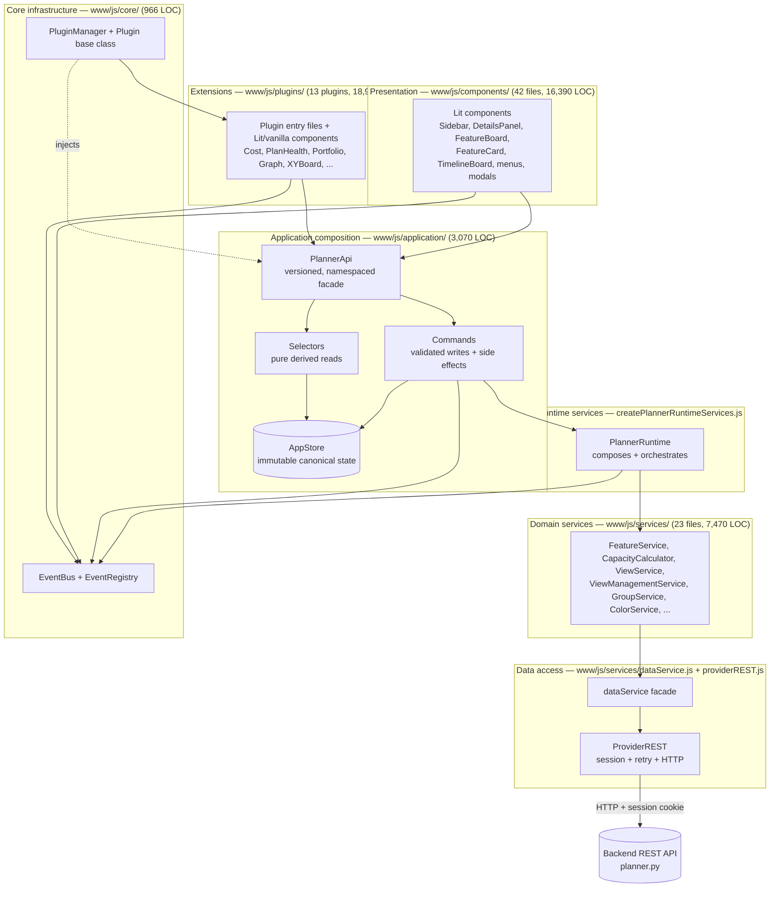
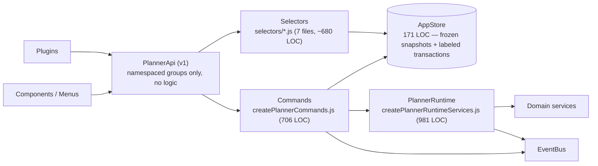
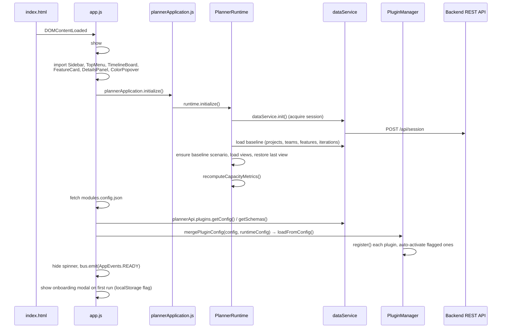
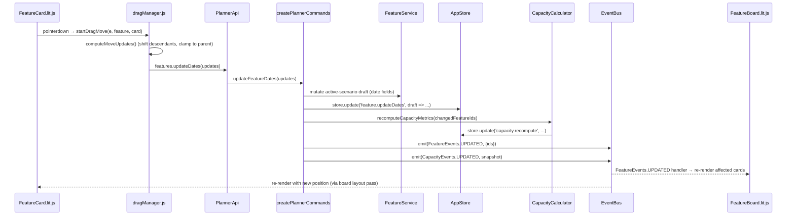
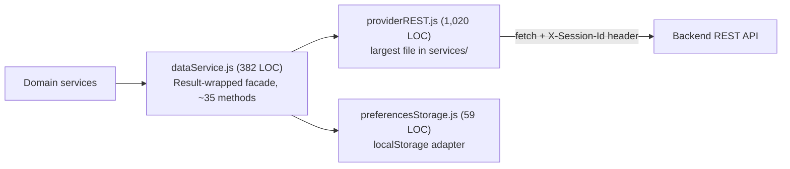

# PlannerTool Web Architecture

> **Status: current baseline (2026-07-15).** This document supersedes
> [ARCHITECTURE_LEGACY.md](ARCHITECTURE_LEGACY.md), which described the pre-refactor design centered on a
> single `State.js` god object. That class has been deleted; state is now owned by an immutable `AppStore`
> and mutated only through commands. See [ARCHITECTURE_ASSESSMENT.md](ARCHITECTURE_ASSESSMENT.md) for a
> best-in-class rating of this codebase and a prioritized list of pain points / reduction opportunities.
>
> Every module size quoted below was measured directly (`wc -l`) on 2026-07-15 and every architectural claim
> was verified by reading the referenced source files. Treat this as the ground truth baseline for further
> implementation and optimization work.

## 1. Scope and tech stack

This document covers the browser front end only:

- **`www/js/`** — the main planning application (~47,100 LOC across 130+ modules, excluding the vendored
  `lit` library).
- **`www-admin/js/`** — the administration panel (~10,500 LOC), a separate, decoupled Lit application.

Backend architecture (`planner_lib/`, `planner.py`) is out of scope; see
[ARCHITECTURE_BACKEND_DATA.md](ARCHITECTURE_BACKEND_DATA.md) and [ARCHITECTURE_SERVER.md](ARCHITECTURE_SERVER.md).

**Tech stack**

| Concern | Choice |
|---|---|
| Component model | [Lit](https://lit.dev) 3.x web components (`*.lit.js`), vendored at `www/js/vendor/lit.js` |
| Modules | Native ES modules, no bundler at dev/runtime; browser loads `import`s directly |
| Production build | **Vite** (`npm run build`, `vite.config.js`) bundles/copies `www/` into `dist/` |
| Vendor bundling | **Rollup** (`npm run build:vendor`, `rollup.config.mjs`) produces the pinned `vendor/lit.js` |
| State | Custom immutable store (`AppStore`), no Redux/MobX/Zustand |
| Data access | Hand-written `fetch`-based REST provider, no axios/graphql client |
| Testing | Vitest (unit/component, jsdom + `@vitest/browser`), Playwright (e2e/smoke) |
| Types | None — plain JavaScript with sparse JSDoc; no TypeScript, no PropTypes-equivalent |
| Linting | ESLint (`eslint-plugin-lit`, `eslint-plugin-lit-a11y`), Prettier |

This is a deliberately framework-light, hand-rolled stack: no React/Vue/Svelte, no state library, no
router, no CSS framework. Every cross-cutting concern (state, events, plugins, drag-and-drop, layout
packing) is bespoke code living in this repository. Section 4 ("Framework/library alternatives") of
[ARCHITECTURE_ASSESSMENT.md](ARCHITECTURE_ASSESSMENT.md) evaluates whether that trade-off still pays off at
the current size.

## 2. Module inventory (measured 2026-07-15)

```
www/js/                       47,123 LOC (excl. vendor/)
├── application/                3,070  — state store, commands, selectors, PlannerApi, composition root
├── core/                         966  — EventBus, EventRegistry, PluginManager, Plugin base class
├── services/                   7,470  — domain logic, REST provider, view/filter/capacity services
├── components/                16,390  — 42 Lit components + drag/layout/util helpers
├── plugins/                   18,916  — 13 registered plugins + 3 helper subfolders
└── config.js / config/            56  — feature flags, view defaults

www-admin/js/                  10,502 LOC — fully decoupled admin SPA (own components/services/core)
```

The **plugins** directory is now larger than the core application (`application` + `core` + `services` +
`components` = 27,896 LOC vs. 18,916 LOC of plugins) — see the diagram in Section 3 and the discussion in
`ARCHITECTURE_ASSESSMENT.md` on whether plugin/component sizes indicate missing decomposition rather than
genuine feature surface.

## 3. Layered architecture



**Layer responsibilities**

1. **Presentation (`components/`)** — Lit elements render UI and handle pointer/keyboard interaction. They
   read/write state exclusively through the namespaced `PlannerApi` singleton and communicate cross-component
   through the `EventBus`. No component imports another component's internals; no component imports a
   service directly (all such calls in the current tree go through `PlannerApi`).
2. **Plugins (`plugins/`)** — optional, independently loaded features (cost analysis, dependency arrows,
   plan health checks, portfolio board, etc.). Each plugin receives the same `PlannerApi` instance and
   follows a declarative lifecycle (`init/activate/deactivate/destroy`) managed by `PluginManager`.
3. **Application composition (`application/`)** — the sole owner of canonical state (`AppStore`), the
   mutation boundary (`commands`), and the read boundary (`selectors`). `PlannerApi` is a thin, versioned,
   namespaced facade over commands + selectors — it contains **no business logic**.
4. **Runtime services (`createPlannerRuntimeServices.js`)** — composes and wires the 15 domain services,
   exposes "runtime effects" (capacity recompute, event emission helpers, scenario lifecycle primitives)
   that commands call into after committing a state transaction.
5. **Domain services (`services/`)** — business logic and computation (feature overrides, capacity
   calculation, view/filter state, groups, colors). Pure functions where possible
   (`FeatureVisibilityService`, `SwimlaneService`); classes with narrow owned state elsewhere.
6. **Data access (`dataService.js` + `providerREST.js`)** — a single provider abstraction wrapping
   `fetch`, session/auth handling, and Result-style (`{ok, data|error}`) error normalization.
7. **Core infrastructure (`core/`)** — `EventBus`/`EventRegistry` (typed pub/sub) and `PluginManager`/`Plugin`
   (lifecycle + dependency + exclusivity rules). Infrastructure only, no business logic.

## 4. State management: AppStore, commands, selectors, PlannerApi

This is the biggest architectural change since the legacy document: **`State.js` (a 1,572-line, 214-method
god object) was deleted** and replaced with four cleanly separated pieces.



### 4.1 `AppStore.js` (171 LOC)

- Canonical top-level state slices: `lifecycle`, `baseline`, `scenarios`, `selection`, `view`, `groups`,
  `pluginState`, `capacity`.
- **Immutability**: every `update(label, reducer)` call clones state into a mutable draft, applies the
  reducer, then deep-freezes (`Object.freeze`) the result at every level. Equality between snapshots is a
  recursive structural comparison (`statesEqual`), not reference identity.
- **Transactions**: `store.update('namespace.action', (draft, previous) => { ... })` — a labeled mutation.
  Nested updates are rejected via an `_isUpdating` guard, preventing accidental re-entrancy.
- **Subscriptions**: `store.subscribe(selector, listener, {equals?, emitCurrent?})` — listeners only fire
  when the selector's derived output actually changes.
- **Invariant enforced by design**: the store holds data only; it has no domain logic, no service calls.

### 4.2 Canonical state shape (`createInitialAppState.js`, 75 LOC)

```
lifecycle:  { status: idle|loading|ready|failed, error }
baseline:   { revision, projects[], teams[], features[], iterationsByProject{} }
scenarios:  { activeId, items[] }            // item: {id, name, overrides, filters, view, isChanged, readonly}
selection:  { projectIds[], teamIds[], featureStateNames[], taskFilters{schedule,allocation,hierarchy,relations},
              taskTypeNames[], sidebarDisabled{} }
view:       { activeId, saved[], options{}, expansion{parentChild, relations, teamAllocated} }
groups:     { byPlanId{} }
pluginState:{ /* arbitrary per-plugin state, keyed by plugin id */ }
capacity:   { dates[], teamDaily[], teamDailyMap[], projectDailyRaw[], projectDaily[], projectDailyMap[],
              organizationDaily[], organizationDailyPerTeamAverage[] }
```

### 4.3 Commands (`commands/createPlannerCommands.js`, 706 LOC)

Every command follows the same shape:

```
store.update('<namespace>.<action>', draft => { /* mutate draft */ })
  → runtime.<method>()          // delegate IO / compute to PlannerRuntime + domain services
  → bus.emit(<EventType>, payload)
  → (if capacity-affecting) recomputeRuntimeCapacity()
```

Command groups (grouped by domain, not exhaustive — see file for the full list):

| Group | Examples |
|---|---|
| Scenario lifecycle | `activateScenario`, `cloneScenario`, `renameScenario`, `deleteScenario`, `saveScenario` |
| Feature mutation | `updateFeatureDates`, `updateFeatureField`, `updateFeatureRelations`, `revertFeature`, `setScenarioOverride` |
| Group mutation | `createGroupInScenario`, `updateGroupInScenario`, `deleteGroupInScenario`, `applyGroupMemberDelta` |
| Selection / filters | `setProjectSelected`, `setTeamSelected`, `setExpansionState`, `setSelectedTaskTypes`, `setSelectedStates` |
| View options | `setDisplayMode`, `setCondensedCards`, `setTimelineScale`, `setCapacityViewMode`, `setFeatureSortMode` |
| View restore | `applyViewSelectionRestore`, `applyViewOptionsRestore`, `applyViewPluginStateRestore` |
| Data hydration / autosave | `hydrateScenarioData`, `performAutosaveTick` |

### 4.4 Selectors (`selectors/*.js`, 7 files)

Pure derivation only — no mutation, no IO. `createPlannerSelectors.js` (112 LOC) composes the individual
selector modules into one object consumed by commands and `PlannerApi`:

| File | Purpose |
|---|---|
| `scenarioSelectors.js` | active/writable scenario lookup, save-payload normalization |
| `selectionSelectors.js` | selected-id projections from projects/teams |
| `expansionSelectors.js` (247 LOC, largest selector file) | parent/child closure, relation-link expansion, team-allocation expansion — the "Selected → Expanded → Displayed" pipeline surfaced in the Sidebar |
| `capacitySelectors.js` | canonical → array-shaped capacity snapshot and event payload |
| `taskTypeSelectors.js` | task type hierarchy, ordering, display names |
| `featureSelectors.js` | dirty-field diffing between baseline and scenario override |
| `iterationSelectors.js` | per-project iteration lookup |

### 4.5 `PlannerApi.js` (260 LOC) — the one public boundary

`PLANNER_API_VERSION = 1`. As of the Part 3 code-reduction slice (2026-07-15), the **legacy top-level
mirror was deleted** — there is no `state.getEffectiveFeatures()`-style flat API left in production code.
Every consumer (first-party components and plugins alike) uses namespaced groups:

`features`, `selection`, `filters`, `taskTypes`, `view`, `scenarios`, `views`, `groups`, `capacity`,
`plugins`, `markers`, `colors`, `sidebar`, `cost`, `events`, `history`, `config`, `server`, `app`,
`featureService`, `taskFilterService`, `featureStateService`.

This is the single stable contract shared by first-party UI **and** third-party-style plugins — see
Section 8.

### 4.6 Runtime services (`createPlannerRuntimeServices.js`, 981 LOC)

`PlannerRuntime` composes 15 domain-service collaborators (`BaselineStore`, `CapacityCalculator` +
`CapacityCoordinator`, `ViewService`, `TaskFilterService`, `ColorService`, `ConfigService`,
`StateFilterService`, `FeatureStateService`, `ProjectTeamService`, `DataInitService`, `PluginStateService`,
`ViewManagementService`, `ScenarioGroupService`, `FeatureService`) and exposes "runtime effects" that
commands call: `recomputeCapacityMetrics`, `emitCapacityUpdated`, `emitFeatureUpdated`,
`emitScenarioActivated`, `handleProjectSelectionChanged`, `handleTeamSelectionChanged`, `initialize`
(app-boot sequence), `captureSnapshot`, `replaceBaselineState`, `replaceCapacityState`, `replaceViewState`.

Per Part 4 of the code-reduction effort, ownership was clarified: **AppStore is canonical for all
user-visible domain state** (baseline, capacity, view/session metadata, selected task types); services may
keep only small, disposable, *derived/performance* caches (e.g., `FeatureService._countsCache`,
`CapacityCalculator._lastResultCache` for incremental delta calculation, `ColorService.projectColors`).

### 4.7 Runtime invariants (unchanged from the migration)

- `AppStore` is the only canonical mutable runtime truth — no second mutable runtime owner may exist.
- Writes must go through `commands` (`store.update(...)`); components/plugins/services never mutate
  `AppStore` snapshots directly. Enforced by `npm run guard:runtime-state`
  (`scripts/check-runtime-state-guard.mjs`), which fails the build on direct `services/State.js` imports
  (now dead — the file no longer exists) or in-place mutation of `getState()` results.
- Selectors are pure; services may do IO but never write `AppStore` state directly.

## 5. Event system

`www/js/core/EventBus.js` (156 LOC) is a symbol-keyed pub/sub bus with namespace fan-out:

```
bus.on(EventSymbol, handler) → unsubscribe()
bus.once(EventSymbol, handler)
bus.onNamespace('feature', handler)     // matches any Symbol('feature:*')
bus.emit(EventSymbol, payload)          // exact listeners first, then namespace listeners
bus.enableHistoryLogging(limit)         // opt-in ring buffer for debugging (config.js: LOG_EVENT_HISTORY)
```

Each handler executes inside a try/catch so one listener's exception cannot break event delivery to others
— a deliberate robustness trade-off (see assessment doc for the corresponding risk: silent handler
failures).

`www/js/core/EventRegistry.js` (171 LOC) defines the typed event catalogue, grouped by domain:
`FeatureEvents`, `ScenarioEvents`, `ProjectEvents`, `TeamEvents`, `PluginEvents`, `CapacityEvents`,
`FilterEvents`, `UIEvents`, `ViewEvents`, `ViewManagementEvents`, `AppEvents`, `SessionEvents`,
`ConfigEvents`, `TimelineEvents`, `DataEvents`, `ColorEvents`, `BoardEvents`, `GroupEvents`,
`StateFilterEvents`, `DragEvents`, `PlanEventEvents`.

Events carry **minimal payloads** (typically ids or small deltas), not full domain objects — components
re-read current state via `PlannerApi` rather than trusting event payloads as the source of truth.

## 6. Application bootstrap sequence



Key details verified in `www/js/app.js`:
- The spinner (`#appSpinner`) is shown before any import and hidden only after plugin loading completes or
  an error is caught and re-thrown.
- `plannerApplication.initialize()` is explicitly documented in-code as keeping legacy consumers working
  "during the staged migration" — this comment is now stale (the migration completed); see assessment doc.
- Plugin config merge is **non-fatal**: `.catch(() => null)` on both `getConfig()` and `getSchemas()`, so a
  backend outage degrades to metadata-only plugin defaults rather than blocking app start.
- Session-expiry UI (`SessionEvents.EXPIRED` / `REACQUIRED`) and the global `Ctrl+Shift+F` search shortcut
  are wired directly in `app.js` after `AppEvents.READY`.

## 7. End-to-end data flow example: dragging a feature card



No component ever calls `AppStore.update` directly, and no component ever calls `FeatureService` directly —
both are reached exclusively through `PlannerApi` → `commands`. This is the enforceable boundary described
in Section 4.7.

## 8. Plugin system

Plugins are optional, independently activatable feature modules. 13 are currently registered in
`www/js/modules.config.json`:

| id | mountPoint | exclusive | fullscreen | enabled | Purpose |
|---|---|---|---|---|---|
| `sample-plugin` | `timeline-board` | true | — | false | Reference/template implementation, kept for smoke tests |
| `plugin-portfolio-board` | `app` | true | true | true | Kanban board: teams × states |
| `plugin-dependencies` | `feature-board` | false | — | true | SVG dependency arrows between cards |
| `plugin-plan-health` | `feature-board` | true | — | true | Detects planning issues/anomalies |
| `plugin-history` | `feature-board` | true | — | true | Task date-change history overlay |
| `plugin-markers` | `feature-board` | true | — | true | Delivery-plan marker tags on timeline |
| `plugin-events` | `feature-board` | false | — | true | Locally stored plan events on timeline |
| `plugin-cost` | `app` | true | true | true | Cost analysis (project/task/team/team-members views) |
| `plugin-export-timeline` | `timeline-board` | true | true | true | Export timeline/capacity to PNG/JSON/CSV |
| `plugin-annotations` | `feature-board` | true | — | true | Freehand drawing/annotation overlay |
| `plugin-graph` | `app` | true | true | true | Large capacity-allocation SVG graph |
| `plugin-link-editor` | `feature-board` | true | — | false | Edit dependency link types |
| `plugin-xy-board` | `app` | true | true | true | X/Y field intersection table |

### 8.1 Lifecycle contract

`core/Plugin.js` (73 LOC) defines the abstract contract: `init()`, `activate()`, `deactivate()`,
`destroy()`, `getMetadata()`. `PluginManager.js` (328 LOC) drives it:

```
register(plugin)  → dependency check → plugin.init() → emit(PluginEvents.REGISTERED)
activate(id)      → init if needed → deactivate incompatible "exclusive" actives → activate deps → activate → emit ACTIVATED
deactivate(id)    → deactivate dependents first → emit DEACTIVATED
loadFromConfig(cfg)→ filter disabled → topological sort by dependency → register each → auto-activate flagged plugin
```

**Exclusivity**: a plugin with `exclusive: true` (the default) deactivates every other active,
non-dependency, `exclusive` plugin when it activates — effectively one exclusive plugin per mount point at
a time. `exclusive: false` plugins (Dependencies, Events) coexist with anything.

**Fullscreen**: `fullscreen: true` plugins (Portfolio, Cost, Export Timeline, Graph, XY Board) hide the
`#timeline-board` element on activate and restore its prior `display` style on deactivate — a manual,
per-plugin visibility hack rather than a shared base-class behavior (see assessment doc, Section "Plugin
system bloat").

### 8.2 Two inconsistent implementation patterns

Reading all 13 entry files shows the plugin tree is **not** internally consistent:

- **`OverlayPlugin` subclasses** (PlanHealth, History, Markers) are thin (~20–25 lines): they lazy-import a
  companion `*Component.js`, mount it, and delegate `open()/close()` to it.
- **Manual-lifecycle plugins** (Portfolio, Cost, ExportTimeline, Annotations, Graph, XYBoard, Dependencies)
  do **not** extend `Plugin`/`OverlayPlugin` at all; each hand-rolls mount-point DOM resolution
  (`document.querySelector('#'+mountPoint) || document.querySelector('.'+mountPoint) || document.body`) and
  fullscreen show/hide logic, duplicated near-verbatim across ~8 files.

### 8.3 Companion component sizes (all Lit, one exception noted)

| Component file | LOC | Notes |
|---|---|---|
| `PluginPlanHealthComponent.js` | 1,295 | Largest plugin UI file; runs 7 validation checks *and* renders results |
| `PluginEventsComponent.js` | 1,107 | Extends `OverlaySvgComponent` |
| `PluginCostComponent.js` | 1,091 | 4 sub-views (project/task/team/team-members) |
| `PluginCostCalculator.js` | 1,065 | Pure calculation module — month allocation, tree building, budget deviation; orthogonal to `services/CapacityCalculator.js` (that one computes daily team/project capacity from features; this one allocates *cost* per month/task/team) |
| `PluginHistoryComponent.js` | 951 | Extends `OverlaySvgComponent` |
| `PluginPortfolioComponent.lit.js` (+ `.styles.js`, 689) | 848 | Kanban + timeline + drag-drop, not extending `Plugin` |
| `PluginGraphComponent.js` | 773 | Hand-rolled SVG, no chart library |
| `PluginXYBoardComponent.lit.js` | 640 | |
| `PluginExportTimelineComponent.js` | 636 | Delegates canvas work to `plugins/export/TimelineExportRenderer.js` (1,079 LOC) |
| `PluginMarkersComponent.js` | 630 | Extends `OverlaySvgComponent` |
| `PluginAnnotationsComponent.js` | 393 | Delegates to `plugins/annotations/AnnotationOverlay.js` (1,552 LOC — the largest single file in `plugins/`) and `AnnotationState.js` (389 LOC) |
| `PluginLinkEditorComponent.js` | 365 | Delegates to `plugins/linkeditor/LinkEditorOverlay.js` (410 LOC) + `LinkEditorState.js` (234 LOC); disabled by default |
| `PluginDependenciesComponent.js` | 234 | Extends `OverlaySvgComponent` |

### 8.4 PlannerApi consumption by plugins

Plugins consume the same namespaced API as first-party components (Section 4.5) — there is no separate
"plugin API." Representative calls: `api.selection.getProjects()`, `api.features.list()`,
`api.history.get(projectId, {per_page: 500})`, `api.plugins.setState('plugin-xy-board', {...})`,
`api.view.getCapacityMode()`.

## 9. Data access layer



- `dataService.js` wraps every call in `_invoke()`, normalizing outcomes via `result.js`'s `ok()`/`fail()`/
  `asResult()`/`dataOr()` helpers — no caching at this layer.
- `providerREST.js` owns HTTP concerns end-to-end: session acquisition (`POST /api/session`), a
  single in-flight re-acquisition promise to avoid a thundering herd on 401, exponential-backoff network
  retry (2 attempts), and endpoint coverage for tasks, teams, projects, iterations, cost, scenarios, views,
  groups, events/event-categories, markers, history, plugin config/schemas, and cache invalidation.
- Session expiry (401 + `invalid_session`/`missing_session_id`) triggers `SessionEvents.EXPIRED` /
  `REACQUIRED`, surfaced by `app.js` as spinner messages instructing the user to retry.

## 10. Presentation layer (`components/`)

All 42 files share one access pattern — a global singleton import, not constructor injection:

```js
import { applicationApi as state } from '../application/plannerApplication.js';
// state.features.list(), state.selection.getProjects(), state.scenarios.getActive()
```

Lifecycle discipline is consistent: every component subscribes to `EventBus` events in
`connectedCallback()` and unsubscribes in `disconnectedCallback()`. There is no shared Lit base class beyond
`Modal.lit.js` (used by all 10+ modal dialogs to avoid duplicated open/close/backdrop boilerplate).

**Component sizes (LOC), largest first:**

| Component | LOC | Tag | Notes |
|---|---|---|---|
| `DetailsPanel.lit.js` | 2,079 | `<details-panel>` | **Largest file in `www/js`.** Header, scheduling, capacity allocation, tags, relations/links all in one file |
| `Sidebar.lit.js` | 1,978 | `<app-sidebar>` | Projects/teams/scenarios/views lists, data-funnel metrics, expansion controls, task filters, taskboard options |
| `FeatureCard.lit.js` | 931 | `<feature-card-lit>` | Card visual states, ghost title, drag/resize handlers |
| `FeatureBoard.lit.js` (+ `.init.js` 156, `.styles.js` 188) | 894 | `<feature-board>` | Split into render/init/styles files; swimlane + group-band layout |
| `AzureDevopsModal.lit.js` | 838 | `<azure-devops-modal>` | Row-level change review + publish-to-ADO with cascading selection |
| `MainGraph.lit.js` | 721 | `<maingraph-lit>` | Canvas org-load graph, scroll-synced fast re-render path |
| `Timeline.lit.js` | 692 | `<timeline-lit>` | Month header + exported scale/scroll helper functions |
| `ScenarioMenu.lit.js` | 535 | | Scenario CRUD + Azure publish flow |
| `TopMenu.lit.js` | 511 | | Top bar hosting Plan/Team/Scenario/View/Tools submenus |
| `GroupContextMenu.lit.js` (+ `.styles.js` 92) | 459 | | Singleton right-click menu for group ops |
| `TimelineBoard.lit.js` | 445 | `<timeline-board>` | Root composition: header + board + overlays + panning |
| `dragManager.js` | 418 | *(non-Lit)* | Pure drag/resize math, no DOM state held |
| `EventsPanel.lit.js` | 404 | | Plan-event CRUD, nested in PlanMenu |
| `groupBandLayout.js` | 284 | *(non-Lit)* | Pure greedy row-packing layout algorithm |
| *(28 smaller files: modals, menus, board helpers)* | ≤250 each | | See file list in Section 2 |

Event pattern: components exchange **ids/deltas**, not domain objects, via `EventBus`
(`FeatureEvents.UPDATED → {ids}`), then re-fetch current state through `PlannerApi` — this avoids stale
payload bugs but means every handler does a fresh read.

## 11. Domain services (`services/`, 23 files)

| Service | LOC | Owns (post Part-4 cutover) |
|---|---|---|
| `providerREST.js` | 1,020 | HTTP/session (Section 9) |
| `FeatureService.js` | 771 | Scenario-override application, date/capacity mutation, dirty tracking, expansion algorithms (parent/child closure, relation links, team-allocation) |
| `ViewManagementService.js` | 759 | Saved-view capture/restore orchestration; reads/writes `AppStore.view.saved`/`activeId` |
| `CapacityCalculator.js` | 543 | Feature-first daily capacity algorithm; epic/child precedence; incremental delta cache |
| `GroupService.js` | 430 | Baseline + scenario-local group CRUD, effective-group merge |
| `ViewService.js` | 441 | Timeline scale, display mode, capacity/sort mode — canonical view-option state |
| `dataService.js` | 382 | Provider facade (Section 9) |
| `FeatureVisibilityService.js` | 367 | Pure feature-visibility filter predicate (project/state/expansion/task-type/unplanned) |
| `DataInitService.js` | 264 | Baseline bootstrap + lookup-map construction |
| `SwimlaneService.js` | 232 | Pure swimlane grouping/assignment functions |
| `ColorService.js` | 227 | Project/team/state color assignment with deterministic hash fallback |
| `StateFilterService.js` | 214 | Selected feature-state Set management |
| `ProjectTeamService.js` | 199 | Working-copy project/team selection + org-load computation |
| `ConfigService.js` | 184 | Autosave timer + local preference plumbing |
| `IconService.js` | 161 | Task-type SVG icon templates |
| `PluginStateService.js` | 155 | Session-only per-plugin state store + view capture/restore |
| `TaskFilterService.js` | 173 | Dimensional task filters (schedule/allocation/hierarchy/relations) |
| `ScenarioGroupService.js` | 168 | Scenario-local group draft mutation (create/update/delete/member-delta) |
| `BaselineStore.js` | 101 | Canonical baseline projects/teams/features storage |
| `CapacityCoordinator.js` | 66 | Input-validation policy layer in front of `CapacityCalculator` |
| `result.js` | 79 | `ok()`/`fail()`/`asResult()`/`dataOr()` Result helpers |
| `preferencesStorage.js` | 59 | localStorage adapter |
| `BoardCoordinateService.js` | 236 | Board↔screen coordinate transforms, scroll subscription |

## 12. Admin panel (`www-admin/js/`, ~10,500 LOC)

The admin panel is a **fully independent Lit application** — zero cross-imports with `www/js/`. It shares
only `dataService.js` and the vendored `lit.js`, both loaded from the common `/static/js/` path.

```mermaid
flowchart TD
    ADMIN[admin.js — bootstrap] -->|dataService.init(); GET /admin/check| AUTH{Authorized?}
    AUTH -- no --> LOGIN[redirect /admin/login]
    AUTH -- yes --> APP["AdminApp.lit.js (174 LOC)<br/>tab-switch shell, no router"]
    APP --> SECTIONS[12 sections: System, Users, Projects, Teams,<br/>People, Cost, AreaMappings, Iterations,<br/>GlobalSettings, DataSources, Plugins, Utilities]
    SECTIONS --> BASE["BaseConfigComponent.lit.js (263 LOC)<br/>shared schema-form/raw-JSON toggle + save/reload"]
    BASE --> FORM["SchemaForm.lit.js (947 LOC)<br/>recursive JSON-Schema → HTML form renderer"]
    SECTIONS --> AREST["services/providerREST.js (312 LOC)<br/>admin-scoped REST client, no retry/EventBus"]
    AREST -->|same-origin cookie| API[Backend /admin/v1/* endpoints]
```

Notable admin-only components: `DataSources.lit.js` (621 LOC, configures ADO/Events/Groups data domains and
backend selection), `Plugins.lit.js` (1,245 LOC — the largest admin component; manages plugin
enabled/activated/order + schema-driven `custom_config` forms), `Iterations.lit.js` (776 LOC),
`AreaMappingsNew.lit.js` (718 LOC), `GlobalSettings.lit.js` (700 LOC).

**Deliberate duplication vs. `www/js`**: the admin app has its own `ProviderREST` (no session-retry/backoff
logic, since it relies on same-origin cookies and has no offline concerns) and no `EventBus`/`PluginManager`
at all — it only reuses `pluginSchemaRegistry.js` for discovering plugin config schemas. This isolation is
intentional (different auth model, different lifecycle needs) but see the assessment doc for where shared
utility extraction (e.g., Result helpers, base HTTP client) would reduce duplication without re-coupling the
two apps.

## 13. Feature flags (`config.js`)

Runtime-togglable flags (`window.__featureFlags` override supported): `WARN_ON_STRING_EVENTS`,
`LOG_EVENT_HISTORY`, `USE_PLUGIN_SYSTEM`, `USE_LIT_COMPONENTS`, `USE_COMMAND_PATTERN` (disabled — future
undo/redo), `serviceInstrumentation` (disabled), `USE_PARENT_CAPACITY_GAP_FILLS`, `SHOW_UNPLANNED_WORK`,
`PRESERVE_UNPLANNED_CHILDREN_ON_PARENT_MOVE`, `GRAPH_ONLY_SELECTED_PLANS`. Several of these
(`USE_LIT_COMPONENTS`, `USE_PLUGIN_SYSTEM`) gate migrations that are now 100% complete and could be removed
— see assessment doc.

## 14. Testing strategy

- **Unit tests** — services and pure selector/domain logic (Vitest, jsdom). Fast, deterministic.
- **Component tests** — Vitest + `@vitest/browser`/`@open-wc/testing` render Lit components, assert DOM,
  verify event emission; stub `applicationApi`/`AppStore` rather than mocking a service locator.
- **Integration tests** — exercise `dataService` + provider + `AppStore` wiring together.
- **E2E/smoke** — Playwright (`playwright.smoke.config.js`).
- **Guard script** — `npm run guard:runtime-state` statically enforces the AppStore mutation boundary
  (Section 4.7) and is part of `npm run lint`.
- Coverage goal: ~80% statements in service code, prioritizing branch coverage on capacity/expansion/date
  logic. See [testing-notes.md](../memories/repo/testing-notes.md) memory for known fixture pitfalls
  (getter-backed properties, view-restore duplication, etc.).

## 15. Code organization rules (still enforced)

- `core/` — infrastructure/wiring only, no business logic.
- `services/` — business logic and computation, no rendering/DOM.
- `components/` — rendering and interaction only; delegate logic to `PlannerApi` → commands/selectors.
- `plugins/` — optional, must clean up fully on `deactivate()`.
- Dependency direction: `core → application → services → (components, plugins)`. Components/plugins may
  depend on `core` (EventBus/EventRegistry) and `application` (`PlannerApi`), never the reverse.

## 16. Where to go next

- **Best-in-class rating, pain points, and code-reduction opportunities**: see
  [ARCHITECTURE_ASSESSMENT.md](ARCHITECTURE_ASSESSMENT.md).
- **Historical/pre-refactor design**: see [ARCHITECTURE_LEGACY.md](ARCHITECTURE_LEGACY.md).
- **In-flight reduction plan and decision log**: see the repo memory file
  `memories/repo/code-reduction-plan.md`, which tracks the `State.js` → `AppStore` migration parts (1–5)
  referenced throughout this document.
