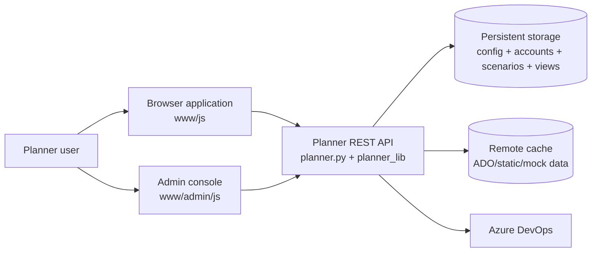
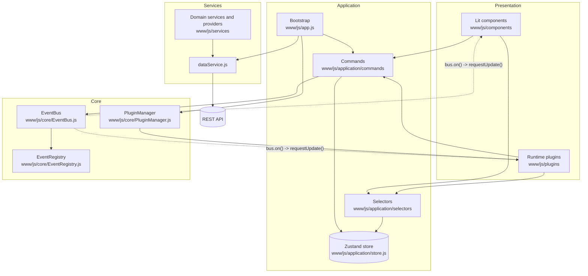
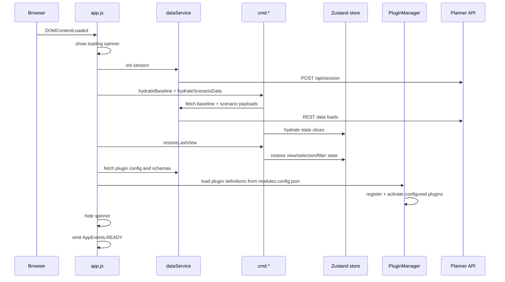
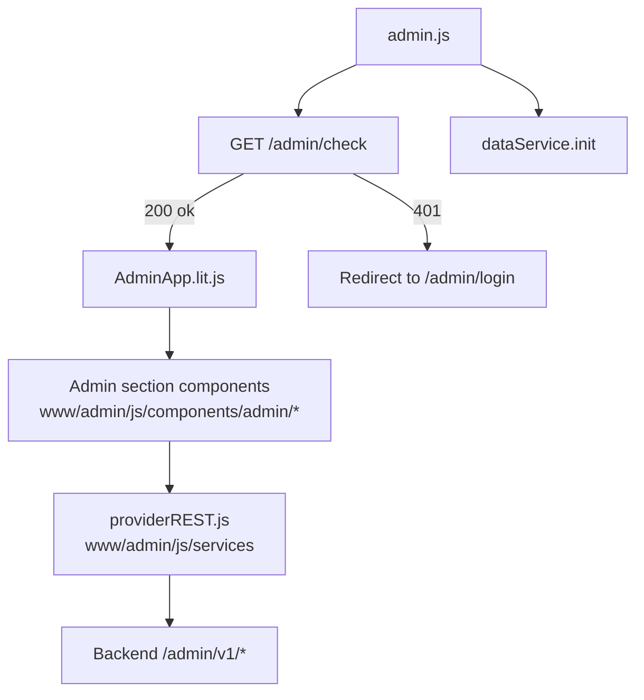

# PlannerTool Architecture (v5.0.0)

> Status: current architecture reference for the PlannerTool web application and backend runtime.

## 1. Purpose

This document describes the architecture of PlannerTool as implemented in the v5.0.0 codebase. The design is centered on a single canonical runtime state store, explicit command/selector seams, and a plugin runtime that loads feature modules from configuration rather than hard-wired UI code.

This document covers:

- the browser application under `www/js/`
- the admin application under `www/admin/js/`
- the backend service built from `planner_lib/` and `planner.py`
- the runtime boundaries between state, events, services, plugins, and persistence

It deliberately excludes deployment specifics, which are covered in `docs/DEPLOYMENT.md`.

## 2. Scope

In scope:

- Main frontend runtime and state model
- Admin configuration UI and backend schema flow
- REST API and service composition in the Python server
- Data storage, caching, and provider selection
- Plugin lifecycle and full-screen/toolbox mounts

Out of scope:

- exact low-level Azure SDK behavior
- infrastructure and cluster deployment
- browser-specific performance tuning beyond the V5 application model

## 3. System Context

```mermaid
flowchart LR
    User[Planner user]
    Browser[Browser application\nwww/js]
    Admin[Admin console\nwww/admin/js]
    API[Planner REST API\nplanner.py + planner_lib]
    Backend[(Persistent storage\nconfig + accounts + scenarios + views)]
    Cache[(Remote cache\nADO/static/mock data)]
    ADO[Azure DevOps]

    User --> Browser
    User --> Admin
    Browser --> API
    Admin --> API
    API --> Backend
    API --> Cache
    API --> ADO
```

## 4. Technology Profile

| Concern | Current implementation |
|---|---|
| UI framework | Lit 3 custom elements |
| Module system | Native ES modules |
| Runtime state | Zustand store with `subscribeWithSelector` |
| Write path | command modules in `www/js/application/commands` |
| Read path | selector modules in `www/js/application/selectors` |
| Events | symbol-based `EventBus` and `EventRegistry` |
| Plugin runtime | `PluginManager` + `modules.config.json` |
| Server | FastAPI + Uvicorn |
| Persistence | Diskcache-backed storage with separate remote cache |
| Build | Vite + Rollup |
| Test stack | Vitest, Playwright, pytest |

## 5. Frontend Runtime Architecture

```mermaid
flowchart TD
    subgraph Presentation
        Comp[Lit components\nwww/js/components]
        Plugins[Runtime plugins\nwww/js/plugins]
    end

    subgraph Application
        Cmd[Commands\nwww/js/application/commands]
        Sel[Selectors\nwww/js/application/selectors]
        Store[(Zustand store\nwww/js/application/store.js)]
        Boot[Bootstrap\nwww/js/app.js]
    end

    subgraph Core
        Bus[EventBus\nwww/js/core/EventBus.js]
        Registry[EventRegistry\nwww/js/core/EventRegistry.js]
        PM[PluginManager\nwww/js/core/PluginManager.js]
    end

    subgraph Services
        DataSvc[dataService.js]
        DomainSvc[Domain services and providers\nwww/js/services]
    end

    API[(REST API)]

    Boot --> Cmd
    Boot --> PM
    Boot --> DataSvc
    Comp --> Cmd
    Plugins --> Cmd
    Comp --> Sel
    Plugins --> Sel
    Cmd --> Store
    Sel --> Store
    Cmd --> Bus
    Bus -.->|"bus.on() -> requestUpdate()"| Comp
    Bus -.->|"bus.on() -> requestUpdate()"| Plugins
    Bus --> Registry
    PM --> Plugins
    DataSvc --> API
    DomainSvc --> DataSvc
```

Note the dashed edges: components and plugins do **not** subscribe to the Zustand store directly. Reactivity flows Cmd → Store (write) and, separately, Cmd → Bus → listener → `requestUpdate()` (repaint signal), after which the repainted component re-reads the store via `Sel`. This two-step (write, then signal) is why every store-mutating command must also emit an event — see §14 Known Sharp Edges.

## 6. State Architecture

### 6.1 Canonical store

The runtime state is defined in `www/js/application/store.js`. It is the single source of truth for UI state, selection, filter state, scenarios, plugin state, and capacity data.

Primary slices include:

- `lifecycle`
- `baseline`
- `scenarios`
- `selection`
- `view`
- `groups`
- `pluginState`
- `capacity`
- `scope`

### 6.2 Write path

The write path is command-driven:

- components and plugins call functions from `www/js/application/imports.js`
- commands mutate the store using `store.setState(...)`
- commands emit typed events for cross-module coordination
- initial hydration is done from `app.js` using `cmd.data.hydrateBaseline()`, `cmd.data.hydrateScenarioData()`, and `cmd.viewRestore.restoreLastView()`

### 6.3 Read path

The read path is selector-driven:

- selectors compute derived values from the current store snapshot
- components read from `sel.*`, typically re-calling the selector inside `render()`
- reactivity is driven by `EventBus` subscriptions, not store subscriptions: commands mutate the store *and* emit a typed event; components listen for that event (`bus.on(...)`) and call `this.requestUpdate()`, which triggers Lit to re-render and re-read the latest selector output

### 6.4 Invariants

- Store mutations happen only through command modules.
- Selectors are pure and deterministic for a given snapshot.
- Services do not own canonical UI state.
- UI components represent presentation, not state ownership.

## 7. Event and Signal Model

`www/js/core/EventBus.js` is the cross-cutting signal bus. Events are symbol-based identifiers defined in `EventRegistry.js`.

The design intentionally avoids sending mutable state payloads through events. Instead:

- events carry small IDs, routing hints, or lifecycle markers
- UI updates happen when a component's own `bus.on(...)` listener fires and calls `this.requestUpdate()`, causing Lit to re-render and pull fresh values from selectors on the next `render()` pass (see §6.3)
- state synchronization is explicit and command-driven

Examples include:

- `FeatureEvents.*`
- `ScenarioEvents.*`
- `CapacityEvents.*`
- `PluginEvents.*`
- `GroupEvents.*`
- `AppEvents.READY`

## 8. Startup Sequence

```mermaid
sequenceDiagram
    participant Browser
    participant App as app.js
    participant Data as dataService
    participant Cmd as cmd.*
    participant Store as Zustand store
    participant PM as PluginManager
    participant API as Planner API

    Browser->>App: DOMContentLoaded
    App->>App: show loading spinner
    App->>Data: init session
    Data->>API: POST /api/session
    App->>Cmd: hydrateBaseline + hydrateScenarioData
    Cmd->>Data: fetch baseline + scenario payloads
    Data->>API: REST data loads
    Cmd->>Store: hydrate state slices
    App->>Cmd: restoreLastView
    Cmd->>Store: restore view/selection/filter state
    App->>Data: fetch plugin config and schemas
    App->>PM: load plugin definitions from modules.config.json
    PM->>PM: register + activate configured plugins
    App->>App: hide spinner
    App->>App: emit AppEvents.READY
```

## 9. Plugin Architecture

Plugins are first-class runtime modules loaded by `PluginManager` and the JSON config in `www/js/modules.config.json`.

A plugin has a lifecycle of:

- `init()`
- `activate()`
- `deactivate()`
- `destroy()`

The V5 plugin model distinguishes:

- toolbox plugins mounted in the app surface
- full-screen plugins mounted at the app level
- persistent overlays that remain active across other plugin switches
- exclusive plugins that deactivate competing activations when needed

This is the current source of truth for plugin behavior and runtime configuration.

## 10. Admin Application Architecture

The admin application is a separate Lit SPA under `www/admin/js`, bootstrapped by `www/admin/js/admin.js`. It follows the same module/build conventions as the main app but is a distinct UI composition (no shared Zustand store, commands, or selectors with `www/js`).

```mermaid
flowchart TD
    AdminBoot[admin.js] --> Check[GET /admin/check]
    Check -->|200 ok| AdminShell[AdminApp.lit.js]
    Check -->|401| LoginRedirect[Redirect to /admin/login]
    AdminShell --> Sections[Admin section components\nwww/admin/js/components/admin/*]
    AdminBoot --> SharedData[dataService.init]
    Sections --> AdminREST[providerREST.js\nwww/admin/js/services]
    AdminREST --> API[Backend /admin/v1/*]
```

The admin surface is responsible for:

- project and team configuration
- Azure settings and feature flags
- server configuration and backup/reload behavior
- user and permissions management
- schema-driven admin forms (see `docs/SCHEMA_UI_SYSTEM.md` for the schema/data contract in detail)

Each config domain (Teams, Projects, System, Cost, ...) is a thin subclass of `BaseConfigComponent`, which fetches `GET /admin/v1/schema/{type}` and `GET /admin/v1/{type}` in parallel and renders a generic `SchemaForm` component from the returned JSON Schema — new config domains are added by declaring a schema entry and a subclass, not by hand-building a form.

## 11. Backend Architecture Summary

The Python backend is built from `planner_lib` and assembled in `planner_lib/main.py` via `create_app(config)`. It uses FastAPI, per-request dependency resolution, and a diskcache-backed storage model.

The important backend boundaries are:

- authoritative storage for server config, accounts, sessions, and user data
- a separate `remote_cache_storage` directory for TTL-governed backend reads
- a `BackendRegistry` that selects an active backend implementation
- `CachingBackend` as a transparent soft-freshness proxy around remote data backends
- repositories that depend on focused protocols rather than concrete backend classes

This creates a clear split between durable server state and volatile remote-data cache state.

## 12. Quality Constraints

The architecture is designed around a few non-negotiable rules:

- canonical state lives in one place
- writes are explicit and command-driven
- selectors stay side-effect free
- plugin lifecycle is explicit and inspectable
- backend config and user data are durable, cache is not
- the browser UI is a client to the server, not the system of record for configuration

These rules are enforced in code and are the basis for valid V5 changes.

Runtime behavior notes:

- `PluginManager` emits `PluginEvents.REGISTERED`, `ACTIVATED`, `DEACTIVATED`, `UNREGISTERED`.
- `loadFromConfig` resolves dependencies and can reorder activation for dependency safety.
- Plugin UI components typically subscribe to EventBus signals and read state via `sel.*`.

## 13. Testing Architecture

Test layers:

- Unit: command, selector, service, and pure utility coverage
- Component: Lit rendering and interaction coverage
- Integration: command + selector + store behavior
- E2E: Playwright user-path validation
- Backend/API: pytest coverage

Contract-testing rules:

- Tests assert public behavior and observable effects.
- Tests avoid private-field coupling.
- Tests isolate state per test case.

## 14. Known Sharp Edges

- **Store writes go through `writeState`, which makes the notification mandatory.** Commands no longer call `store.setState(...)` and `bus.emit(...)` as two independent statements. `www/js/application/storeWrite.js` exports `writeState(store, bus, { updater, events, actionName, ids, data })`, which commits the state change and emits every listed event in one call; `events` is required and non-empty, so it is structurally impossible to write to the store without signaling at least one event. Non-transition signals that are not paired with a store commit (e.g. a hydration failure where nothing was written) use the sibling `emitOperationStatus(bus, event, data)` instead, keeping "write succeeded" and "write didn't happen" from being conflated under one helper.
- **Store-derived event payloads follow one contract: `{ ids, data }`.** `ids` is always `string[]` or `null` and is domain knowledge the command computes itself (e.g. which feature ids were touched) — `writeState` does not attempt to reverse-engineer it via generic state diffing. `data` carries bespoke per-event fields (e.g. `revision`, `scenarioId`, `debugFlag`) plus an auto-injected `actionName` (the devtools action name) that commands never author themselves. Before this, the same event (`FeatureEvents.UPDATED`) was observed with at least four different ad hoc shapes depending on call site (`{ids}`, `{id, field}`, `{id, fields}`, `{ids, type}`), and one caller (the Link Editor plugin) emitted a singular `{id}` that a consumer (`DetailsPanel`) silently mishandled by falling into its "unknown feature, refresh everything" branch instead of matching the specific feature.
- **`LinkEditorState` used to mutate the live store reference directly.** The Link Editor plugin read the active scenario via `sel.scenario.getActiveScenario()` and mutated `scenario.overrides[...].relations` in place on that returned object, bypassing `store.setState` entirely; it then manually emitted an event to paper over the missing store notification. Any code relying on store-reference equality (devtools time-travel, future `store.subscribe`-based reactivity) would have missed the change even though a manual event happened to fire. This has been fixed: relation edits now go through `cmd.feature.updateFeatureField(...)`, the same canonical command path other feature mutations use.
- **Selectors are not memoized/scoped.** `sel.*` functions recompute against the full store snapshot on every call; there is no `subscribeWithSelector`-based fine-grained diffing in use for UI updates (that middleware is only exercised by the Redux DevTools integration). Expensive derived computations should memoize internally if called from hot render paths.
- **Two reactivity models coexist.** The canonical Zustand store (via commands/selectors/events) governs most application state, but several plugins maintain their own small local pub-sub stores (`boardCoords`, per-plugin `_state`/`_annotationState`/`_linkEditorState`, `cmd.pluginState.subscribe(pluginId, ...)`) for high-frequency updates like scroll/viewport sync. New plugin code touching scroll or drag interactions should follow the existing local-store pattern rather than routing high-frequency updates through the global `EventBus`.
- **`CachingBackend` never hard-expires entries on error.** A stale cache entry is served indefinitely if the live ADO backend keeps failing (expired PAT, outage) — there is no forced-refresh ceiling. Diagnosing "why is this data old" requires checking the `taskmeta__*` freshness sidecar and the `/cache/refresh` endpoint, not just the cache TTL config.
- **Config vs. cache storage split is directory-based, not type-based.** Authoritative config/accounts/sessions/scenarios live in `data/cache` (via the `storage` singleton) while the TTL-governed remote backend cache lives in the separate `data/remote_cache` directory (via `remote_cache_storage`). Deleting the wrong directory has very different blast radii — deleting `remote_cache` is safe (forces refetch), deleting `cache` destroys user/config data.

## 15. Quality Attributes

### 15.1 Modifiability

- Layered separation of presentation, application, core, and service responsibilities.
- Command/selector seams localize state-model changes.

### 15.2 Testability

- Deterministic selectors and explicit command APIs.
- Event-driven UI updates (`bus.on(...)` → `requestUpdate()`) make update behavior observable and easy to trigger from tests without mounting the full store.

### 15.3 Performance

- Components re-render on explicit event signals rather than on every store write, limiting rerenders to interested listeners.
- High-frequency interactions (scroll/viewport sync) bypass the canonical store and EventBus entirely, using small local pub-sub stores (e.g. `boardCoords.subscribe(...)` in `www/js/plugins`, `cmd.pluginState.subscribe(pluginId, ...)`) to avoid the cost of full command/selector/event round-trips on every frame.

### 15.4 Reliability

- Startup sequence enforces explicit hydration before ready signal.
- Session lifecycle handling is centralized in data-access services.

## 16. Governance Rules

- New state writes are added only through command modules.
- New derived reads are added only through selectors.
- New event types must document payload shape and consumer responsibility.
- Plugin additions must define lifecycle behavior and cleanup.
- Architecture-impacting changes must update this document and corresponding tests.
