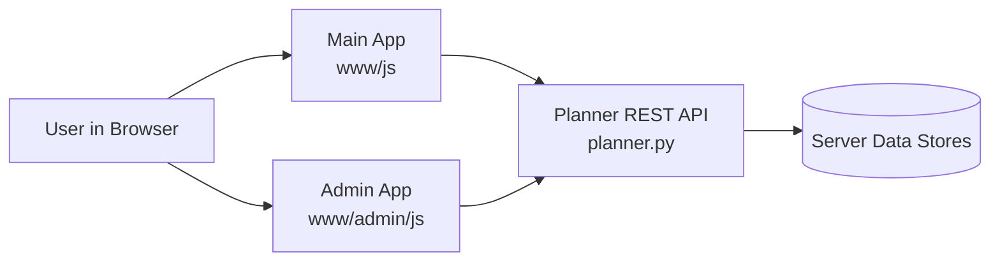
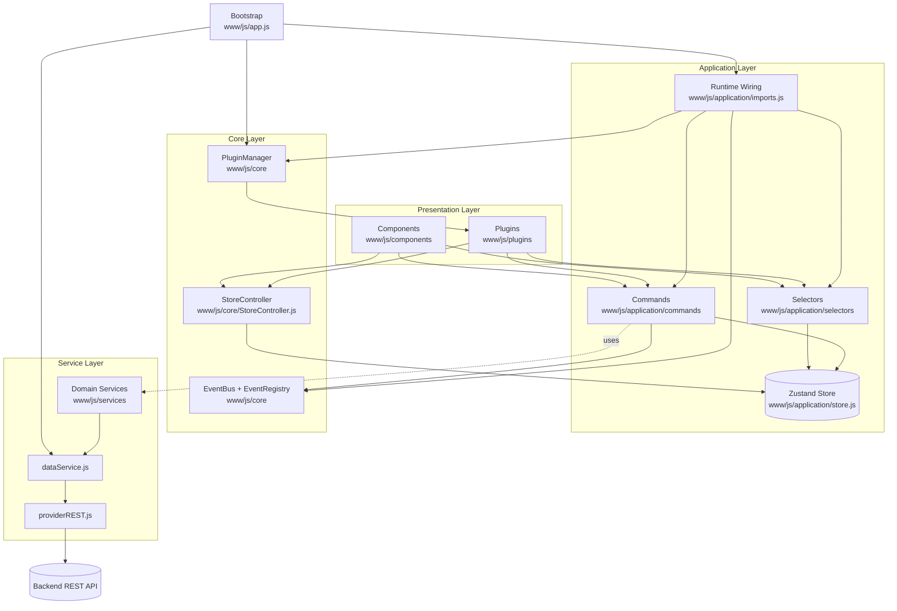
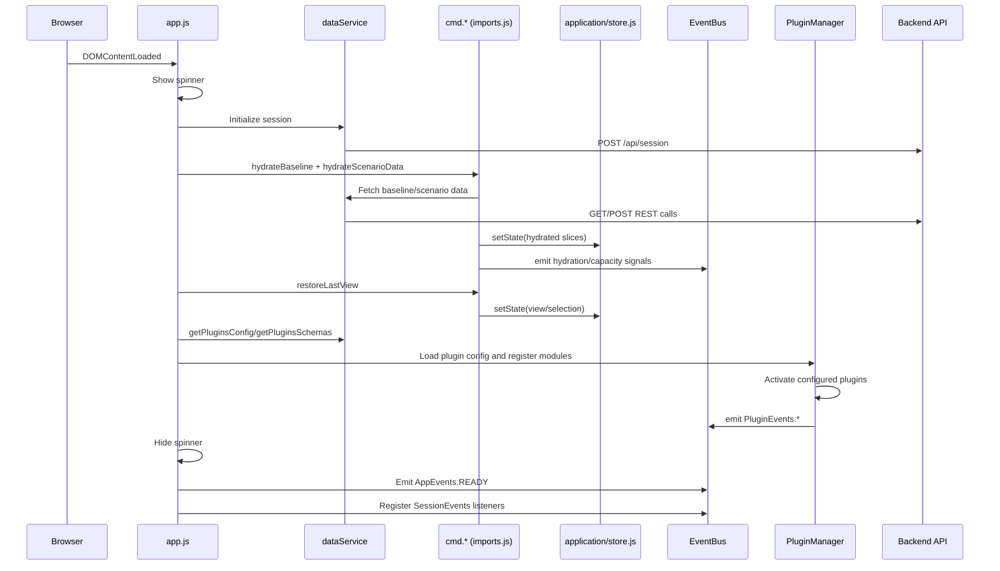
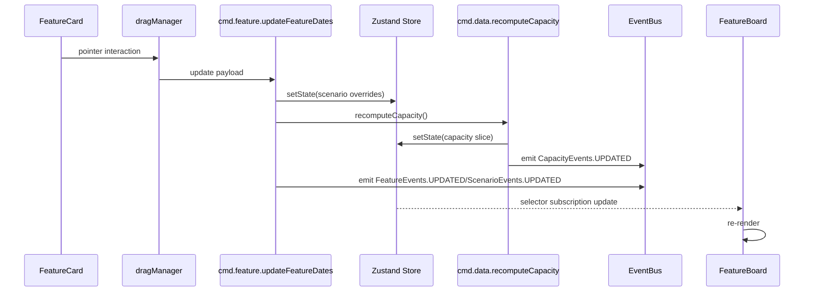
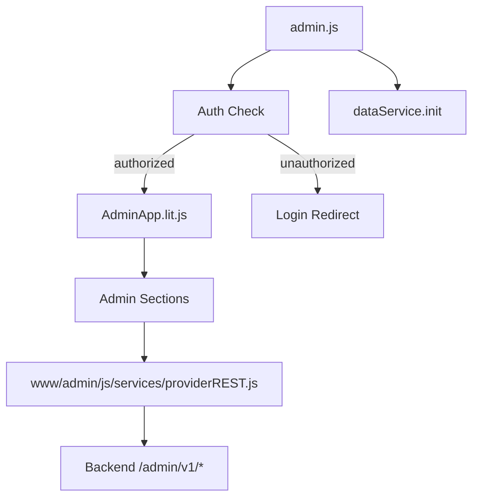

# PlannerTool Web Architecture (v2)

> Status: current architecture reference for the PlannerTool web system.

## 1. Purpose

This document describes the current architecture of the PlannerTool web system.
It defines system boundaries, runtime composition, module responsibilities, state and event contracts,
and quality-focused constraints used for implementation and review.

## 2. Scope

In scope:

- Main web application under `www/js/`
- Admin web application under `www/admin/js/`
- Frontend-to-backend interaction with `planner.py` REST endpoints
- Runtime state, eventing, plugin composition, and UI architecture

Out of scope:

- Backend internals and persistence implementation details
- Deployment infrastructure details (covered by deployment documentation)

## 3. System Context

```mermaid
flowchart LR
    User[User in Browser]
    MainApp[Main App\nwww/js]
    AdminApp[Admin App\nwww/admin/js]
    API[Planner REST API\nplanner.py]
    Data[(Server Data Stores)]

    User --> MainApp
    User --> AdminApp
    MainApp --> API
    AdminApp --> API
    API --> Data
```

## 4. Technology Profile

| Concern | Technology |
|---|---|
| Component model | Lit 3 web components |
| Module system | Native ES modules |
| Frontend state | Zustand vanilla (`createStore`, `subscribeWithSelector`) |
| Build pipeline | Vite (`npm run build`) |
| Vendor bundling | Rollup (`npm run build:vendor`) |
| Testing | Vitest, Playwright, pytest |
| Linting | ESLint |

## 5. Top-Level Structure

Generated from the current frontend audit.

| Area | Files | LOC | Role |
|---|---:|---:|---|
| `www/js/application` | 21 | 4,850 | Store composition, commands, selectors, runtime wiring |
| `www/js/core` | 8 | 1,040 | Event bus, plugin manager, store controller |
| `www/js/services` | 22 | 7,115 | Domain services and REST provider |
| `www/js/components` | 48 | 17,093 | Main UI components and UI helpers |
| `www/js/plugins` | 52 | 18,817 | Feature plugins and plugin UI components |
| `www/admin/js` | 27 | 11,349 | Admin SPA components and services |

### 5.1 Code Navigation Map

Primary entry points and composition seams:

- Main app bootstrap: `www/js/app.js`
- Main app command/selector composition: `www/js/application/imports.js`
- Store definition: `www/js/application/store.js`
- Command modules: `www/js/application/commands/*.js`
- Selector modules: `www/js/application/selectors/*.js`
- Event system: `www/js/core/EventBus.js`, `www/js/core/EventRegistry.js`
- Plugin lifecycle manager: `www/js/core/PluginManager.js`
- Lit store subscription controller: `www/js/core/StoreController.js`
- Shared data facade: `www/js/services/dataService.js`
- Admin app bootstrap: `www/admin/js/admin.js`
- Admin backend adapter: `www/admin/js/services/providerREST.js`

## 6. Architectural Principles

- Single canonical runtime state store.
- Explicit write path through command modules.
- Pure read path through selector modules.
- UI components do not mutate store directly.
- Runtime composition is centralized in `www/js/application/imports.js`.
- Domain services are explicit modules; some are constructor-injected, others are singleton exports.
- Event bus carries signals and routing hints, not state snapshots.
- Plugin lifecycle is explicit (`init`, `activate`, `deactivate`, `destroy`).

## 7. Runtime Architecture

```mermaid
flowchart TD
    subgraph Presentation[Presentation Layer]
        Comp[Components\nwww/js/components]
        Plugins[Plugins\nwww/js/plugins]
    end

    subgraph AppLayer[Application Layer]
        Cmd[Commands\nwww/js/application/commands]
        Sel[Selectors\nwww/js/application/selectors]
        Store[(Zustand Store\nwww/js/application/store.js)]
        Runtime[Runtime Wiring\nwww/js/application/imports.js]
    end

    subgraph Core[Core Layer]
        Bus[EventBus + EventRegistry\nwww/js/core]
        PM[PluginManager\nwww/js/core]
        SC[StoreController\nwww/js/core/StoreController.js]
    end

    subgraph Services[Service Layer]
        DomainSvc[Domain Services\nwww/js/services]
        DataSvc[dataService.js]
        REST[providerREST.js]
    end

    API[(Backend REST API)]
    AppBoot[Bootstrap\nwww/js/app.js]

    Comp --> SC --> Store
    Plugins --> SC
    Comp --> Cmd
    Plugins --> Cmd
    Comp --> Sel
    Plugins --> Sel
    Sel --> Store
    Cmd --> Store
    Cmd --> Bus
    Runtime --> Cmd
    Runtime --> Sel
    Runtime --> Bus
    Runtime --> PM
    AppBoot --> Runtime
    AppBoot --> PM
    AppBoot --> DataSvc
    Cmd -. uses .-> DomainSvc
    DomainSvc --> DataSvc --> REST --> API
    PM --> Plugins
```

## 8. State Architecture

### 8.1 Store

Canonical runtime state lives in `www/js/application/store.js`.

Primary slices:

- `lifecycle`
- `baseline`
- `scenarios`
- `selection`
- `view`
- `groups`
- `pluginState`
- `capacity`

### 8.2 Write Path

- Components and plugins call command functions from `www/js/application/imports.js` (`cmd.*`).
- Commands mutate state via `store.setState(...)`.
- Commands emit signal events for cross-module coordination (for example scenario, plugin, capacity, and UI synchronization events).
- Startup hydration is command-driven from `www/js/app.js` (`cmd.data.hydrateBaseline()`, `cmd.data.hydrateScenarioData()`, `cmd.viewRestore.restoreLastView()`).

### 8.3 Read Path

- Selectors compute derived data from `store.getState()` and are exposed via `sel.*`.
- Components and plugins read via `sel.*` and subscribe with `StoreController` where reactive updates are needed.
- Re-render occurs from store subscription notifications.

### 8.4 Invariants

- No direct store mutation outside command modules.
- Selectors are pure and deterministic for a given state snapshot.
- Services do not own canonical frontend state.

## 9. Event Architecture

`www/js/core/EventBus.js` provides symbol-based pub/sub with namespace listeners.

Event usage rules:

- Event payloads contain IDs or compact routing hints.
- State collections and derived snapshots are not sent on event payloads.
- UI update propagation uses store subscriptions, not event payload transport.

## 10. Startup Architecture

```mermaid
sequenceDiagram
    participant Browser as Browser
    participant App as app.js
    participant DS as dataService
    participant Cmd as cmd.* (imports.js)
    participant Store as application/store.js
    participant Bus as EventBus
    participant PM as PluginManager
    participant API as Backend API

    Browser->>App: DOMContentLoaded
    App->>App: Show spinner
    App->>DS: Initialize session
    DS->>API: POST /api/session
    App->>Cmd: hydrateBaseline + hydrateScenarioData
    Cmd->>DS: Fetch baseline/scenario data
    DS->>API: GET/POST REST calls
    Cmd->>Store: setState(hydrated slices)
    Cmd->>Bus: emit hydration/capacity signals
    App->>Cmd: restoreLastView
    Cmd->>Store: setState(view/selection)
    App->>DS: getPluginsConfig/getPluginsSchemas
    App->>PM: Load plugin config and register modules
    PM->>PM: Activate configured plugins
    PM->>Bus: emit PluginEvents.*
    App->>App: Hide spinner
    App->>Bus: Emit AppEvents.READY
    App->>Bus: Register SessionEvents listeners
```

## 11. Interaction Flow (Example)

Example: feature drag date update.

```mermaid
sequenceDiagram
    participant Card as FeatureCard
    participant Drag as dragManager
    participant Cmd as cmd.feature.updateFeatureDates
    participant Store as Zustand Store
    participant DataCmd as cmd.data.recomputeCapacity
    participant Bus as EventBus
    participant Board as FeatureBoard

    Card->>Drag: pointer interaction
    Drag->>Cmd: update payload
    Cmd->>Store: setState(scenario overrides)
    Cmd->>DataCmd: recomputeCapacity()
    DataCmd->>Store: setState(capacity slice)
    DataCmd->>Bus: emit CapacityEvents.UPDATED
    Cmd->>Bus: emit FeatureEvents.UPDATED/ScenarioEvents.UPDATED
    Store-->>Board: selector subscription update
    Board->>Board: re-render
```

## 12. Plugin Architecture

Plugins are runtime modules loaded through `PluginManager` and `modules.config.json`.

Plugin contracts:

- Lifecycle: `init`, `activate`, `deactivate`, `destroy`
- Mounting through configured mount points
- Optional exclusivity and fullscreen behavior
- Access to state through `cmd`/`sel` seams and store controller subscriptions

Runtime behavior notes:

- `PluginManager` emits `PluginEvents.REGISTERED`, `ACTIVATED`, `DEACTIVATED`, `UNREGISTERED`.
- `loadFromConfig` resolves dependencies and can reorder activation for dependency safety.
- Plugin UI components typically subscribe to EventBus signals and read state via `sel.*`.

## 13. Admin Application Architecture

The admin application is a separate Lit SPA under `www/admin/js`.

```mermaid
flowchart TD
    AdminBoot[admin.js] --> Check[Auth Check]
    Check -->|authorized| AdminShell[AdminApp.lit.js]
    Check -->|unauthorized| LoginRedirect[Login Redirect]
    AdminShell --> Sections[Admin Sections]
    AdminBoot --> SharedData[dataService.init]
    Sections --> AdminREST[www/admin/js/services/providerREST.js]
    AdminREST --> API[Backend /admin/v1/*]
```

Admin and main applications share backend APIs and build pipeline conventions but remain separate UI compositions.

## 14. Testing Architecture

Test layers:

- Unit: command, selector, service, and pure utility coverage
- Component: Lit rendering and interaction coverage
- Integration: command + selector + store behavior
- E2E: Playwright user-path validation
- Backend/API: pytest coverage

Contract-testing rules:

- Tests assert public behavior and observable effects.
- Tests avoid private-field coupling.
- Tests isolate state per test case.

## 15. Quality Attributes

### 15.1 Modifiability

- Layered separation of presentation, application, core, and service responsibilities.
- Command/selector seams localize state-model changes.

### 15.2 Testability

- Deterministic selectors and explicit command APIs.
- Store subscriptions make UI update behavior observable.

### 15.3 Performance

- Selector-scoped subscriptions reduce unnecessary rerenders.
- Event bus is used for targeted side-effect signaling.

### 15.4 Reliability

- Startup sequence enforces explicit hydration before ready signal.
- Session lifecycle handling is centralized in data-access services.

## 16. Governance Rules

- New state writes are added only through command modules.
- New derived reads are added only through selectors.
- New event types must document payload shape and consumer responsibility.
- Plugin additions must define lifecycle behavior and cleanup.
- Architecture-impacting changes must update this document and corresponding tests.
