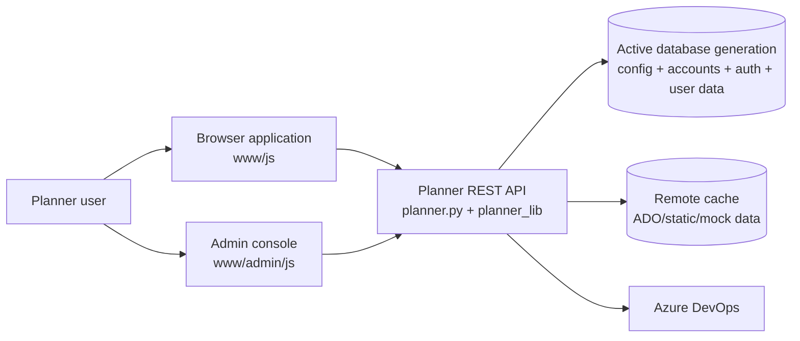
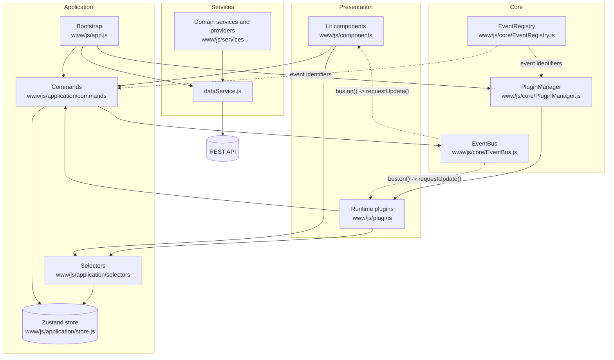
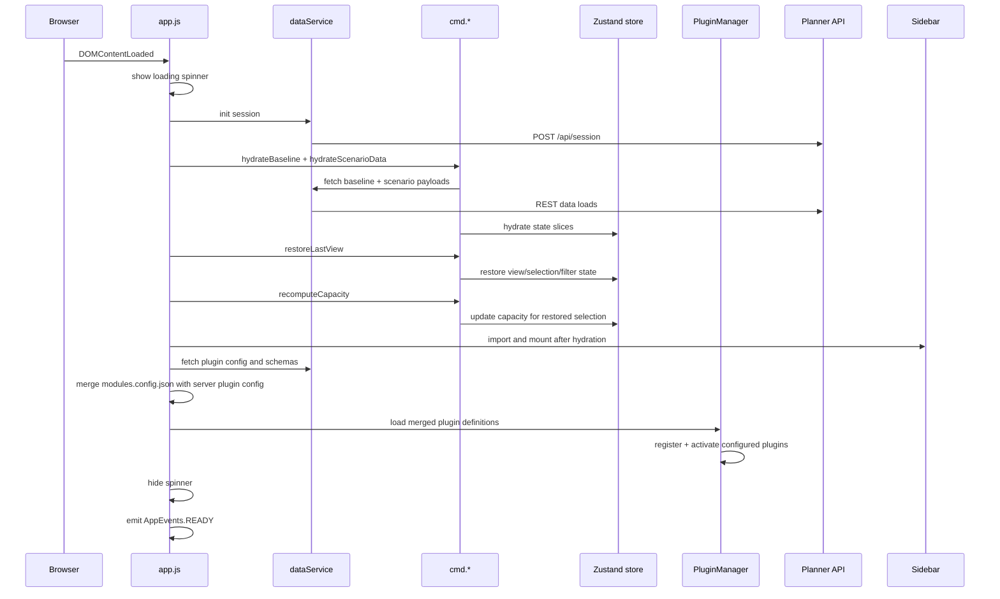
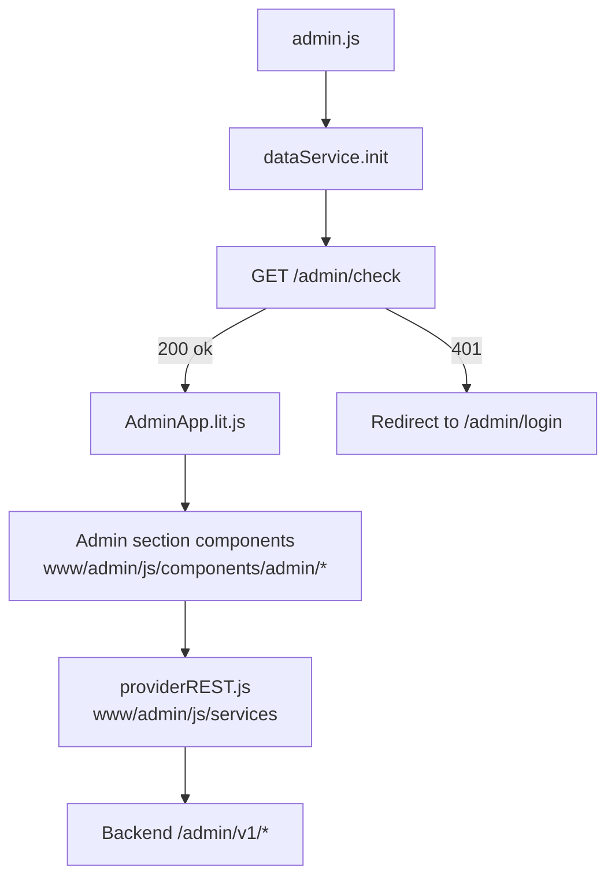

# PlannerTool Architecture (v5.0.0)

> Status: current architecture reference for the PlannerTool web application and backend runtime.

> Verified against the workspace implementation on 2026-10-02. Detailed operational contracts live in [Migrations](MIGRATIONS.md), [Authentication](AUTHENTICATION.md), and [Testing](TESTING.md).

## 1. Purpose

This document describes the architecture of PlannerTool as implemented in the v5.0.0 codebase. The design is centered on a single canonical runtime state store, explicit command/selector seams, and a plugin runtime that loads feature modules from configuration rather than hard-wired UI code.

This document covers:

- the browser application under `www/js/`
- the admin application under `www/admin/js/`
- the backend service built from `planner_lib/` and `planner.py`
- the runtime boundaries between state, events, services, plugins, and persistence

It deliberately excludes deployment specifics, which are covered in `docs/DEPLOYMENT.md`.

## 2. Scope

In scope:

- Main frontend runtime and state model
- Admin configuration UI and backend schema flow
- REST API and service composition in the Python server
- Data storage, caching, and provider selection
- Plugin lifecycle and full-screen/toolbox mounts

Out of scope:

- exact low-level Azure SDK behavior
- infrastructure and cluster deployment
- browser-specific performance tuning beyond the V5 application model

## 3. System Context

```mermaid
flowchart LR
    User[Planner user]
    Browser[Browser application\nwww/js]
    Admin[Admin console\nwww/admin/js]
    API[Planner REST API\nplanner.py + planner_lib]
    Backend[(Active database generation\nconfig + accounts + auth + user data)]
    Cache[(Remote cache\nADO/static/mock data)]
    ADO[Azure DevOps]

    User --> Browser
    User --> Admin
    Browser --> API
    Admin --> API
    API --> Backend
    API --> Cache
    API --> ADO
```

## 4. Technology Profile

| Concern | Current implementation |
|---|---|
| UI framework | Lit 3 custom elements |
| Module system | Native ES modules |
| Runtime state | Zustand vanilla store with `subscribeWithSelector` and Redux DevTools middleware |
| Write path | command modules in `www/js/application/commands` |
| Read path | selector modules in `www/js/application/selectors` |
| Events | symbol-based `EventBus` and `EventRegistry` |
| Plugin runtime | `PluginManager` + `modules.config.json` |
| Server | FastAPI + Uvicorn |
| Persistence | Server-owned authoritative DiskCache generations and separate disposable remote cache |
| Build | Vite + Rollup |
| Test stack | Vitest, Playwright, pytest |

## 5. Frontend Runtime Architecture

```mermaid
flowchart TD
    subgraph Presentation
        Comp[Lit components\nwww/js/components]
        Plugins[Runtime plugins\nwww/js/plugins]
    end

    subgraph Application
        Cmd[Commands\nwww/js/application/commands]
        Sel[Selectors\nwww/js/application/selectors]
        Store[(Zustand store\nwww/js/application/store.js)]
        Boot[Bootstrap\nwww/js/app.js]
    end

    subgraph Core
        Bus[EventBus\nwww/js/core/EventBus.js]
        Registry[EventRegistry\nwww/js/core/EventRegistry.js]
        PM[PluginManager\nwww/js/core/PluginManager.js]
    end

    subgraph Services
        DataSvc[dataService.js]
        DomainSvc[Domain services and providers\nwww/js/services]
    end

    API[(REST API)]

    Boot --> Cmd
    Boot --> PM
    Boot --> DataSvc
    Comp --> Cmd
    Plugins --> Cmd
    Comp --> Sel
    Plugins --> Sel
    Cmd --> Store
    Sel --> Store
    Cmd --> Bus
    Bus -.->|"bus.on() -> requestUpdate()"| Comp
    Bus -.->|"bus.on() -> requestUpdate()"| Plugins
    Registry -.->|event identifiers| Cmd
    Registry -.->|event identifiers| PM
    PM --> Plugins
    DataSvc --> API
    DomainSvc --> DataSvc
```

For the main UI, reactivity flows Cmd → Store (write) and, separately, Cmd → Bus → listener → Lit update (repaint signal). A listener either requests an update or assigns reactive properties from selectors; rendering then uses the refreshed data. There is no general store subscription that automatically repaints every component. Plugin-state commands have their own subscriber notifications, and some plugin-local stores have a separate update path; not every store mutation emits a bus event. See §14 Known Sharp Edges.

## 6. State Architecture

### 6.1 Canonical store

The runtime state is defined in `www/js/application/store.js`. It is the single source of truth for UI state, selection, filter state, scenarios, plugin state, and capacity data.

Primary slices include:

- `lifecycle`
- `baseline`
- `scenarios`
- `selection`
- `view`
- `groups`
- `pluginState`
- `capacity`
- `featureDisplay`

Planning scope is derived by `sel.scope` from selection, view context, and effective tasks; it is not a separate persisted store slice. `featureDisplay` holds the currently selected task ID.

### 6.2 Write path

The write path is command-driven:

- components and plugins call functions from `www/js/application/imports.js`
- commands mutate the store using `store.setState(...)`
- commands emit typed events for cross-module coordination
- initial hydration is done from `app.js` using `cmd.data.hydrateBaseline()`, `cmd.data.hydrateScenarioData()`, and `cmd.viewRestore.restoreLastView()`

`application/imports.js` composes the store-backed command/selector surface; there is no alternate legacy-state runtime. It also synchronizes incoming scenario data into the store on `DataEvents.SCENARIOS_CHANGED` and `SCENARIOS_DATA`. This application-level synchronization is an existing write path outside the command modules.

### 6.3 Read path

The read path is selector-driven:

- selectors compute derived values from the current store snapshot
- components read from `sel.*`, either during rendering or in event listeners that refresh reactive properties
- most UI reactivity is driven by `EventBus` subscriptions: commands mutate the store and signal interested consumers, which schedule Lit updates
- `sel.scope` caches resolved, context, and visible task projections using input references and selection/view keys; other selectors may recompute on each call

### 6.4 Invariants

- UI and plugin callers write through commands, not by mutating selector results. Application composition also contains the scenario-data synchronization path described above.
- Selectors are pure and deterministic for a given snapshot.
- Services do not own canonical UI state.
- UI components represent presentation, not state ownership.

### 6.5 Scope, scenarios, and persistence

`sel.scope` separates effective tasks, planning context, and displayed tasks. Plan selection and Scope relationship flags determine planning context; team focus and display filters determine visibility. Capacity recomputation derives effective tasks directly and calculates across all configured plans and teams, independently of display filters, so hiding cards must not change organization totals.

Baseline is a synthetic readonly scenario. Editable scenarios hold task overrides, group overrides, scenario-owned groups, and `pluginData`; selectors project these over baseline data. Task edits, scenario persistence, and explicit publishing to the backend are distinct operations.

The Zustand store is the canonical in-memory model, not the sole persistence layer. REST providers persist server scenarios, views, and configuration. Browser-local providers retain preferences and colors. Shared baseline groups are fetched from the server in batches and cached in `groups.byPlanId`; in-flight requests are deduplicated and account changes invalidate older responses. This browser-session cache is not local-storage persistence. The synthetic Baseline's `pluginData` is stored locally because it has no server-side scenario record; plugin view state can be captured and restored with saved views.

## 7. Event and Signal Model

`www/js/core/EventBus.js` is the cross-cutting signal bus. Events are symbol-based identifiers defined in `EventRegistry.js`.

Event payloads are defined by individual producers and consumers, not a universal envelope:

- many events are payload-free invalidation signals; others carry IDs, field metadata, plugin IDs, or data such as scenario and saved-view lists
- feature mutations currently use shapes including `{ id, field }`, `{ id, fields }`, and batch `{ ids }`; there is no automatic `actionName` injection into payloads
- consumers refresh selectors or reactive properties; incoming scenario-data events also drive the explicit synchronization in `application/imports.js`

`EventBus.emit` invokes listeners synchronously and logs caught listener errors; it does not await asynchronous listeners or propagate their failures as a command transaction. Symbol identifiers are the standard, while the bus still accepts strings and supports namespace listeners and optional bounded history logging.

Examples include:

- `FeatureEvents.*`
- `ScenarioEvents.*`
- `CapacityEvents.*`
- `PluginEvents.*`
- `GroupEvents.*`
- `AppEvents.READY`

## 8. Startup Sequence

```mermaid
sequenceDiagram
    participant Browser
    participant App as app.js
    participant Data as dataService
    participant Cmd as cmd.*
    participant Store as Zustand store
    participant PM as PluginManager
    participant API as Planner API
    participant Sidebar

    Browser->>App: DOMContentLoaded
    App->>App: show loading spinner
    App->>Data: init session
    Data->>API: POST /api/session
    App->>Cmd: hydrateBaseline + hydrateScenarioData
    Cmd->>Data: fetch baseline + scenario payloads
    Data->>API: REST data loads
    Cmd->>Store: hydrate state slices
    App->>Cmd: restoreLastView
    Cmd->>Store: restore view/selection/filter state
    App->>Cmd: recomputeCapacity
    Cmd->>Store: update capacity for restored selection
    App->>Sidebar: import and mount after hydration
    App->>Data: fetch plugin config and schemas
    App->>App: merge modules.config.json with server plugin config
    App->>PM: load merged plugin definitions
    PM->>PM: register + activate configured plugins
    App->>App: hide spinner
    App->>App: emit AppEvents.READY
```

The Top Menu, Timeline Board, and Details components are registered before data hydration. Sidebar mounting is deliberately deferred until baseline, scenarios, saved-view restoration, and capacity recomputation complete. After the ready signal, startup handles first-run onboarding, session-expiry notifications, and keyboard shortcuts.

## 9. Plugin Architecture

Plugins are first-class runtime modules instantiated from constructors in `core/pluginRegistry.js`. `PluginManager` loads the packaged `www/js/modules.config.json` definitions merged with server runtime settings from `/api/plugins/config`; `/api/plugins/schemas` supplies their settings schemas.

A plugin has a lifecycle of:

- `init()`
- `activate()`
- `deactivate()`
- `destroy()`

The configured plugin types are `hidden`, `tool`, and `menu`. Presentation includes:

- tool plugins exposed in the Tools menu and mounted in the app surface
- full-screen plugins mounted at the app level
- persistent overlays that remain active across other plugin switches
- exclusive plugins that deactivate competing activations when needed
- menu plugins positioned before or after Tools; TopMenu creates their dropdown content without activating them or replacing the active tool

Registration calls `init()`, activation honors dependencies, and unregistering deactivates and destroys the plugin. Disabled definitions are skipped. Dependency sorting controls initialization order while `displayOrder` retains the configured menu order. Only the first non-menu plugin marked `activateOnStartup` is auto-activated. Individual load failures are logged and loading continues; the app ready signal does not certify that every configured plugin loaded successfully.

This is the current source of truth for plugin behavior and runtime configuration.

## 10. Admin Application Architecture

The admin application is a separate Lit SPA under `www/admin/js`, bootstrapped by `www/admin/js/admin.js`. It follows the same module/build conventions as the main app but is a distinct UI composition (no shared Zustand store, commands, or selectors with `www/js`).

```mermaid
flowchart TD
    AdminBoot[admin.js] --> SharedData[dataService.init]
    SharedData --> Check[GET /admin/check]
    Check -->|200 ok| AdminShell[AdminApp.lit.js]
    Check -->|401| LoginRedirect[Redirect to /admin/login]
    AdminShell --> Sections[Admin section components\nwww/admin/js/components/admin/*]
    Sections --> AdminREST[providerREST.js\nwww/admin/js/services]
    AdminREST --> API[Backend /admin/v1/*]
```

The admin surface is responsible for:

- project and team configuration
- Azure settings and feature flags
- server configuration and backup/reload behavior
- user and permissions management
- schema-driven admin forms (see `docs/SCHEMA_UI_SYSTEM.md` for the schema/data contract in detail)

Teams, Projects, System, and Azure settings use `BaseConfigComponent`, which loads schema and content in parallel and renders schema-driven forms. Other sections, including People, Cost, Users, Plugins, Iterations, and backup utilities, are dedicated Lit components with specialized workflows; not every admin domain is a thin generic-form subclass. See [Schema UI System](SCHEMA_UI_SYSTEM.md) for the schema/data contract.

Admin bootstrap attempts shared `dataService` initialization before `/admin/check`. A 401 redirects to `/admin/login`; network errors or other unexpected responses can still reach the client mount path. Authorization is enforced by backend handlers, not solely by this browser check. Admin shares data-access infrastructure with the main app but has no shared canonical UI store.

## 11. Backend Architecture Summary

The Python backend is built from `planner_lib` and assembled in `planner_lib/main.py` via `create_app(config)`. It uses FastAPI with an application-owned `ServiceContainer`: lazy service factories and singleton storage are composed once, and request dependencies resolve services from that container.

The important backend boundaries are:

- authoritative storage for server config, accounts, device authentication, sessions, and user data
- a separate `remote_cache_storage` directory for TTL-governed backend reads
- backend registry functions that select an Azure, static, fixture, or generated implementation from feature flags
- `CachingBackend` as a transparent soft-freshness proxy around remote data backends
- repositories that depend on focused protocols rather than concrete backend classes

This creates a clear split between durable server state and volatile remote-data cache state.

### 11.1 Database preparation and ownership

Before logging, schema-dependent configuration reads, or service construction, `create_app` calls `Database(config.data_dir).prepare()` for disk-backed installations. Fresh databases initialize the current schema (revision 33); admitted historical databases are upgraded and validated in an independent candidate generation. Unsupported or unverifiable layouts fail before HTTP startup. In-memory test storage must already satisfy the current schema contract.

`DATA_DIR` is the installation root. `active-generation.json` selects `generations/<id>/cache/`, which contains the complete authoritative DiskCache; `upgrade-state.json` records preparation and recovery phases. Current workers retain a shared lifetime lease; preparation and offline maintenance require exclusive ownership. Validated candidates are durably published and activated before predecessor cleanup, and successful upgrades retain no automatic backup. Shutdown closes database/cache handles and releases ownership. See [Migrations](MIGRATIONS.md) for admission, locks, recovery, and operator backups.

`remote_cache/` remains separate and disposable. Configuration and user-data backends are not wrapped in `CachingBackend`; `fetch_projects` and `fetch_project_map` also bypass its cached-read path to preserve configuration consistency.

### 11.2 Authentication and data-access boundaries

Browser authentication uses `sessionId` and remembered-device cookies. `/api/session` renews from an enrolled device; enrollment and recovery use the account-key workflow. Email-only sessions and `X-Session-Id` are unsupported. Request identity and credential access are separate: account PATs are decrypted only for credential-bearing requests, and Azure client connections are worker-thread scoped. See [Authentication](AUTHENTICATION.md).

Main and admin REST providers share `RestProviderBase` and normalized JSON Results (`{ ok: true, data }` or `{ ok: false, error }`). Consumers must check failures before hydration or persistence; session acquisition and authentication flows also have explicit throwing/control-flow paths rather than treating every operation as a JSON Result.

## 12. Quality Constraints

The architecture is designed around a few non-negotiable rules:

- canonical main-app runtime state lives in one store; durable server data and explicit browser-local data have separate ownership
- writes are explicit and command-driven
- selectors stay side-effect free
- plugin lifecycle is explicit and inspectable
- backend config and user data are durable, cache is not
- the browser UI is a client to the server, not the system of record for configuration

These rules are enforced in code and are the basis for valid V5 changes.

Runtime behavior notes:

- `PluginManager` emits `PluginEvents.REGISTERED`, `ACTIVATED`, `DEACTIVATED`, `UNREGISTERED`.
- `loadFromConfig` resolves dependencies and can reorder activation for dependency safety.
- Plugin UI components typically subscribe to EventBus signals and read state via `sel.*`.

## 13. Testing Architecture

Test layers:

- Unit: command, selector, service, and pure utility coverage
- Component: Lit rendering and interaction coverage
- Integration: command + selector + store behavior
- E2E: Playwright user-path validation
- Backend/API: pytest coverage

Contract-testing rules:

- Tests assert public behavior and observable effects.
- New contract tests prefer public interfaces over private-field coupling; existing characterization tests still include private handlers and simulated DOM paths.
- Tests isolate state per test case.

Python suites mirror `planner_lib` owners under `tests/python/`; database-upgrade suites live in `tests/migrations/`. JavaScript tests mirror application commands, selectors, shared helpers, components, services, and plugins. Vitest has separate jsdom and Node projects. Playwright desktop workflows run against a per-run temporary database and mock dataset, never the active installation. HTTP tests enroll isolated accounts and use real cookie authentication; there is no test-auth bypass. Timing benchmarks are opt-in under `tests/performance/`. See [Testing](TESTING.md) for commands, fixture rules, and remaining coverage gaps.

## 14. Known Sharp Edges

- **Writes and repaint signals are separate.** A store update alone does not repaint the main UI. Commands must notify relevant consumers unless notification is intentionally suppressed or supplied by a dedicated subscriber path. DevTools action labels are the third argument to `store.setState`, not event metadata.
- **Event shapes differ.** Consumers must handle the payload documented by their producer, including payload-free invalidations and singular versus batch feature IDs. The bus does not validate payloads or provide rollback; a caught listener error may leave one consumer stale while others update.
- **Selector results are read-only by convention.** Some expose store-owned objects. Mutating those objects bypasses command side effects and can also invalidate reference-based caching assumptions; use commands for changes.
- **Memoization is selective.** Scope projections are cached, but many selectors still recompute and there is no general fine-grained UI subscription layer. Preserve immutable inputs and measure hot paths before adding caches.
- **Multiple notification models coexist.** `cmd.pluginState.subscribe` observes store-backed plugin state through command-owned callbacks, not a second canonical store. Plugin-local viewport/interaction stores provide another path for high-frequency updates; avoid routing every scroll frame through the global bus.
- **Remote cache freshness is soft.** For remote ADO reads with cached content, stale results can be served immediately while a background refresh runs. Failures or empty refreshes can preserve old content and produce warnings; there is no hard stale-age ceiling. Inspect `taskmeta__*` freshness sidecars and `/api/cache/refresh`, not just configured TTLs. Local/static/mock failures are not covered by the remote stale-on-failure policy.
- **The active pointer determines authoritative storage.** Configuration, accounts, sessions, and user data live in the selected `data/generations/<id>/cache/`, not normally `data/cache`. Never select a generation by timestamp or delete generation/control/lock files as cache cleanup. Only `data/remote_cache/` is disposable; legacy root `cache/` is handled by database admission and activation.

## 15. Quality Attributes

### 15.1 Modifiability

- Layered separation of presentation, application, core, and service responsibilities.
- Command/selector seams localize state-model changes.

### 15.2 Testability

- Deterministic selectors and explicit command APIs.
- Event-driven UI updates (`bus.on(...)` → `requestUpdate()`) make update behavior observable and easy to trigger from tests without mounting the full store.

### 15.3 Performance

- Components re-render on explicit event signals rather than on every store write, limiting rerenders to interested listeners.
- Scope projections reuse cached results when their inputs are unchanged. High-frequency plugin-local interactions can use local pub-sub rather than global events; `cmd.pluginState.subscribe` is a separate notification API for canonical store-backed plugin state, not proof that an interaction bypasses the store.

### 15.4 Reliability

- Startup sequence enforces explicit hydration before ready signal.
- Session lifecycle handling is centralized in data-access services.
- Database compatibility and generation ownership are checked before HTTP startup; authentication is enforced on the server independently of browser mounts.

## 16. Governance Rules

- New UI/plugin state writes are added through command modules; the existing application-level scenario synchronization is not a license for direct presentation-layer writes.
- New derived reads are added only through selectors.
- New event types must document payload shape and consumer responsibility; do not assume a universal envelope or automatic repaint.
- Plugin additions must define lifecycle behavior and cleanup.
- Architecture-impacting changes must update this document and corresponding tests.
