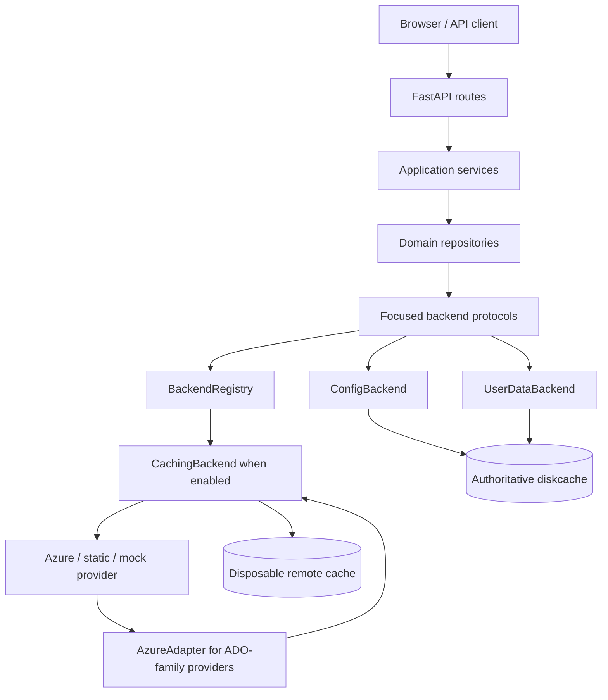

# System Architecture & Design: Backend Data

This document describes how PlannerTool moves data from the browser and REST
routes through repositories, backend protocols, providers, and storage. It is
the contributor mental model for changing backend data behavior safely.

## 1. Executive Summary & Mental Model

### High-Level Purpose

The backend data layer gives planning features one stable domain-facing API while
supporting live Azure DevOps data, deterministic fixtures, generated mock data,
local configuration, and user-owned scenarios and views. It also separates data
that can be re-fetched from data that must survive a cache purge.

### The Core Metaphor

Treat the subsystem as a **port-and-adapter pipeline with two ledgers**:

- repositories and protocols are the ports; concrete Azure, static, and mock
  implementations are replaceable adapters
- the authoritative ledger stores configuration, accounts, sessions, scenarios,
  views, events, and groups
- the remote ledger is a disposable read-through cache for provider data

The pipeline normalizes provider-specific records into domain objects before the
rest of the application sees them. The cache can return stale remote data during
an outage, but it must never be used as the system of record for user changes.

## 2. System Components & Boundary Map

### Directory & File Layout

```text
planner_lib/
  main.py                         dependency injection and app composition
  */api.py                        FastAPI routes and request/session boundary
  */service.py                    application orchestration and calculations
  repository/                     one repository per data domain
  backend/
    port.py                       focused runtime-checkable protocols
    registry.py                   active provider selection
    caching.py                    soft-freshness cache proxy
    adapter.py                    Azure-shaped data to domain translation
    azure.py                      live Azure DevOps adapter
    static.py                     read-only YAML/JSON domain-data adapter
    mock.py                       fixture and generated-data adapters
    config.py                     durable local configuration backend
    user_data.py                  durable scenarios, views, events, and groups
  domain/                         TypedDict domain contracts
  storage/                        StorageBackend and diskcache implementation
  services/container.py           DI keys and service container
  admin/reload_orchestrator.py    config reload and cache invalidation side effects
```

### Key Abstractions

| Component | Responsibility |
|---|---|
| `TaskRepository`, `HistoryRepository`, `PlanRepository`, `IterationRepository` | Translate application requests into remote protocol calls and return domain data. |
| `ProjectRepository`, `TeamRepository`, `PeopleRepository` | Read durable project, team, and people configuration. |
| `ScenarioRepository`, `ViewRepository` | Persist user-owned scenario and view data without a cache layer. |
| `TaskBackend`, `HistoryBackend`, `TeamsBackend`, `PlansBackend`, `IterationsBackend` | Focused remote-data ports. `BackendPort` composes these remote contracts. |
| `ConfigBackend` | Reads and writes configuration keys in authoritative diskcache storage. |
| `UserDataBackend` | Reads and writes scenarios, views, events, and groups in authoritative storage. |
| `BackendRegistry` | Selects one remote provider from ordered feature flags. |
| `CachingBackend` | Transparently caches `fetch_*` calls, tracks soft freshness, and patches cached task lists after writes. |
| `AzureAdapter` | Converts raw Azure-shaped work items into canonical `DomainTask` values. |
| `DiskCacheStorage` | Implements the `StorageBackend` abstraction over diskcache/SQLite. |
| `ReloadOrchestrator` | Applies admin configuration changes, rebuilds affected services, and invalidates remote data when required. |

The focused protocol inventory is:

| Protocol | Owner | Main operations |
|---|---|---|
| `TaskBackend` | Remote provider | `fetch_tasks`, `write_task`, `invalidate_cache` |
| `HistoryBackend` | Remote provider | `fetch_history` |
| `TeamsBackend` | Remote provider | `fetch_teams` |
| `PlansBackend` | Remote provider | `fetch_plans`, `fetch_markers` |
| `IterationsBackend` | Remote provider | `fetch_iterations` |
| `PeopleBackend`, `ProjectConfigBackend`, `TeamConfigBackend` | `ConfigBackend` | Local people, project, and team configuration reads |
| `IterationConfigBackend`, `PlanConfigBackend`, `AdoConfigBackend` | `ConfigBackend` | Iteration, area-plan, and ADO configuration reads/writes |
| `EventConfigBackend` | `ConfigBackend` | Event configuration reads/writes |
| `ScenarioBackend`, `ViewBackend`, `EventBackend` | `UserDataBackend` | Scenario, view, and event persistence |

`BackendPort` is the composite remote contract. `DiagnosticBackend` is an
optional capability implemented by backends that publish user-facing
diagnostics; it is not part of the remote data contract itself.

### Dependency-Injection Keys

`planner_lib/main.py` wires these names through the service container:

| Key | Implementation | Boundary |
|---|---|---|
| `backend` | Selected provider, optionally wrapped by `CachingBackend` | Remote work-item, history, team, plan, and iteration data |
| `config_backend` | `ConfigBackend` | Durable local configuration |
| `user_data_backend` | `UserDataBackend` | Durable scenarios, views, events, and groups |
| `storage` | `DiskCacheStorage` | Authoritative diskcache instance |
| `remote_cache_storage` | Lazily-created `DiskCacheStorage` | Disposable cache, created only when caching is enabled |

### Layer Map



The diagram shows logical ownership rather than every Python call. In
particular, `ConfigBackend` and `UserDataBackend` do not pass through
`CachingBackend`, while the selected remote provider does.

## 3. Data Flow & Integration Patterns

### Primary Execution Path: Read

1. The browser calls a domain REST route. The route validates session context,
   parses request parameters, and creates a credential when remote access needs
   one.
2. The route or application service asks a repository for a domain operation.
3. The repository depends on a protocol, never on a concrete provider class.
4. For remote data, the injected `backend` is either the selected provider or a
   `CachingBackend` wrapper. A fresh cache hit returns immediately.
5. On a cache miss, the provider fetches data. Azure-family providers normalize
   provider records and call `AzureAdapter.to_domain()` before returning;
   `StaticBackend` already contains domain records and skips the adapter.
6. The repository applies domain-level filtering or composition and returns
   `DomainTask`, history, team, plan, or iteration values to the service.
7. FastAPI serializes the result for the browser.

### Primary Execution Path: Writes and Reloads

| Data | Write path | Consistency behavior |
|---|---|---|
| Azure work items | `TaskRepository` -> `TaskBackend.write_task()` -> provider | `CachingBackend` delegates the write, then patches matching task entries in every cached task list. |
| Configuration | Admin route/service -> `ConfigBackend` | Diskcache is authoritative; reads observe the saved value immediately. |
| ADO configuration | Admin ADO save -> `ConfigBackend` -> `ReloadOrchestrator` | The orchestrator rebuilds the Azure service/provider and invalidates affected remote cache entries. |
| Generic server configuration | Admin system save -> authoritative `config::server_config` key -> reload | The saved diskcache value is the source for subsequent service construction. |
| Scenarios and views | Repository -> `UserDataBackend` | Direct durable reads and writes; no stale cache layer is inserted. |

### Provider Selection

`BackendRegistry` evaluates feature flags in this order; the first enabled
flag wins. `AzureDevOpsBackend` is the default when no mock/static flag is set.

| Priority | Provider | Flag | Data representation |
|---|---|---|---|
| 1 | `StaticBackend` | `use_static_backend` | Domain data loaded from YAML or JSON. |
| 2 | `MockGeneratorBackend` | `use_azure_mock_generator` | ADO-shaped/generated data translated by `AzureAdapter`. |
| 3 | `MockFixtureBackend` | `use_azure_mock` | ADO-shaped fixture data translated by `AzureAdapter`. |
| 4 | `AzureDevOpsBackend` | none | Live Azure DevOps data translated by `AzureAdapter`. |

### Cache Read Path

```text
CachingBackend.fetch_*
        |
        +-- fresh entry ----------------------> return cached domain data
        |
        +-- soft-expired entry --> remote refresh
        |                            |
        |                            +-- success/non-empty -> replace entry
        |                            +-- remote failure/empty -> keep stale entry
        |                                                       + queue diagnostic
        |
        +-- missing entry ----------> provider fetch -> store data + freshness sidecar
```

`CachingBackend` intercepts `fetch_*` methods through `__getattribute__`. Cache
keys combine the method name with a hash of arguments; credentials are excluded
from the key so the same remote result can be reused while authorization is
still required for a cold fetch. Data entries are saved without a hard
diskcache expiry. A `taskmeta__*` sidecar records `fresh_until` instead.

For the live remote backend, a failed or empty refresh preserves stale data and
queues a diagnostic. Local/static/mock providers do not receive the same outage
classification because they are not remote. An in-flight key guard prevents
duplicate refresh work for the same cache entry.

### State Management & Storage

`planner_lib.main._build_storages()` creates the authoritative `storage`
instance, normally backed by `data/cache`. When caching is enabled,
`_build_services()` lazily creates a separate `remote_cache_storage` instance
under `data/remote_cache`.

| Store | Contents | Operational meaning |
|---|---|---|
| `storage` | Accounts, sessions, server config, projects, teams, people, cost and iteration config, ADO config, scenarios, views, events, groups | Durable system of record. Never delete as a cache cleanup operation. |
| `remote_cache_storage` | Cached remote `fetch_*` results and freshness sidecars | Disposable. Clearing it forces provider reads but does not delete user work or configuration. |

Default cache freshness windows are configured by `cache.ttls` in
`config::server_config` and are measured in minutes. The current defaults are:

| Method | Default | Reason |
|---|---:|---|
| `fetch_tasks` | 30 minutes | Work-item state changes frequently. |
| `fetch_history` | 24 hours | History is comparatively stable/append-oriented. |
| `fetch_teams` | 4 hours | Membership changes less frequently than tasks. |
| `fetch_plans` | 4 hours | Plan metadata and markers are slower-moving. |
| `fetch_markers` | 2 hours | Sprint marker data needs a shorter window. |
| `fetch_iterations` | 8 hours | Iteration definitions are stable. |

`0` means no soft expiry until explicit invalidation. These are freshness
windows, not deletion deadlines: preserving stale rows is what allows an
outage-safe refresh.

### Side Effects

- A remote refresh failure queues backend diagnostics consumed by the API layer.
- A successful task write mutates the remote provider and patches matching
  cached task lists.
- Admin changes can trigger `ReloadOrchestrator` to rebuild the Azure service,
  update the active provider, and invalidate remote cache data.
- Explicit cache refresh/invalidation removes remote-cache entries; it must not
  touch authoritative storage.

## 4. Architectural Decisions & Trade-offs

### Observed Design Patterns

- **Hexagonal architecture / ports and adapters:** repositories depend on small
  protocols, allowing Azure, static, and mock providers to be swapped without
  changing application code.
- **Interface segregation:** each domain has a focused protocol rather than one
  broad backend interface. `PlanRepository` and `IterationRepository` may
  combine remote and local configuration ports when that is the domain contract.
- **Strategy plus registry:** `BackendRegistry` selects the provider strategy at
  startup/reload from feature flags.
- **Decorator/proxy:** `CachingBackend` preserves the inner backend protocol and
  adds caching without changing repository call sites. Runtime-checkable
  protocol checks continue to work for the protocols implemented by the inner
  backend.
- **Repository pattern:** repositories contain domain-facing orchestration and
  keep storage/provider details out of routes and services.
- **Soft-expiry cache:** freshness metadata is separate from physical storage
  expiry so remote outages do not turn useful stale data into a hard failure.

### Technical Debt & Trade-offs

- `CachingBackend` uses dynamic attribute interception, which reduces repeated
  wrapper code but makes new `fetch_*` methods implicitly cacheable. A new fetch
  method must therefore have sensible cache-key inputs and TTL behavior.
- Cache keys intentionally omit credentials. This improves reuse, but provider
  authorization must still be enforced on cold misses and writes; cached data
  must not be treated as proof that a credential is valid.
- Remote refresh can return stale data rather than an error. Callers must expose
  diagnostics where appropriate so users understand that the displayed data may
  be older than the configured freshness window.
- Diskcache/SQLite gives simple durable local storage and WAL/mmap performance,
  but it is a local-server storage choice, not a multi-node coordination system.
- Static data is already canonical while Azure-family providers need an adapter;
  contributors adding a provider must decide explicitly which representation it
  owns rather than applying the adapter twice.

## 5. Contributor Guide & Operational Hazards

### Extension Points

To add a new data domain:

1. Define a focused protocol in `planner_lib/backend/port.py`.
2. Implement that protocol in each provider/backend that owns the data.
3. Add a repository in `planner_lib/repository/` that depends only on the new
   protocol and any genuinely required companion protocol.
4. Register the dependency key/factory in `planner_lib/main.py` and expose it to
   the owning route or service.
5. Add focused tests for the repository, provider behavior, and DI wiring.

For a new remote provider, register it in `BackendRegistry`, define its feature
flag precedence, and return canonical domain objects. For an ADO-shaped source,
reuse `AzureAdapter`; for a source that already emits domain data, follow
`StaticBackend` and do not translate a second time.

### Known Sharp Edges

- Never put scenarios, views, configuration, accounts, or sessions in
  `remote_cache_storage`. It is intentionally disposable.
- Do not add a hard diskcache TTL to remote data. Physical expiry would remove
  the stale value needed for outage resilience.
- `write_task` always requires a credential even when a read can use warm cache
  data. Do not weaken this boundary.
- A cached task write patches cached lists but does not make every provider-side
  read globally transactional. Treat the provider write result as authoritative.
- Configuration changes are not complete until reload/invalidation side effects
  have run. Use `ReloadOrchestrator` rather than mutating an in-memory service
  alone.
- Iteration root paths are configuration-level values. The Azure backend owns
  construction of the project-prefixed ADO path; repositories must not duplicate
  that provider knowledge.
- `DomainTask` is the canonical contract above the backend adapter. Preserve its
  frontend-facing field names (`start`, `end`, `iterationPath`, `parentId`) when
  changing provider mappings.
- Warm cache reads are not a substitute for authorization. Cold remote reads and
  all remote writes still follow credential rules in `planner_lib/backend/port.py`.

### Testing Strategy

Run the backend-focused Python tests with the repository virtual environment
active:

```bash
source .venv/bin/activate
pytest
```

Useful focused coverage includes:

- repository tests using protocol fakes to verify calls and domain shaping
- adapter tests for raw ADO fields, inferred dates, relations, and capacity
- cache tests for miss, fresh hit, soft expiry, stale-on-failure, diagnostics,
  invalidation, and task-write patching
- provider tests for registry precedence and static/mock fixture formats
- integration tests for admin config save followed by reload and cache
  invalidation

The canonical domain contracts live in `planner_lib/domain/`; update or add
tests there when a public data shape changes. Avoid live Azure calls in unit
tests; use protocol fakes, static data, or mock providers.

## Data Schemas

### Raw ADO Dict

`AzureNativeClient` normalizes Azure field names before
`AzureAdapter.to_domain()` consumes them:

```text
{
  "id": int,
  "title": str,
  "type": str,
  "state": str,
  "startDate": str | None,
  "finishDate": str | None,
  "iterationPath": str | None,
  "parentId": str | None,
  "relations": List[{type, id, url}],
  "description": str | None,
  "assignee": str | None,
  "tags": str | None,
  "areaPath": str | None,
  "url": str | None
}
```

### DomainTask

`planner_lib/domain/tasks.py` defines the canonical `TypedDict` returned above
the adapter. Its required core fields are `id`, `title`, `type`, `state`, and
`project`; optional fields include `start`, `end`, `iterationPath`, `parentId`,
`relations`, `capacity`, `description`, `assignee`, `tags`, `areaPath`, and
`url`. `_inferred_start` and `_inferred_end` record dates inferred from an
iteration when explicit dates are absent.

`DomainRelation` contains `type`, `id`, and optional `url`.
`DomainCapacity` contains a team identifier and fractional `capacity` from 0 to
1. `WriteResult` contains `ok`, `updated`, and `errors`.

### History Contracts

`DomainHistoryEntry` contains `field`, `value`, `changed_at`, `changed_by`, and
optional `pair_id`. `DomainTaskHistory` contains `task_id`, `title`, `plan_id`,
and a list of history entries. See `planner_lib/domain/history.py` for the
single source of truth when fields change.

### Static Backend File Format

For `use_static_backend: true`, the YAML/JSON file maps `area_path` to a list of
canonical `DomainTask` values. Optional top-level keys provide `_teams`,
`_plans`, `_markers`, `_iterations`, `_history`, and `_people`. Static files are
served as-is, so malformed or provider-shaped records are a data/configuration
error rather than an adapter input.

### Credential Rules

- Remote `fetch_*` calls may omit credentials when a warm cache entry exists;
  a cold miss without credentials raises `PermissionError`.
- `write_task` always requires a credential.
- Configuration and user-data backends do not require credentials.
