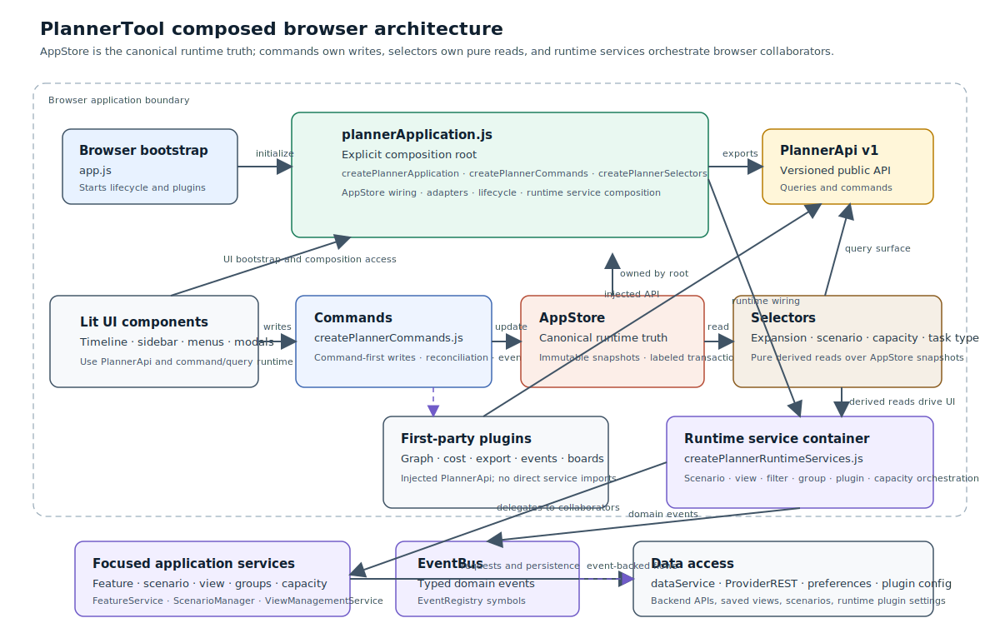
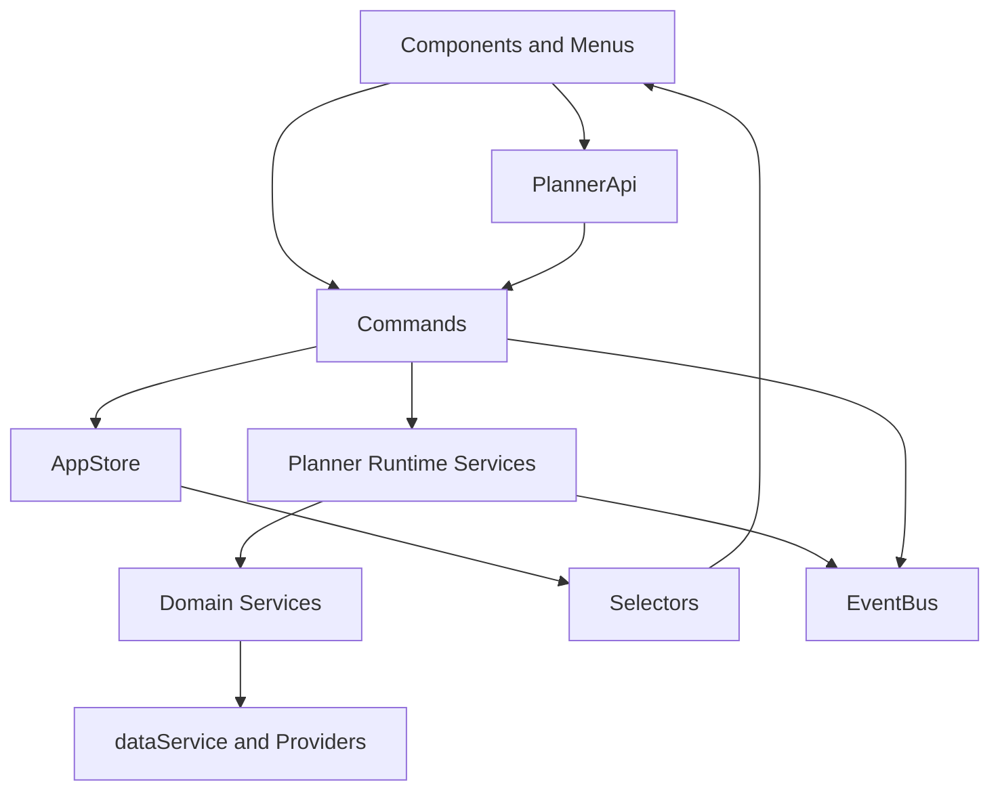

> **⚠️ SUPERSEDED DOCUMENT — DO NOT USE AS A CURRENT REFERENCE.**
>
> This file is the pre-refactor snapshot of [ARCHITECTURE.md](ARCHITECTURE.md), preserved for historical
> context only. It describes the application **before** the `State.js` → `AppStore` / commands / selectors /
> `PlannerApi` migration documented in [../memories/repo/code-reduction-plan.md](../memories/repo/code-reduction-plan.md)
> and before the plugin/component inventory below existed in its current form.
>
> Notably outdated claims in this file:
> - "State Management" section describes a single `State.js` god object — **this class was deleted**. State is
>   now owned by `AppStore` (immutable snapshots) and mutated only through `commands/createPlannerCommands.js`.
> - "No bundler; modules are loaded as-is" — the repo now uses **Vite** (`npm run build`) and **Rollup** for the
>   vendor bundle (`npm run build:vendor`).
> - Plugin/component/service lists and diagrams are incomplete relative to the current 13-plugin, 42-component,
>   23-service tree.
>
> Use [ARCHITECTURE.md](ARCHITECTURE.md) for the current, verified architecture and
> [ARCHITECTURE_ASSESSMENT.md](ARCHITECTURE_ASSESSMENT.md) for the best-in-class rating and code-reduction
> opportunities.

---

**PlannerTool Web Architecture**

Purpose: a concise overview of the architecture and module responsibilities for the web front-end under `www/js` and admin panel under `www-admin/js`. This document describes high-level architectural layers and how major subsystems fit together. It avoids line-level or function-level detail in favor of responsibilities and design principles.

**System Overview**
- **Tech stack:** ES modules, vanilla JavaScript with Lit for web components. No heavy client framework. Data access via pluggable providers (REST, local storage, mock).
- **Design principles:** layered separation of concerns (components, core orchestration, services, providers); small, testable, single-responsibility modules; typed event bus for decoupled communication; pluggable plugin and provider extension points.

**Layered Architecture: www/js (Main Application)**

1. **Presentation (components/):** Lit element components responsible for rendering UI and managing direct DOM interactions. Components stay thin: they emit domain events to the bus and consume state-change events. Examples: feature cards, timeline, sidebar controls, modals, graphs, dependency renderers. Lifecycle management (attach/detach listeners) is critical here.

2. **Core Orchestration (core/):** Provides infrastructure for cross-cutting concerns. Includes EventBus (typed event routing), EventRegistry (event type definitions), PluginManager (plugin lifecycle and loading), and the Plugin base class. Application dependency composition lives in `application/`, not in a service locator or DI container.

3. **Application (application/):** Contains explicit application composition, immutable store primitives, versioned plugin APIs, command modules, runtime snapshot helpers, and pure selectors. `plannerApplication.js` composes the browser application from `AppStore`, `createPlannerCommands`, `createPlannerSelectors`, and `createPlannerRuntimeServices`.

4. **Application Services (services/):** Encapsulates business logic, runtime collaborators, and domain computations. Includes baseline storage (BaselineStore), feature/scenario operations (FeatureService, ScenarioManager, ScenarioEventService, ScenarioGroupService), filtering (ProjectTeamService, StateFilterService), capacity calculation/co-ordination (CapacityCalculator, CapacityCoordinator, PluginCostCalculator), and utility services (ColorService, IconService, ConfigService, ViewService). Services own narrow responsibilities and numeric calculation code does not emit capacity events.

5. **Data Access Layer (providers + dataService):** Abstract persistence and remote data. Includes ProviderREST (HTTP), preferences storage, and DataInitService. The dataService adapter wires the active provider so services and components use a single interface regardless of backend.

6. **Plugins (plugins/):** Optional, loadable modules for extensibility. Plugins declare metadata (id, dependencies, mount point) in modules.config.json and have optional schema definitions in .schema.json files. Current plugins include markers, cost analysis, and export functionality. PluginManager injects the versioned `PlannerApi` into plugin instances; first-party plugins use this API rather than importing State. Runtime configuration is managed separately via the admin panel and merged with static metadata at app startup.

7. **Utilities & Helpers (tour/, vendor/, and standalone files):** Reusable helpers like board-utils.js (layout/render helpers), dragManager.js (drag-and-drop), util.js (date/geometry math), viewOptions.js (UI state), and modalHelpers.js (modal management). vendor/ holds third-party libraries (e.g., Lit).

**Layered Architecture: www-admin/js (Admin Panel)**

1. **Admin Components (components/):** Lit elements for admin-specific UI. AdminApp.lit.js is the main container. Subdirectory admin/ houses feature-specific components (System, Users, Projects, Teams, Cost, AreaMappings, Iterations). Admin components follow the same patterns as main-app components.

2. **Admin Services (services/):** REST provider for admin data operations. Simpler than main-app services; focuses on CRUD and admin-specific queries.

3. **Entry Point (admin.js):** Bootstrap that initializes dataService, checks admin authorization, and mounts the admin app.

**Key Patterns & Design Decisions**

- **Event-Driven Communication:** The EventBus provides typed, symbol-based events (defined in EventRegistry) for decoupled module interaction. Components and services subscribe/unsubscribe in lifecycle methods (connectedCallback/disconnectedCallback or equivalent) to avoid memory leaks.

- **Immutable State & Derived Computation:** `application/AppStore.js` is the canonical mutable runtime truth exposed through immutable snapshots and labeled transactions. Pure selectors derive expansion, scenario, capacity, and task-type data; CapacityCalculator is a pure numeric service and CapacityCoordinator owns its input policy.

- **Service APIs:** Services expose imperative methods to modify state and emit events when state changes. Consumers call service methods rather than mutating state directly. This maintains a single source of truth and enables undo/redo and scenario management.

- **Plugin Extension & Configuration:** Plugins declare static metadata (id, path, export, dependencies, enabled, mountPoint) in modules.config.json. Each plugin has an optional .schema.json file defining configuration schema and defaults. PluginManager loads and activates plugins declaratively, merging runtime-managed config (enabled, activated, custom_config) with static metadata. Runtime configuration is managed via admin panel REST endpoints and persisted per-deployment. Plugins hook into the event bus, access runtime config via constructor parameters, and must clean up on deactivation.

- **Provider Abstraction:** Services call dataService, which delegates to an active provider (ProviderREST, ProviderLocalStorage, or ProviderMock). This allows seamless backend swapping and offline-first fallback without changing service code.

**Component Design Principles**

- Keep components focused on render and direct interactions (pointer, keyboard).
- Extract business logic to services or utility functions for testability.
- Use reactive properties for inputs; manage local UI state sparingly.
- Always unsubscribe from events and observers in disconnectedCallback to prevent leaks.
- Emit domain events (not DOM events) to the bus for cross-component communication.
- Use Shadow DOM for encapsulation but coordinate layout and theming via CSS custom properties.

**State Management Architecture**

The browser starts through `application/plannerApplication.js`, the explicit composition root. It wires together `createPlannerApplication`, `createPlannerRuntimeServices`, `createPlannerCommands`, `createPlannerSelectors`, and `createPlannerApi`. The runtime service container exposes narrow imperative collaborators for UI and plugins, while AppStore remains the sole canonical runtime truth.

- AppStore owns canonical runtime state and is mutated only through command transactions.
- `createPlannerCommands` owns mutation orchestration, command-first sync policy, and runtime reconciliation.
- `createPlannerSelectors` owns pure derived reads for expansion, scenario, iteration, feature, and capacity state.
- `createPlannerRuntimeServices` composes scenario, view, group, capacity, filter, and plugin collaborators behind narrow ports for browser consumers.
- ViewManagementService receives a narrow view-state port rather than a monolithic runtime object.
- PluginManager injects `PlannerApi` version 1. Plugins and first-party UI consume this API instead of importing service implementations.

**Runtime Invariants (Migration Guardrails)**

- AppStore is the only canonical mutable runtime truth; no second mutable runtime owner may be introduced.
- Runtime state writes must occur through commands/transaction labels (`AppStore.update(...)`); UI/components and services must not mutate AppStore snapshots directly.
- Selectors remain pure derivations with no side effects and no in-place writes.
- Services may compute and perform IO, but they must not directly mutate canonical AppStore state.

**Plugin Configuration Management**

The plugin system uses a two-tier configuration model separating static metadata from runtime configuration:

- **Static Metadata (modules.config.json):** Immutable, deployment-wide plugin registry. Defines id, path, export, dependencies, default enabled/activated states, and mount points. Deployed with the application code.

- **Schema Definitions (plugins/*.schema.json):** Optional per-plugin JSON Schema defining configuration constraints (type, required fields, min/max values, patterns, enums). Used by admin UI for form field rendering and validation. Each schema includes both constraint metadata and default values for custom_config.

- **Runtime Configuration (backend: plugin_runtime_config):** Mutable, per-deployment plugin settings including enabled, activated, order, and plugin-specific custom_config. Stored in backend persistent config (via admin_service). Managed by admin panel (REST endpoints: POST/GET /admin/v1/plugins-config) and loaded by client app at startup.

- **Configuration Merge (www/js/core/pluginConfigMerge.js):** At app startup, client fetches runtime config from /api/plugins/config and merges with modules.config.json via mergePluginConfig(). Runtime order is authoritative when provided; metadata defaults apply when not overridden. Unknown plugin IDs in runtime config are skipped with a warning, and missing metadata plugins are appended with metadata defaults.

- **Schema Discovery:** Admin panel discovers plugin schemas via per-plugin .schema.json files using pluginSchemaRegistry. User app loads all schemas at startup via /api/plugins/schemas endpoint. Schema-driven form UI in admin panel uses schema.properties to render typed input fields (text, number, boolean, select, JSON) with real-time validation. Config button only appears for plugins with non-empty schema.properties.

- **Safeguards:** Validation ensures at most one activated plugin, enabled=false forces activated=false, duplicate IDs are rejected, and all custom_config values are objects (no deep schema validation—delegated to frontend forms). Backend returns errors for unknown plugin IDs; client silently skips them to allow safe deployment of subset of plugins.

**Testing Strategy**

- **Unit tests:** Focus on services and domain logic (ScenarioManager, FeatureService, ProjectTeamService, CapacityCalculator). Keep these isolated, fast, and deterministic.
- **Component tests:** Use a headless test runner (configured in package.json) to render components, assert DOM and attributes, and verify event emission. Mock bus and state to isolate components.
- **Integration tests:** Exercise dataService + provider + state wiring to verify end-to-end flows.
- **E2E tests:** Use Playwright for smoke and user-flow tests (load baseline, open details, create/save scenarios, drag/resize).
- **Coverage goals:** aim for 80% statements in service code; prioritize high branch coverage for critical paths.

**Development Guidelines**

- **Adding a component:** Create under components/, export as a Lit element, register custom element, add unit + component tests in tests/.
- **Adding a service:** Implement under services/, inject dependencies (bus, state, other services), add unit tests. Follow the service API pattern: imperative methods + event emission.
- **Adding a plugin:** Create under plugins/, implement the Plugin interface (init, activate, deactivate, destroy), add metadata to modules.config.json, create a .schema.json file with configuration schema (optional but recommended), ensure clean activation/deactivation. If the plugin supports runtime configuration, accept custom_config in constructor and validate against schema.
- **Adding a provider:** Implement the provider interface (matching existing ProviderREST, ProviderLocalStorage), integrate via dataService.
- **Event naming:** Use EventRegistry constants; prefer domain-namespaced events (e.g., FeatureEvents.UPDATED, ScenarioEvents.SAVED, UIEvents.DETAILS_SHOW).

**Code Organization Rules**

- core/: infrastructure and wiring only (EventBus, registries, plugin lifecycle). No business logic.
- services/: business logic, state management, domain computations. No component rendering or DOM.
- components/: UI rendering and interactions. Delegate complex logic to services.
- plugins/: optional extensions; must be reversible (clean up on deactivate).
- providers/: data access adapters; maintain a consistent interface for dataService.
- Utilities: pure functions and helpers; no side-effects where possible.

**Maintenance & Scalability**

- **Keep APIs stable:** service methods, event names, and provider interfaces are module boundaries; changes ripple widely. Deprecate gradually.
- **Avoid circular dependencies:** core → services → (components, providers); components may depend on core and services but not vice versa.
- **Use feature flags (config.js):** gate breaking changes during migrations; remove progressively.
- **Document non-obvious logic:** use comments to explain invariants, magic numbers, and complex algorithms. JSDoc for public APIs.
- **Refactor regularly:** extract long methods into smaller services, consolidate duplicated patterns, remove dead code.

**Deployment & Configuration**

- **www/js/config.js:** feature flags and runtime configuration.
- **www/js/modules.config.json:** static plugin metadata (id, path, export, dependencies, enabled, mountPoint).
- **www/js/plugins/*.schema.json:** plugin configuration schema and defaults (optional per-plugin metadata for runtime config UI).
- **Backend plugin_runtime_config:** runtime-managed plugin settings (enabled, activated, custom_config, order) persisted per-deployment. Admin panel provides REST endpoints for CRUD. Merged with static metadata at app startup.
- **Environment:** Node.js v16+ for tests; tests run via npm scripts in package.json. Python tests in requirements-dev.txt for backend.
- **Build:** No bundler; modules are loaded as-is by the browser. Libraries in vendor/ or via CDN.

**Known Limitations & Future Improvements**

- Provider interface could be more strongly typed (e.g., TypeScript or JSDoc @typedef).
- Scenario management logic (in ScenarioManager and the runtime service container) is still dense and could be split further.
- Some legacy DOM wiring remains; full migration to Lit components is ongoing.
- Feature flag cleanup: old flags should be removed as migrations complete.
