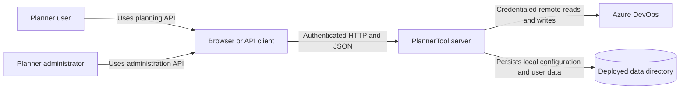
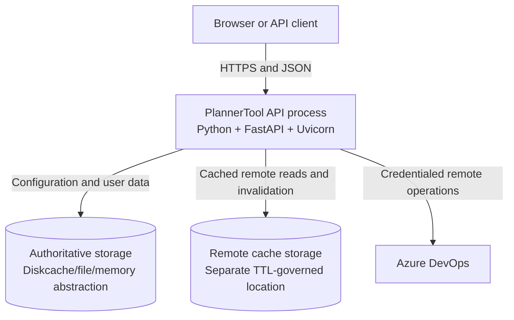
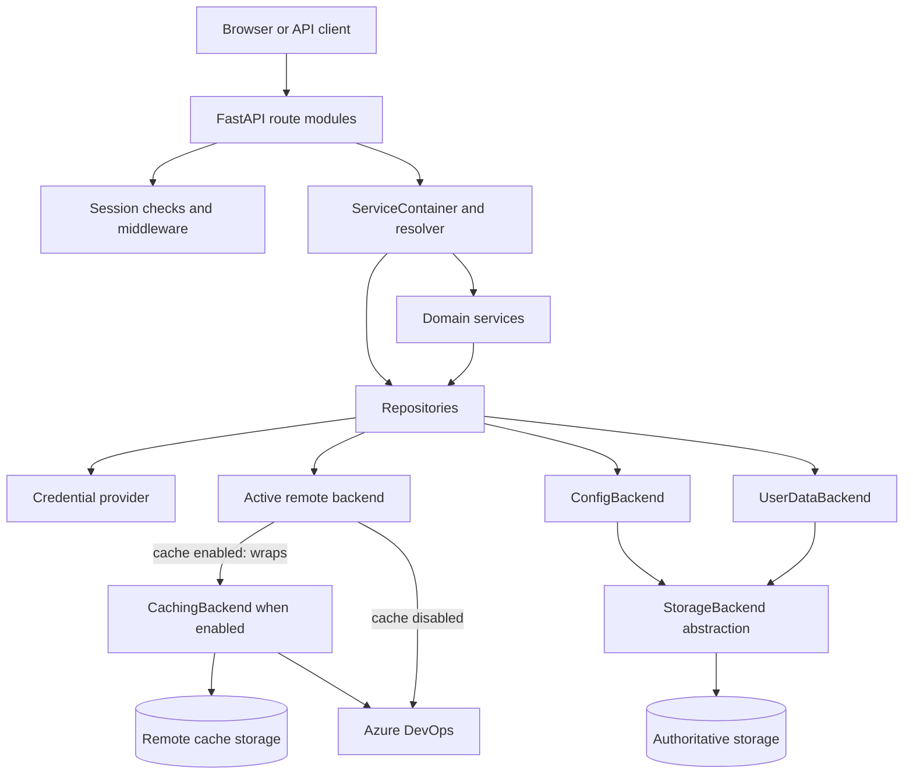
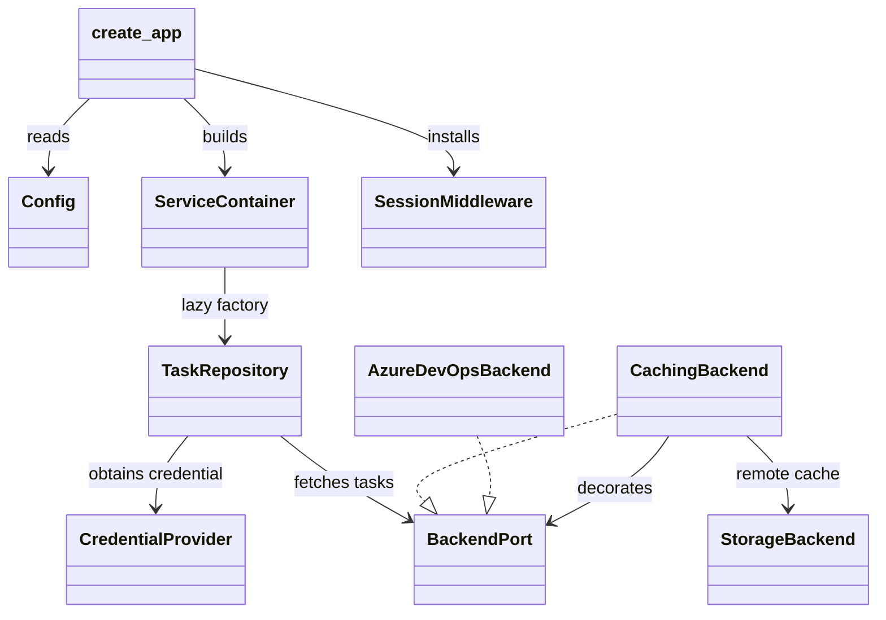
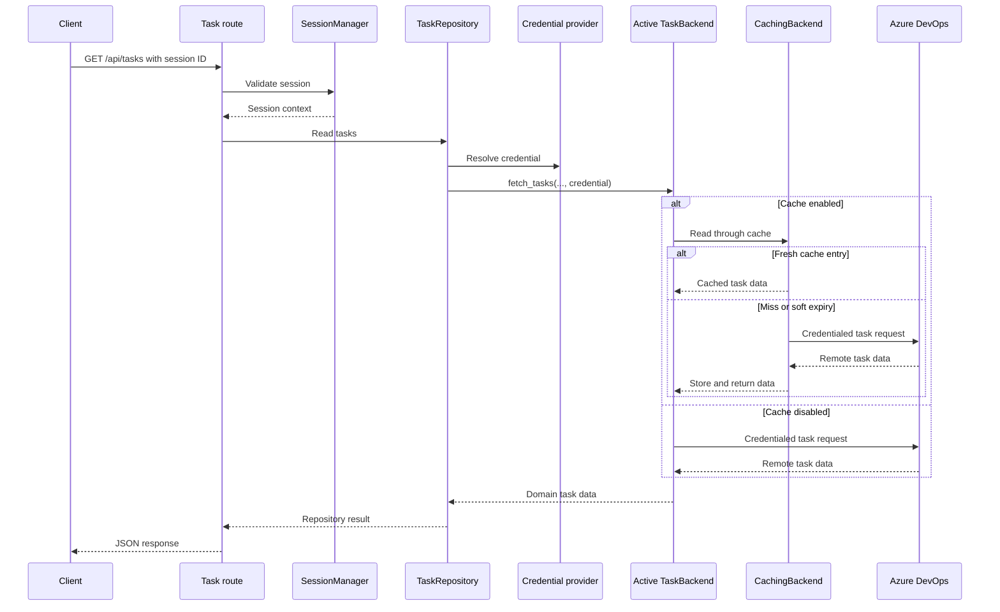

# System Architecture & Design: PlannerTool Server

This document describes the Python backend in `planner_lib` and its Uvicorn entry point in `planner.py`. It uses the C4 vocabulary: System Context, Container, Component, and Code. Here, a Container is a runnable process or persistence boundary, not the Python dependency-injection container.

## 1. Executive Summary & Mental Model

### High-Level Purpose

PlannerTool is an authenticated planning service. It combines locally managed configuration and user-owned planning data with task, history, team, plan, and iteration data from Azure DevOps or a compatible backend. The HTTP API also exposes administration, cost, capacity, cache, event, group, and health operations.

### Core Metaphor

The server is a ports-and-adapters pipeline with two kinds of state: authoritative local state and disposable remote-read cache state. Routes resolve repositories and services through explicit dependency injection. Repositories call focused backend protocols; the active remote adapter can be selected by feature flag and optionally decorated with a TTL cache.

The browser owns interactive editing state. The server owns durable configuration, user data, remote reads, credentials, and the HTTP contract.

### People and External Systems

| Element | Type | Description |
|---|---|---|
| Planner user | Person | Reads planning data and manages user-owned scenarios, views, events, and groups. |
| Planner administrator | Person | Configures projects, teams, Azure connectivity, feature flags, users, backups, and server behavior. |
| Browser or API client | External system | Sends authenticated requests; it may be the web client, automation, or another service. |
| Azure DevOps | External system | Supplies work items, revision history, teams, plans, markers, and iterations, and accepts supported writes and event operations. |
| Deployed data directory | External data store | Holds authoritative storage and the separate remote-cache location. |

### System Context



## 2. System Components & Boundary Map

### Directory and File Layout

```text
planner.py                         Uvicorn zero-argument factory
planner_lib/main.py                application composition and router setup
planner_lib/middleware/            sessions, access control, compression
planner_lib/services/              DI container and domain orchestration
planner_lib/repository/            application-facing repository boundaries
planner_lib/backend/               protocols, adapters, registry, cache proxy
planner_lib/storage/                namespaced persistence abstraction
planner_lib/*/api.py                FastAPI route modules
tests/                             unit and integration tests
```

### Runtime Containers

| Container | Technology | Responsibility |
|---|---|---|
| API process | Python, FastAPI, Uvicorn | Builds the application, authenticates requests, resolves services, runs routes, and shapes responses. |
| Authoritative storage | `StorageBackend`, diskcache by default | Stores configuration, accounts, scenarios, views, events, groups, and other durable application data. |
| Remote cache storage | Separate `StorageBackend` location | Stores TTL-governed remote `fetch_*` results when caching is enabled. It is disposable. |
| Azure DevOps | External SaaS | Supplies and accepts supported remote planning operations. |

`Config` selects the data directory, storage implementation, serializer,
compression settings, and static asset directory. `DiskCacheStorage` is the
default; `FileStorageBackend` and `MemoryStorage` are useful for alternate
deployments and tests. Serializer composition supports raw, YAML, JSON, and
encrypted values where configured.

### Container Diagram



### Component Map



### Component Catalogue

#### API routes and middleware

Routers under `planner_lib/*/api.py` parse HTTP input, resolve a repository or
service, and format the response. They cover session, configuration, projects,
scenarios, views, cost, server, administration, events, groups, and Azure
endpoints. Routes do not implement persistence or provider-specific
orchestration.

`SessionMiddleware` converts the internal response header into the `sessionId`
cookie. `require_session` and `require_admin_session` enforce route-specific
access. Optional Brotli and always-on GZip middleware compress responses, while
the global exception handlers shape 401, 404, and JSON error responses.

#### ServiceContainer and resolver

`planner_lib.services.container.ServiceContainer` registers singletons and lazy
factories. Factories are evaluated once and cached. `resolve_service(request,
key)` resolves through `request.app.state.container`, keeping route modules
independent from construction details.

#### Domain repositories

| Component | Main responsibility |
|---|---|
| `TaskRepository` | Work-item reads, writes, project scoping, and credential use |
| `HistoryRepository` | Work-item revision history |
| `ProjectRepository` / `TeamRepository` | Configured projects and teams |
| `PeopleRepository` | Configured people and team members |
| `PlanRepository` / `IterationRepository` | Plans, markers, and iterations |
| `ScenarioRepository` / `ViewRepository` | User-scoped scenarios and views |
| `EventRepository` / `GroupRepository` | Plan-scoped events and task groups |

Repositories depend on focused protocols or local configuration backends, not
on route handlers.

#### Domain services

- `AccountManager` validates and persists account records.
- `SessionManager` tracks active sessions in a thread-safe process-local map and
  loads account credentials during session creation.
- `CapacityService` calculates capacity from configured team data.
- `AzureProjectMetadataService` obtains project metadata.
- `CostService` coordinates calculations across people, projects, teams, and
  storage.
- `AdminService` handles privileged configuration, account, cache, backup, and
  reload operations.
- `CacheCoordinator` coordinates invalidation and reload behavior.
- `HealthConfig` supports server health and status behavior.

#### Backend adapters and contracts

`planner_lib/backend/port.py` defines focused protocols: `TaskBackend`,
`HistoryBackend`, `TeamsBackend`, `PlansBackend`, `IterationsBackend`,
`PeopleBackend`, project/team/iteration/plan configuration backends,
scenario/view backends, and event backends. `BackendPort` is the composite
remote-data contract and deliberately excludes local people/configuration data.

Remote operations receive a `BackendCredential` containing an opaque token and
session user ID. Cache-satisfied reads may not need a credential; local config
and user-data operations never require one. Azure SDK lifecycle and calls stay
behind the backend/Azure adapter boundary.

#### Storage abstraction

`planner_lib.storage` provides namespaced `save`, `load`, `delete`, `list_keys`,
and existence operations. Diskcache is the default durable implementation;
file and memory implementations are available for alternate deployments and
tests. Serializer composition supports raw, YAML, JSON, and encrypted values
where configured.

### Key Abstractions

- `create_app` in `planner_lib/main.py` composes storage, lazy services,
  middleware, exception handlers, and routers in three phases.
- `ServiceContainer` registers explicit singletons and lazy factories. A
  factory is evaluated once and its result is cached.
- `StorageBackend` provides namespaced persistence operations.
- `ConfigBackend` owns shared local configuration. `UserDataBackend` owns
  mutable scenarios, views, and local events. Neither is a remote-read cache.
- Focused protocols in `planner_lib/backend/port.py` describe task, history,
  teams, plans, iterations, configuration, user-data, event, and group
  capabilities. `BackendPort` is the composite remote-data contract.
- `registry.py` selects `StaticBackend`, `MockGeneratorBackend`,
  `MockFixtureBackend`, or the default `AzureDevOpsBackend`, in priority order.
- `CachingBackend` decorates the selected backend with per-method soft TTLs,
  persistent remote-cache entries, invalidation, and background refresh.
- Repositories translate backend capabilities into application operations.
- `SessionManager` keeps active session context in a process-local,
  thread-safe map and obtains account credentials during session creation.

### Code-Level Construction Diagram

The Code level is limited to the application-factory path and one representative
authenticated task request. These are the primary construction and request-flow
anchors:



Representative ownership is `Config` and `create_app` in
`planner_lib/main.py`, `ServiceContainer` in
`planner_lib/services/container.py`, session access in
`planner_lib/middleware/session.py`, task operations in
`planner_lib/repository/task_repository.py`, backend selection in
`planner_lib/backend/registry.py`, caching in
`planner_lib/backend/caching.py`, Azure access in
`planner_lib/backend/azure.py`, and persistence through
`planner_lib/storage/base.py`.

## 3. Data Flow & Integration Patterns

### Application Startup

1. `planner.py:make_app` calls `create_app(Config())` for Uvicorn.
2. `_build_storages` creates the authoritative storage instance.
3. `create_app` ensures a default `server_config` exists and reads feature flags.
4. `_build_services` registers storage, config/user-data backends, account and
   session services, backend/repository factories, domain services, and cache
   coordination.
5. `_build_app` creates FastAPI, installs session and compression middleware,
   registers exception handlers, mounts static assets, and includes API routers.
6. Factories resolve dependencies on first use; there is no import-time global
   application instance.

### Authenticated Task Request



Authentication is explicit and route-specific. `SessionMiddleware` mainly
converts the internal response header into the `sessionId` cookie; validation
is performed by `require_session` or `get_session_id_from_request`.

### Error Handling

FastAPI handles request-model validation. Missing or invalid sessions produce
HTTP 401 responses, with browser clients receiving the access-denied response
and JSON clients receiving an error payload. Domain and storage operations use
explicit exceptions such as `KeyError`, `ValueError`, and backend-specific
errors; route handlers translate expected failures into HTTP responses.
Unexpected failures are not converted into empty data. They remain visible
through error responses and logging.

The root route serves `static_dir/index.html`, injects the deployment
`root_path` into a `<base>` element, redirects non-trailing-slash requests, and
mounts the built frontend at `/static`.

### State Management and Side Effects

- Authoritative storage is the source of truth for config, accounts, and
  user-owned data. Namespaces prevent unrelated domains from sharing keys.
- `remote_cache_storage` is a separate diskcache location and may be cleared
  without deleting configuration, accounts, scenarios, or views.
- `CachingBackend` filters credentials out of cache-key material, stores
  freshness metadata separately, and may schedule background refreshes.
- Remote writes such as task updates go through the active backend and trigger
  targeted cache updates or invalidation where supported.
- `CacheCoordinator` coordinates invalidation and reload behavior; no external
  queue is required by the core request path.

## 4. Architectural Decisions & Trade-offs

### Observed Design Patterns

- **Ports and adapters:** focused protocols isolate repositories from Azure SDK
  details and allow live, mock, fixture, and static implementations.
- **Strategy and registry:** feature flags select one backend from a priority-
  ordered registry without changing repository code.
- **Decorator/proxy:** `CachingBackend` adds read caching around a compatible
  backend while preserving its capability surface.
- **Dependency injection:** lazy factories avoid import-time application state
  and make isolated app construction possible in tests.
- **Repository boundary:** routes do not touch storage directly; repositories
  map domain operations and credential requirements.

### Technical Debt and Trade-offs

- Sessions are process-local. Restarting the process invalidates sessions, and
  multiple API instances cannot share them without shared session storage.
- Some synchronous storage and Azure SDK operations run inside the web process.
- Cache freshness is configuration-driven and intentionally soft: remote data
  can be stale during background refresh or transient upstream failure.
- Cache keys exclude credentials so shared remote results can be reused across
  sessions; authorization must be enforced by the backend contract.
- Error payloads are not standardized across every route family.
- `rebuild_backend_instance` mutates an existing instance's class and
  dictionary, so reload behavior must preserve compatible state shape.

## 5. Contributor Guide & Operational Hazards

### Extension Points

To add a remote backend:

1. Implement the required focused protocols in `planner_lib/backend/port.py`.
2. Add `FEATURE_FLAG`, `config_schema()`, and `build_from_flags()` to the
   backend class.
3. Register it in `_priority_backends()` in
   `planner_lib/backend/registry.py` at the intended priority.
4. Add backend and repository tests using a non-network fixture.

To add a local domain, add a focused protocol and implementation to
`ConfigBackend` for shared configuration or to `UserDataBackend` for mutable
user-owned data. Then add its repository, register the factory in
`_build_services`, add the route, and apply explicit session/admin protection.

Do not wrap `UserDataBackend` in `CachingBackend`: its writes must be visible
immediately. Do not place disposable remote cache entries in authoritative
storage.

### Known Sharp Edges

- Deleting `remote_cache` is safe; deleting authoritative storage removes
  application data.
- A cache miss may require a valid `BackendCredential`; a cached response may
  not. Test both paths explicitly.
- `SessionManager` is thread-safe within one process but is not distributed and
  does not persist session state.
- Backend selection is first-match-wins. Registry order determines precedence.
- Do not convert unexpected backend or storage failures into empty data; keep
  explicit errors observable to the API and logs.

### Testing Strategy

Run the Python suite with `pytest` and the JavaScript suite with `npm test`.
Backend and repository unit tests should use `MemoryStorage`, mock backends,
and explicit credential/session fixtures; they should not call Azure DevOps.
Route tests should construct isolated FastAPI apps through `create_app` and
exercise both authenticated and unauthenticated paths. Integration tests should
verify router registration, lazy dependency wiring, cache enablement, and the
separation between authoritative and remote-cache storage.

## Deployment and Current Limitations

- `planner.py:make_app` is the zero-argument Uvicorn factory.
- Run locally with `uvicorn planner:make_app --factory --reload --port 8001`.
- Build the frontend bundle before serving the configured static directory.
- `SessionManager` is process-local; multiple API instances need shared session
  storage to share sessions reliably.
- Diskcache persistence and cache invalidation/TTL behavior are configuration-
  driven.
- Some Azure SDK and storage operations are synchronous inside the web app.
- Error payloads are not standardized across every route family.
