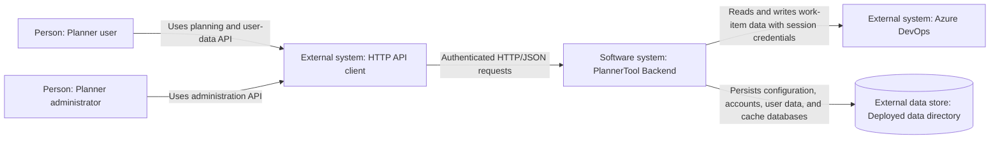
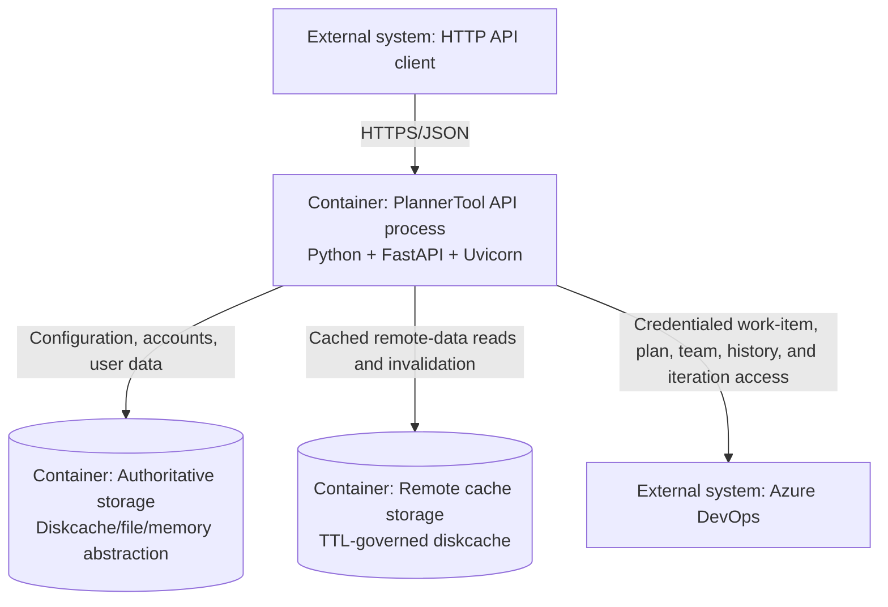
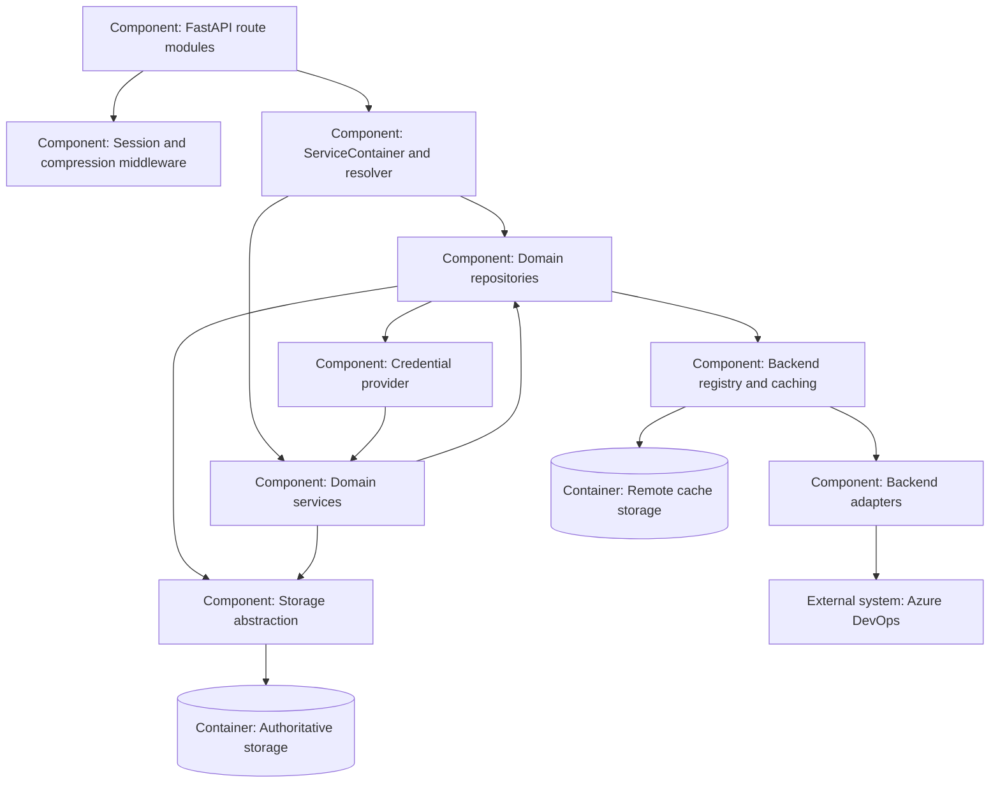
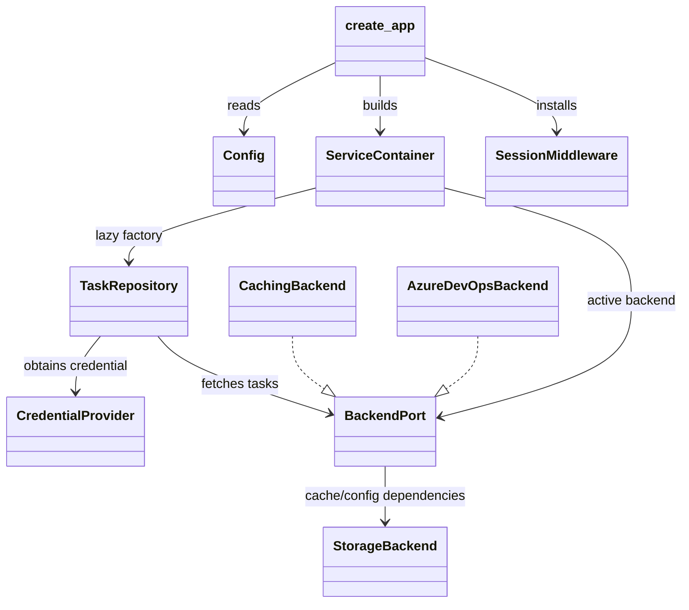
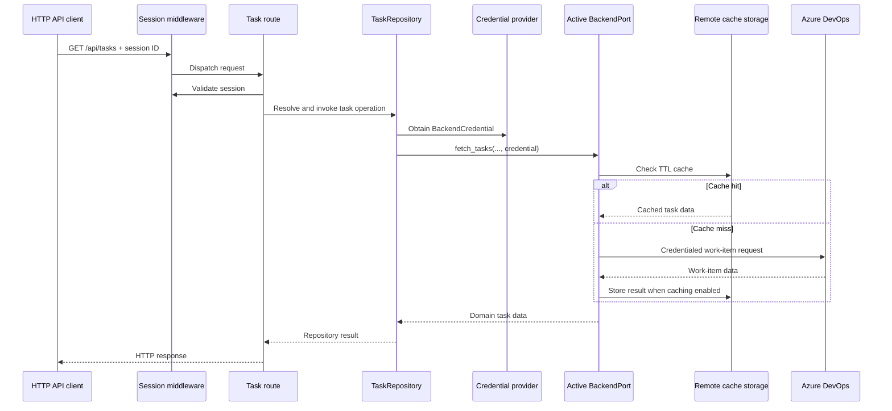

# PlannerTool Backend Architecture: C4 Model

This document applies the [C4 model](https://c4model.com/) to the Python
backend in `planner_lib`. It describes the server as a software system, its
runtime containers and data stores, its Python components, and selected code
relationships. Client-side application code and browser rendering are outside
this document.

C4 uses four hierarchical levels: **System Context**, **Container**,
**Component**, and **Code**. In this document, **Container** means a runnable
application or data store. It does not mean the Python `ServiceContainer`,
which is a dependency-injection component described at Level 3.

## Level 1: System Context

### System

**PlannerTool Backend** is an authenticated HTTP service for planning data. It
serves configuration and planning resources, coordinates Azure DevOps reads and
writes, persists user-owned planning data, and exposes administration and
health endpoints.

### People and external systems

| Element | Type | Description |
|---|---|---|
| Planner user | Person | Uses the HTTP API to read planning data and manage user-owned scenarios, views, events, and groups. |
| Planner administrator | Person | Configures projects, teams, Azure connectivity, feature flags, users, backups, and backend behavior. |
| Azure DevOps | External software system | Supplies work items, revision history, teams, plans, markers, and iterations; accepts supported work-item and event operations. |
| Deployed data directory | External data store | Holds the diskcache databases and other configured persistent data used by the backend. |
| HTTP API client | External software system | Sends authenticated HTTP requests to the backend. It may be a web client, automation, or another service; its implementation is outside this document. |

### Context diagram



## Level 2: Container Diagram

The deployed backend is a Python/Uvicorn process plus two logical persistent
data stores. The stores are separate diskcache locations so TTL-governed remote
cache entries can be deleted without deleting authoritative data.

| Container | Technology | Responsibility |
|---|---|---|
| PlannerTool API process | Python, FastAPI, Uvicorn | Handles HTTP requests, authentication, routing, domain orchestration, backend selection, and response/error handling. Created by `planner_lib.main.create_app`. |
| Authoritative storage | Diskcache by default; file or memory backends are supported | Stores server configuration, accounts, user data, and other durable application records. |
| Remote cache storage | Separate diskcache location | Stores TTL-governed results from Azure, static, or mock remote-data backends when caching is enabled. |
| Azure DevOps | External SaaS system | Remote source and destination for Azure-backed planning data. |

`Config` selects `data_dir`, `storage_backend`, `raw_serializer`, compression,
and the deployed asset directory. The root HTTP route may serve configured
deployment assets, but those assets are not part of the backend model here.

### Container diagram



### Container responsibilities

#### PlannerTool API process

`planner_lib.main.create_app(config)` constructs this container in three
phases:

1. `_build_storages` creates authoritative storage.
2. `_build_services` registers lazy service and repository factories.
3. `_build_app` creates FastAPI, installs middleware and exception handlers,
   and includes the routers.

The process has no import-time global application instance. `planner.py:make_app`
is the zero-argument Uvicorn factory.

#### Authoritative storage

`planner_lib.storage.create_storage` provides the storage abstraction. Runtime
roles are exposed through:

- `storage` for authoritative records;
- `config_backend` for shared server, project, team, people, plan, iteration,
  and Azure configuration;
- `user_data_backend` for scenarios, views, and local event data.

The default is raw `DiskCacheStorage`. `FileStorageBackend` and `MemoryStorage`
are available for alternate deployments and tests. Serializers support raw,
YAML, JSON, and encrypted values when composed with a compatible storage
backend.

#### Remote cache storage

`remote_cache_storage` is a separate storage instance used by `CachingBackend`.
It holds TTL-governed fetch results and can be discarded independently of
configuration, accounts, sessions, and user data. Cache behavior is selected by
the `enable_cache` feature flag and configured TTL values.

## Level 3: Component Diagram

The following components are inside the **PlannerTool API process** container.
The Python `ServiceContainer` is shown as a component, not as a C4 container.



### Component catalogue

#### API route modules

FastAPI routers in `planner_lib/*/api.py` parse HTTP input, resolve a
repository or service, and format the response. They cover session,
configuration, projects, scenarios, views, cost, server, administration,
events, groups, and Azure endpoints. Routes do not directly implement storage
or provider-specific orchestration.

#### Session and compression middleware

`planner_lib.middleware` provides `SessionMiddleware`, `require_session`,
`require_admin_session`, optional Brotli compression, GZip registration, and
access-denied/error response handling. Authentication is route-specific:
session creation and setup are public entry points; protected domain and admin
routes apply explicit decorators.

#### ServiceContainer and resolver

`planner_lib.services.container.ServiceContainer` registers singletons and lazy
factories. Factories are evaluated once and cached. `resolve_service(request,
key)` resolves a service through `request.app.state.container`, keeping route
modules independent from construction details.

#### Domain repositories

Repositories provide the application-facing data boundary:

| Component | Main responsibility |
|---|---|
| `TaskRepository` | Work-item reads and writes |
| `HistoryRepository` | Work-item revision history |
| `ProjectRepository` / `TeamRepository` | Configured projects and teams |
| `PeopleRepository` | Configured people/team members |
| `PlanRepository` / `IterationRepository` | Plans, markers, and iterations |
| `ScenarioRepository` / `ViewRepository` | User-scoped scenarios and views |
| `EventRepository` / `GroupRepository` | Plan-scoped events and task groups |

Repositories depend on focused protocols or local configuration backends, not
on route handlers.

#### Domain services

- `AccountManager` validates and persists account records.
- `SessionManager` tracks active sessions in a thread-safe process-local map
  and loads account credentials during session creation.
- `CapacityService` calculates capacity from configured team data.
- `AzureProjectMetadataService` obtains project metadata.
- `CostService` coordinates cost calculations across people, projects, teams,
  and storage.
- `AdminService` handles privileged configuration, account, cache, backup,
  and reload operations.
- `CacheCoordinator` coordinates invalidation/reload behavior.
- `HealthConfig` supports server health/status behavior.

#### Backend registry and caching

`planner_lib.backend.registry` selects the active backend by feature flags. Its
priority order is `StaticBackend`, `MockGeneratorBackend`,
`MockFixtureBackend`, then the default `AzureDevOpsBackend`. `CachingBackend` is
composed around the selected backend when caching is enabled.

#### Backend adapters

`planner_lib.backend.port` defines focused protocols such as `TaskBackend`,
`HistoryBackend`, `TeamsBackend`, `PlansBackend`, `IterationsBackend`,
`ProjectConfigBackend`, `TeamConfigBackend`, `PeopleBackend`, scenario/view
backends, and event backends. `BackendPort` is the composite remote-data
contract.

Remote operations receive a `BackendCredential` containing an opaque token and
session user ID. Local configuration and user-data operations do not require
remote credentials. Azure-specific client lifecycle and SDK calls remain behind
the backend/Azure adapter boundary.

#### Storage abstraction

`planner_lib.storage` composes storage implementations and serializers. It
provides namespaced `save`, `load`, `delete`, `list_keys`, and existence
operations to the application-facing backends.

## Level 4: Code Diagram

The Code level is intentionally limited to the application-factory path and a
representative authenticated task request. These classes are the primary
construction and request-flow anchors:



Representative Python definitions and ownership:

| Code element | Location | Role |
|---|---|---|
| `Config` | `planner_lib/main.py` | Runtime application configuration |
| `create_app` | `planner_lib/main.py` | Application factory and startup composition |
| `ServiceContainer` | `planner_lib/services/container.py` | Lazy singleton/factory registry |
| `SessionMiddleware` / `require_session` | `planner_lib/middleware/session.py` | Session cookie handling and route authentication |
| `TaskRepository` | `planner_lib/repository/task_repository.py` | Application-facing task operations |
| `BackendPort` | `planner_lib/backend/port.py` | Composite remote-data protocol |
| `get_active_class` / `build_active_backend` | `planner_lib/backend/registry.py` | Feature-flag backend selection |
| `CachingBackend` | `planner_lib/backend/caching.py` | TTL cache decorator around a remote backend |
| `AzureDevOpsBackend` | `planner_lib/backend/azure.py` | Azure DevOps backend implementation |
| `StorageBackend` | `planner_lib/storage/base.py` | Persistence protocol |

## Supporting C4 Dynamic Diagram: Authenticated Task Request

This dynamic view describes one representative request without adding a new
structural level:



## Cross-Cutting Concerns

### Authentication

`POST /api/session` creates a session for a configured account.
`SessionManager` stores the session ID, email, and account PAT in process-local
memory. Repositories that need external access use
`AccountManagerCredentialProvider` to obtain a session-scoped
`BackendCredential`. Session state is lost on process restart; account and
application data remain in configured storage.

### Error handling

FastAPI handles request-model validation. Missing or invalid sessions produce
HTTP 401 responses. Domain and storage operations raise explicit exceptions
such as `KeyError` and `ValueError`, which routes translate into expected HTTP
errors. Unexpected failures are not converted into empty data; they remain
visible through error responses and logging.

### Testing

Tests should target the same C4 boundaries:

- storage and serializer tests for persistence and namespaces;
- backend tests for Azure, mock, static, and caching protocols;
- repository tests for mapping, credentials, scoping, and persistence;
- service tests for account/session, capacity, cost, administration, and health;
- route tests with isolated FastAPI apps and memory storage;
- integration tests for `create_app`, middleware, router registration, and
  repository wiring.

Avoid network calls in unit tests. Use `MemoryStorage`, mock backends, and
explicit session fixtures.

## Deployment and Current Limitations

- `planner.py:make_app` is the zero-argument Uvicorn factory.
- A typical local command is:

  ```text
  uvicorn planner:make_app --factory --reload --port 8001
  ```

- `SessionManager` is process-local; multi-instance deployments need shared
  session storage to share sessions reliably.
- Diskcache persistence and cache invalidation/TTL behavior remain
  configuration-driven.
- Some Azure SDK and storage operations are synchronous inside the web app.
- Error payloads are not standardized across every route family.
