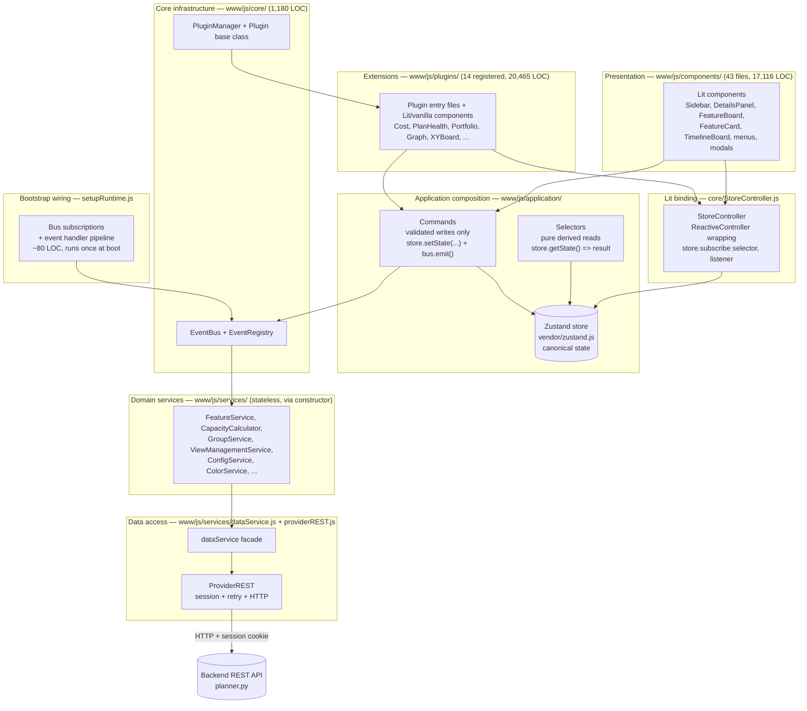
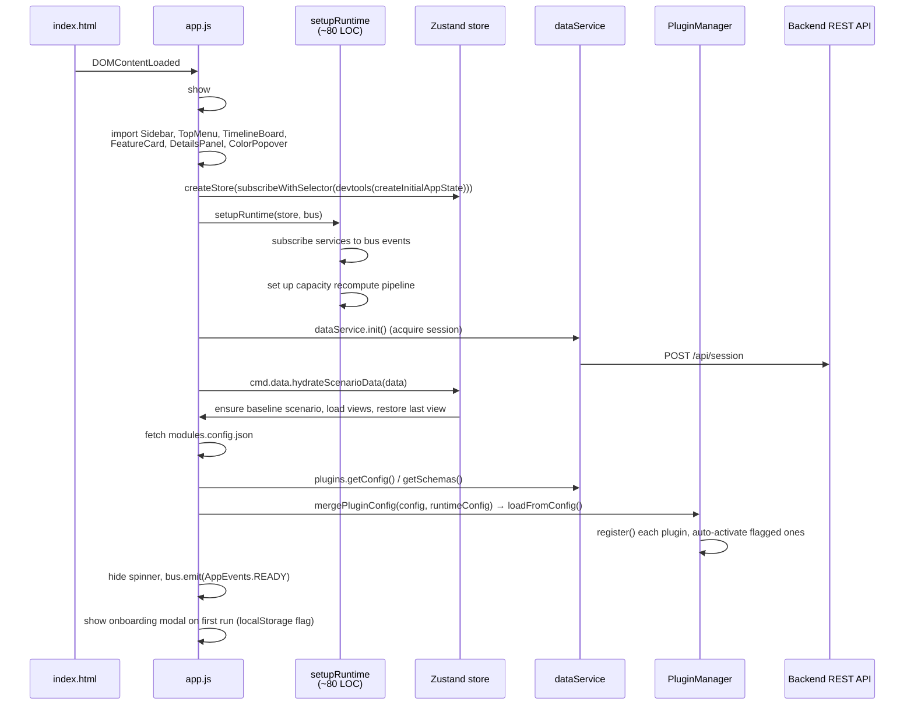
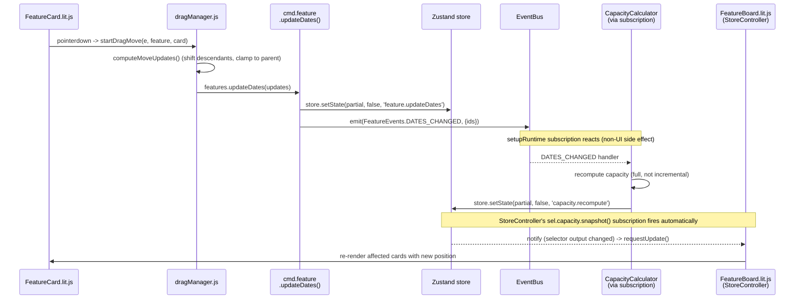
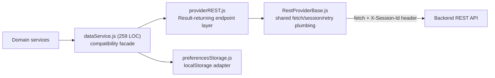

# PlannerTool Web Architecture (v2 draft — target design)

> **Status: TARGET architecture with phased migration in progress (through Phase 6 validation, 2026-08-09).** `application/` scaffolding, `core/StoreController.js`, and command/selector seam groups are implemented and consumed across `www/js/components/` and `www/js/plugins/` for Selection/Filter/View plus Scenario/Feature/Group/Plugin-state/View-restore concerns. Runtime now defaults to Zustand-backed store mode (`USE_STATE_STORE=true`) for dev validation; Phase-7 runtime blocker surfaces (bootstrap, scenario menu, sidebar, plan/team menus, board/group selection flow, cost/graph/history/markers/main graph surfaces) now read/write through `cmd.*`/`sel.*` seams only. Legacy adapters remain present solely as rollback safety until Phase 7 decommissioning removes them. Sections in this document may describe either target end-state or landed interim state; per-phase notes in Sections 4, 10, and 11 call out migration status where behavior is still mixed.

## 0. Why change: current pain points (verified against the code, 2026-08-06)

- **`State.js` is a 1,561-line, 80-method god object**, imported as a singleton (`import { state } from '../services/State.js'`) by 49 files across `components/`, `plugins/`, and `app.js`. There is no dependency-injection boundary — any file can call any of its 80 methods, and every method is a potential mutation entry point.
- **14 of ~24 files under `services/` hold owned mutable state** (`this._xyz = ...`) despite the intent that services be stateless calculators: `BaselineStore`, `CapacityCalculator`, `FeatureService`, `GroupService`, `ViewService`, `ViewManagementService`, `ScenarioEventService`, `StateFilterService`, `ConfigService`, `FeatureStateService`, `PluginStateService`, `BoardCoordinateService`, `providerREST`, and `State.js` itself. This is the literal cause of the "little local caches get out of sync" problem cited as motivation — e.g. `BaselineStore.getFeatures()` performs `JSON.parse(JSON.stringify(...))` on every call (cloned 4 separate times during a single startup), and `FeatureService` keeps its own `_countsCache` that must be manually invalidated on `FeatureEvents.UPDATED`.
- **Events already carry business data, not just signals** — the second problem this doc's own author flagged. Concrete examples: `ScenarioManager` emits `ScenarioEvents.UPDATED` with a whole scenario object, `State.js` emits `CapacityEvents.UPDATED` with full capacity arrays, and `ScenarioEventService._handleScenariosData` re-emits `FeatureEvents.UPDATED` a second time during startup — each duplicate emission triggers 15+ independent listeners that each recompute `getEffectiveFeatures()` from scratch (see `/memories/repo/startup_sequence.md` for the traced hot path). Any handler that reads data off the payload instead of re-querying state is a latent staleness bug.
- **The admin panel has moved**: `www-admin/js/` no longer exists as a sibling of `www/`; it is now `www/admin/js/`, still fully decoupled from `www/js/` (no cross-imports found), sharing only the vendored `lit.js` and its own separate `providerREST.js`.
- **A same-named but unrelated flag already exists**: `www/js/config.js` defines `USE_COMMAND_PATTERN` (Phase 10, undo/redo), a different concept from the `commands/` mutation boundary proposed here. Pick a different flag/term when this work starts to avoid confusion.

## 1. Scope and tech stack

This document covers the browser front end only:

- **`www/js/`** — the main planning application (~49,700 LOC across 130+ modules, excluding the vendored `lit` library).
- **`www/admin/js/`** — the administration panel (~11,600 LOC), a separate, decoupled Lit application (moved from the former top-level `www-admin/` into `www/admin/`).

Backend architecture (`planner_lib/`, `planner.py`) is out of scope; see [ARCHITECTURE_BACKEND_DATA.md](ARCHITECTURE_BACKEND_DATA.md) and [ARCHITECTURE_SERVER.md](ARCHITECTURE_SERVER.md).

**Tech stack**

| Concern | Choice |
|---|---|
| Component model | [Lit](https://lit.dev) 3.x web components (`*.lit.js`), vendored at `www/js/vendor/lit.js` |
| Modules | Native ES modules, no bundler at dev/runtime; browser loads `import`s directly |
| Production build | **Vite** (`npm run build`, `vite.config.js`) bundles/copies `www/` into `dist/` |
| Vendor bundling | **Rollup** (`npm run build:vendor`, `rollup.config.mjs`) produces the pinned `vendor/lit.js` |
| State | **Target:** [Zustand](https://github.com/pmndrs/zustand) vanilla store (`zustand/vanilla` + `subscribeWithSelector` middleware), bound into Lit via a small custom `ReactiveController`. **Current:** singleton `State.js` class instance |
| Data access | Hand-written `fetch`-based REST provider, no axios/graphql client |
| Testing | Vitest (unit/component, jsdom + `@vitest/browser`), Playwright (e2e/smoke) |
| Types | None — plain JavaScript with sparse JSDoc; no TypeScript, no PropTypes-equivalent |
| Linting | ESLint (`eslint-plugin-lit`, `eslint-plugin-lit-a11y`), Prettier |

This is a deliberately framework-light, hand-rolled stack: no React/Vue/Svelte, no router, no CSS framework. Every cross-cutting concern (events, plugins, drag-and-drop, layout packing) is bespoke code living in this repository. Whether that trade-off still pays off at the current size is worth a short standalone assessment before committing to a multi-month migration (see Section 16) — no such assessment doc currently exists in `docs/`.

**Decision update (2026-08-06): adopt Zustand instead of a fully hand-rolled `StateStore`.** The original draft explicitly ruled out Zustand ("no Redux/MobX/Zustand") in favor of a bespoke immutable store. On review, the hand-rolled design in Section 4.1 (`store.update(label, reducer)`, `store.subscribe(selector, listener, {equals, emitCurrent})`) is — feature for feature — reinventing Zustand's own `subscribeWithSelector` middleware and `devtools` action-labeling. Since `www/js` already accepts exactly one third-party runtime dependency (`lit`, vendored via `rollup -c` into `www/js/vendor/lit.js`), adding Zustand's core (~1 KB min+gzip, framework-agnostic, no React required) the same way is a small, well-contained exception rather than a reversal of the "no state library" philosophy:

- Add `zustand` to `package.json` `dependencies` (alongside `lit`).
- Re-export the vanilla core + the two middlewares actually used from `src/vendor-entry.js`, e.g. `export { createStore } from 'zustand/vanilla'; export { subscribeWithSelector, devtools } from 'zustand/middleware';`, so `rollup -c` bundles them into `www/js/vendor/zustand.js` — the browser still loads a single pre-bundled ES module at runtime, preserving the "no bundler at dev/runtime" rule.
- Do **not** add the `immer` middleware/dependency initially — the state shape in 4.2 is a handful of top-level slices, and plain object-spread reducers (the existing style already used in service code) are enough; revisit only if command bodies get unreadable.

## 2. Module inventory

Generated 2026-08-08 by `npm run audit:frontend` (`scripts/frontend-audit.mjs`); re-run after any phase to refresh.
Full detail in `backup/architecture_v5/plan/baseline-audit.md`.

```
www/js/                        48,657 LOC (excl. vendor/)   [134 files]
├── application/                    0  — [TARGET, DOES NOT EXIST] StateStore, commands/, selectors/, imports.js, setupRuntime.js
├── core/                       1,180  — EventBus, EventRegistry, PluginManager, Plugin base class (real, unchanged by this migration)
├── services/                   9,588  — 24 files; ~14 hold owned mutable state today (target: 0, calculation-only)
├── components/                17,116  — 43 Lit components + drag/layout/util helpers
├── plugins/                   20,465  — plugin modules + helper subfolders; `modules.config.json` currently registers 14 plugins
│                                        Note: PluginCostV2.js / PluginCostV2Component.js deleted (Phase 0, unregistered dead code)
└── config.js / config/           ~58  — feature flags, view defaults

www/admin/js/                  11,643 LOC — fully decoupled admin SPA (own components/services/core), formerly `www-admin/js/`   [27 files]
```

The **plugins** directory remains the largest consumer, followed closely by **components**. Whether that reflects genuine feature surface or missing decomposition (e.g. `DetailsPanel.lit.js` and `Sidebar.lit.js` are both ~2,100 LOC single files) is a separate refactor question from the StateStore migration and shouldn't block it.

## 3. Layered architecture (target)

Everything below this line describes the **target** layering once `State.js` is dissolved. The current codebase already has real, unchanged `core/` and `components/`/`plugins/` layers; the new piece is the `application/` layer replacing `services/State.js` as the mutation/read boundary.



**Layer responsibilities**

1. **Presentation (`components/`)** — Lit elements render UI and handle pointer/keyboard interaction. They **read** state reactively through `StoreController` (Section 4.9, wrapping a Zustand selector) and **write** state exclusively through commands, both reached via a single import (`import { cmd, sel } from '../application/imports.js'`). They communicate ephemeral, non-state signals cross-component through the `EventBus` (Section 5). No component imports another component's internals; no component imports a service directly.
2. **Plugins (`plugins/`)** — optional, independently loaded features (cost analysis, dependency arrows, plan health checks, portfolio board, etc.). Each plugin can use `StoreController`/`sel`/`cmd` the same way first-party components do, and follows a declarative lifecycle (`init/activate/deactivate/destroy`) managed by `PluginManager`.
3. **Application composition (`application/`)** — the sole owner of canonical state (a Zustand `store`), the mutation boundary (`commands`, the only code allowed to call `store.setState`), the read boundary (`selectors`, plain `(state) => derived` functions), and the thin re-export entry point (`imports.js`). No abstraction layer — direct function calls only: `cmd.selection.setProjectSelected(id, true)`, `sel.features.active()`.
4. **Bootstrap wiring (`setupRuntime.js`)** — ~80 LOC of bus subscriptions that run once at app start. Services subscribe to bus events (reacting to commands), not the other way around. This replaces the old "PlannerRuntime" god-object: no 15+ method service object, just event handlers + subscription setup.
5. **Domain services (`services/`)** — business logic and computation (feature overrides, capacity calculation, groups, colors). Pure functions where possible (`FeatureVisibilityService`, `SwimlaneService`). All services accept `(store, bus)` via constructor — never singleton imports. Zero owned state, no exceptions.
6. **Data access (`dataService.js` + `providerREST.js`)** — a single provider abstraction wrapping `fetch`, session/auth handling, and Result-style (`{ok, data|error}`) error normalization.
7. **Core infrastructure (`core/`)** — `EventBus`/`EventRegistry` (typed pub/sub for ephemeral signals), `PluginManager`/`Plugin` (lifecycle + dependency + exclusivity rules), and the new `StoreController` (Lit `ReactiveController` binding to the Zustand store). Infrastructure only, no business logic.

## 4. State management: Zustand store, commands, selectors

### 4.1 `application/store.js`

Implemented directly on `zustand/vanilla` (no React) plus the `subscribeWithSelector` middleware, both re-exported from the vendored `www/js/vendor/zustand.js` bundle (see Section 1's decision note):

```javascript
import { createStore } from '../vendor/zustand.js';
import { subscribeWithSelector, devtools } from '../vendor/zustand.js';
import { createInitialAppState } from './createInitialAppState.js';

export const store = createStore(
  subscribeWithSelector(devtools(() => createInitialAppState(), { name: 'PlannerStore' }))
);
```

- Canonical top-level state slices: `lifecycle`, `baseline`, `scenarios`, `selection`, `view`, `groups`, `pluginState`, `capacity`.
- **Immutability**: commands call `store.setState(partialOrReducer, false, actionLabel)` — the standard object-spread discipline (only the changed branch gets a new reference), not deep-cloning. The `devtools` middleware's third argument gives free labeled actions in the Redux DevTools timeline, replacing the hand-rolled `update(label, reducer)` API the original draft proposed. In non-production builds, wrap `store.setState` with a thin dev-only guard that deep-freezes the previous snapshot after each commit — this catches any code that mutates state in place instead of returning a new reference, without adding runtime cost in production.
- **Subscriptions**: `store.subscribe(selector, listener, {equalityFn, fireImmediately})` — the exact API shape (selector + listener + equality function) that `subscribeWithSelector` ships out of the box. Prefer `Object.is` for primitive/array-reference selections and `zustand/shallow`'s `shallow` for object-shaped selections, so a component selecting `{projectIds, teamIds}` doesn't re-render when an unrelated branch changes.
- **Invariant enforced by design**: the store holds data only; it has no domain logic, no service calls. `store.getState()`/`store.setState()` are the only two entry points — everything else in this document is a naming convention layered on top (`commands` = only callers of `setState`; `selectors` = functions of `getState()`'s shape).

### 4.2 Canonical state shape (`createInitialAppState.js`)

```
lifecycle:  { status: idle|loading|ready|failed, error }
baseline:   { revision, projects[], teams[], features[], iterationsByProject{} }
scenarios:  { activeId, items[] }            // item: {id, name, overrides, filters, view, isChanged, readonly}
selection:  { projectIds[], teamIds[], featureStateNames[], taskFilters{schedule,allocation,hierarchy,relations},
              taskTypeNames[], sidebarDisabled{} }
view:       { activeId, saved[], options{}, expansion{parentChild, relations, teamAllocated} }
groups:     { byPlanId{} }
pluginState:{ /* arbitrary per-plugin state, keyed by plugin id */ }
capacity:   { dates[], teamDaily[], teamDailyMap[], projectDailyRaw[], projectDaily[], projectDailyMap[],
              organizationDaily[], organizationDailyPerTeamAverage[] }
```

### 4.3 Commands (`commands/*.js`)

Commands do two things only: mutate the store via `store.setState` and emit bus events via `bus.emit`. **They never call services directly.** Side effects (capacity recompute, backend save) flow through the bus: commands emit events; setup-phase subscriptions react to them.

```
command → store.setState(partial, false, 'namespace.action')
         → bus.emit(EventType, payload)
    [downstream: setupRuntime subscriptions react to events]
         → services recompute, persist, or notify consumers
```

**Command groups:**

| Group | Examples | Notes |
|---|---|---|
| Selection | `setProjectSelected`, `setTeamSelected`, `setSidebarDisabled` | Phase 4 landed: legacy + store-backed command group implemented in `www/js/application/commands/selectionCommands.js`; no service dependency, direct state mutation |
| Filter | `setSelectedTaskTypes`, `setSelectedFeatureStates`, `setExpansionState`, `setTaskFilter` | Phase 4 landed: legacy + store-backed command group implemented in `www/js/application/commands/filterCommands.js`; replacement path for `FilterManager.js` + `StateFilterService.js` is now in place |
| View | `setDisplayMode`, `setCondensedCards`, `setTimelineScale`, `setCapacityViewMode`, `setFeatureSortMode` | Phase 4 landed: legacy + store-backed command group implemented in `www/js/application/commands/viewCommands.js`; no service dependency, direct state mutation |
| Group | `createGroupInScenario`, `updateGroupInScenario`, `deleteGroupInScenario`, `applyGroupMemberDelta` | Effective-group merge logic stays in `GroupService.js` (pure) |
| Plugin state | `setPluginState`, `clearPluginState` | **Phase 5 landed:** `pluginStateCommands.js` is wired and plugin consumers now call `cmd.pluginState`; service slimming is deferred until store cutover/decommission phases |
| View restore | `applyViewSelectionRestore`, `applyViewOptionsRestore`, `applyViewPluginStateRestore` | **Phase 5 landed seam:** `viewRestoreCommands.js` is wired and view menu/modals route through `cmd.viewRestore`; full state ownership move into `StateStore.view` remains a later-phase cutover task |
| Feature mutation | `updateFeatureDates`, `updateFeatureField`, `setScenarioOverride`, `revertFeature`, `updateFeatureRelations` | **Phase 5 landed:** feature mutation/read consumers migrated to `cmd.feature` / `sel.feature` seams (including `DetailsPanel` after decomposition) |
| Scenario lifecycle | `activateScenario`, `cloneScenario`, `renameScenario`, `deleteScenario`, `saveScenario` | **Phase 5 landed seam:** scenario UI consumers route through `cmd.scenario`; `ScenarioManager.js` removal happens in decommission phase |
| Data hydration | `hydrateBaseline`, `hydrateScenarioData`, `performAutosaveTick` | Dissolves `BaselineStore.js`; baseline projects/teams/features are written straight into `StateStore.baseline` — no separate stateful store. Spike required first: validate batching → command pattern works before wider rollout |

### 4.4 Selectors (`selectors/*.js`)

Pure derivation only — no mutation, no IO. Each selector is a standalone module of pure functions: `input: getState() → output: derived value` — the same shape Zustand's `subscribeWithSelector` expects, so any selector here can be passed directly to `store.subscribe(selector, listener)` or to `StoreController` (Section 4.9) with no adapter layer. The largest file (`expansionSelectors.js`, 247 LOC) was split into three independent modules:

| File | Purpose |
|---|---|
| `scenarioSelectors.js` | Active/writable scenario lookup, save-payload normalization |
| `selectionSelectors.js` | Selected-id projections from projects/teams |
| `expansionParentChild.js` | Parent/child closure algorithm |
| `expansionRelations.js` | Relation-link expansion (find related features) |
| `expansionTeamAllocation.js` | Team-allocation expansion algorithm |
| `capacitySelectors.js` | Canonical → array-shaped capacity snapshot for events |
| `taskTypeSelectors.js` | Task type hierarchy, ordering, display names |
| `featureSelectors.js` | Dirty-field diffing between baseline and scenario override |
| `iterationSelectors.js` | Per-project iteration lookup |
| `createPlannerSelectors.js` | Composition root: combines all selectors into one object |

### 4.5 Bootstrap wiring (`setupRuntime.js`)

Event subscription setup called once at app start, just the wiring glue that connects bus events to service reactions:

```javascript
// Called during bootstrap (from app.js):
import { setupRuntime } from './application/setupRuntime.js';

setupRuntime(store, bus);
// → subscribes services to bus events
// → sets up capacity recompute pipeline
// → initializes plugin state recovery from store.getState().view.activeId
```

### 4.6 Domain services (`services/*.js`)

All services accept `(store, bus)` via constructor — **zero singleton imports anywhere in `services/`**. Services hold **no owned state at all** — not even baseline data. `BaselineStore.js` is dissolved along with the rest: baseline projects/teams/features live only in `StateStore.baseline`, written by the `hydrateBaseline` command. This is a deliberate strengthening of the original plan (which kept `BaselineStore` as a stateful exception) — a single source of truth means zero exceptions, per the stated goal of this migration.

| Service | LOC | Target role |
|---|---|---|
| `CapacityCalculator.js` | ~543 | Stateless pure calculation; `_lastResultCache` removed; recompute is full, not incremental |
| `FeatureService.js` | ~771 | Override merge logic (pure functions); expansion algorithms moved to selectors; `_countsCache` removed |
| `ViewManagementService.js` | ~759 → ~100 | Orchestrator only (zero state); captures/restores view schema against `StateStore.view` |
| `GroupService.js` | ~430 | Effective-group merge (pure functions for commands to call) |
| `ConfigService.js` | ~184 | Autosave timer config; no mutation state |
| `ColorService.js` | ~227 | Deterministic hash color assignment |
| `SwimlaneService.js` | ~232 | Pure swimlane grouping/assignment functions |
| `FeatureVisibilityService.js` | ~367 | Pure feature-visibility filter predicate |
| `DataInitService.js` | ~264 → ~50 | Baseline fetch helpers only; batching and storage logic move to the `hydrateBaseline` command |
| `BaselineStore.js` | **deleted** | Dissolved; baseline data moves into `StateStore.baseline` |
| `dataService.js` | ~382 | Provider facade (Section 9) — not a domain service |
| `providerREST.js` | ~1,024 | HTTP/session (Section 9) — not a domain service |
| Other helpers | varies | Result helpers, preferences storage, coordinate transforms, icon templates |

### 4.7 Composition entry point (`imports.js`)

One import per consumer file. Direct function calls — no API facade, no abstraction layer:

```javascript
import { cmd, sel } from '../application/imports.js';

// Read state through selectors (pure functions):
const active = sel.features.active();
const selectedProjects = sel.selection.getProjects();
const expandedIds = sel.expansion.parentChild.getExpanded(featureId);

// Mutate state through commands:
await cmd.selection.setProjectSelected(id, true);
await cmd.feature.updateDates(updates);
await cmd.scenario.activateScenario(activeScenario.id);
```

### 4.8 Runtime invariants

- The Zustand `store` is the only canonical mutable runtime truth — no second mutable runtime owner may exist. This includes `BaselineStore`: it is dissolved, not kept as a special case.
- Writes must go through `commands` (`store.setState(...)`); components/plugins/services never mutate store snapshots directly, and never call `store.setState` themselves.
- Selectors are pure; services must be fed data via constructor or bus events, and never write to the store directly.
- **Services accept dependencies via constructor** — no singleton imports anywhere in `services/`.
- **Commands emit events; they do not call services** — side effects flow through the bus subscription layer.
- **Event payloads carry identifiers/hints only, never derived data.** An emitted event may say *what changed* (`{ids}`, `{scenarioId}`, `{op}`) but must never carry the actual merged features, capacity arrays, or scenario objects — see Section 5 for the rationale and the specific violations this fixes in the current code. Since components now read state reactively via `StoreController` (4.9) rather than by unpacking event payloads, most events lose any reason to carry data at all.

### 4.9 Lit reactive binding (`core/StoreController.js`)

A small `ReactiveController` (Lit's own controller interface, not part of Zustand) is the only place that connects the store to component re-rendering. It replaces the manual `bus.on(...)`/`bus.off(...)` boilerplate components previously needed just to know "state I care about changed":

```javascript
// core/StoreController.js
import { store } from '../application/store.js';

export class StoreController {
  constructor(host, selector, { equalityFn } = {}) {
    this.host = host;
    this.selector = selector;
    this.equalityFn = equalityFn;
    this.value = selector(store.getState());
    host.addController(this);
  }
  hostConnected() {
    this.value = this.selector(store.getState());
    this._unsubscribe = store.subscribe(
      this.selector,
      (value) => { this.value = value; this.host.requestUpdate(); },
      { equalityFn: this.equalityFn, fireImmediately: false },
    );
  }
  hostDisconnected() {
    this._unsubscribe?.();
  }
}
```

Usage inside any Lit component, no `connectedCallback`/`disconnectedCallback` boilerplate required:

```javascript
import { StoreController } from '../core/StoreController.js';
import { sel } from '../application/imports.js';

class FeatureBoard extends LitElement {
  constructor() {
    super();
    this._features = new StoreController(this, sel.features.active);
  }
  render() {
    return html`${this._features.value.map(f => this._renderCard(f))}`;
  }
}
```

**Why not the more common "subscribe-to-everything + `@state` fields" pattern?** A frequently cited example elsewhere looks like this instead:

```javascript
@state() private items = selectCartItems();
connectedCallback() {
  super.connectedCallback();
  this.unsubscribe = cartStore.subscribe(() => {
    this.items = selectCartItems();       // reselect on EVERY store change, whatever it was
    this.total = selectCartTotal();
  });
}
```

That version works, but it is strictly worse for this codebase's scale (49k+ LOC, 15+ independent listeners already observed reacting to a single event in `/memories/repo/startup_sequence.md`):

- `cartStore.subscribe(() => {...})` with no selector argument fires on **every** `setState` call anywhere in the app, then re-runs every selector unconditionally inside the callback to find out if anything relevant changed. `StoreController` instead calls `zustand`'s own `subscribeWithSelector`, so the equality check (`Object.is` by default, or a custom `equalityFn`) happens *inside* the store before the component is ever notified — a component watching `sel.features.active` is simply not invoked when capacity or scenario state changes.
- Each `@state()` field the naive version reselects on every notification is redundant work per component per store write; with N components each holding 2-3 `@state()` selections, that's O(N) unconditional reselection on every unrelated write. `StoreController` makes this O(1) per relevant write by construction.
- This repo has no build step for decorators/TypeScript (`@customElement`/`@state` require a compiler); `StoreController` is plain JS, consistent with the rest of `www/js/` (see Section 1 — no TypeScript).
- The manual `unsubscribe()`/`disconnectedCallback()` pairing is still hand-written per component in the naive version; `StoreController` centralizes that lifecycle once, in `core/`, matching the "components shouldn't hand-roll subscription bookkeeping" goal already established for `EventBus` usage.

The current draft's `StoreController` design is kept as-is for these reasons.

**Consequence for Section 5**: any state-shaped notification a component previously needed (`FeatureEvents.UPDATED`, `CapacityEvents.UPDATED`, `ScenarioEvents.ACTIVATED`, `ViewEvents.*`, `GroupEvents.CHANGED`, etc.) is now redundant — components subscribed to the relevant slice via `StoreController` re-render automatically and precisely when that slice changes, with no event plumbing at all. `EventBus`/`EventRegistry` are retained only for genuinely ephemeral, non-state signals (see Section 5's revised scope).

## 5. Event system

`www/js/core/EventBus.js` is a symbol-keyed pub/sub bus with namespace fan-out:

```
bus.on(EventSymbol, handler) → unsubscribe()
bus.once(EventSymbol, handler)
bus.onNamespace('feature', handler)     // matches any Symbol('feature:*')
bus.emit(EventSymbol, payload)          // exact listeners first, then namespace listeners
bus.enableHistoryLogging(limit)         // opt-in ring buffer for debugging (config.js: LOG_EVENT_HISTORY)
```

Each handler executes inside a try/catch so one listener's exception cannot break event delivery to others — a deliberate robustness trade-off.

`www/js/core/EventRegistry.js` (171 LOC) currently defines 21 event categories. **With `StoreController` in place (Section 4.9), most of these are redundant for their original purpose** (telling a component "re-render, something changed") because components subscribe to the store directly. The categories split into two groups:

| Disposition | Categories | Why |
|---|---|---|
| **Absorbed into store subscriptions — delete** | `FeatureEvents`, `CapacityEvents`, `ScenarioEvents`, `ProjectEvents`, `TeamEvents`, `ViewEvents`, `ViewManagementEvents`, `GroupEvents`, `FilterEvents`, `StateFilterEvents`, `ColorEvents`, `PlanEventEvents` | All state-shaped: once the data lives in the store, `StoreController` delivers precise, selector-scoped re-renders with zero payload risk. Keeping a parallel event for the same fact is the exact duplication this migration set out to remove |
| **Kept — genuinely ephemeral, not state** | `DragEvents`, `BoardEvents`, `SessionEvents`, `UIEvents`, `AppEvents`, `ConfigEvents`, `TimelineEvents`, `PluginEvents`, `DataEvents` | These represent one-off occurrences or transient UI signals that don't belong in canonical state (a drag is in progress, the session expired, the app finished booting, a plugin activated) — there is no meaningful "current value" to select, only a moment in time |

This shrinks `EventRegistry` by roughly half and, more importantly, removes the entire class of bug this document set out to fix: an event carrying a stale copy of data that has since changed in the store.

**Event flow model (target) for the remaining, genuinely ephemeral events:**

```
component → cmd.feature.updateDates(...) → store.setState(partial, false, 'feature.dates')
    → [no event needed for UI update — StoreController on any component selecting features/capacity
       re-renders automatically the moment the store notifies]
    → bus.emit(FeatureEvents.DATES_CHANGED, {ids}) → ONLY if a non-UI side effect (capacity
       recompute, autosave scheduling) needs to react — and even then, {ids} only, never the features
```

**Hard rule for whatever remains on the bus: event payloads are signals, not data.** This is the second core goal of this migration (alongside killing `State.js`): the event bus must never become a second, informally-typed channel for application data that can drift out of sync with the store. Concretely:

- Payloads may contain identifiers, counts, or small hints needed for routing/filtering (`{ids}`, `{scenarioId}`, `{op: 'memberAdded'}`).
- Payloads must **not** contain derived collections, merged objects, or computed snapshots (full feature arrays, capacity arrays, scenario objects). Any handler that needs data reads it via a selector inside its own handler body, or — for UI re-rendering — doesn't need the bus at all (Section 4.9).
- This is stricter than the original draft of this document, which said "events carry payloads from selectors when the derived data is expensive to recompute" — that phrasing is exactly the anti-pattern already present in the current code (`CapacityEvents.UPDATED` currently ships full capacity arrays; `ScenarioEvents.UPDATED` currently ships a whole scenario object) and is the second named source of "out of sync" bugs. If a selector is expensive, memoize the computed result behind the selector itself, not on the event payload.
- Enforcement: add an ESLint rule or a small unit test that asserts every `bus.emit(...)` call site's payload only contains primitives, ids, or arrays of ids — no nested objects matching known state shapes (features, capacity, scenarios). This is worth writing before the migration starts, since it can catch regressions in the *current* code today, independent of the Zustand migration.

## 6. Application bootstrap sequence



Key details verified in `www/js/app.js`:
- The spinner (`#appSpinner`) is shown before any import and hidden only after plugin loading completes or an error is caught and re-thrown.
- Plugin config merge is **non-fatal**: `.catch(() => null)` on both `getConfig()` and `getSchemas()`, so a backend outage degrades to metadata-only plugin defaults rather than blocking app start.
- Session-expiry UI (`SessionEvents.EXPIRED` / `REACQUIRED`) and the global `Ctrl+Shift+F` search shortcut are wired directly in `app.js` after `AppEvents.READY`.

## 7. End-to-end data flow example: dragging a feature card



No component ever calls `store.setState` directly, and no component ever calls a service directly — both are reached exclusively through commands (mutation) or `StoreController`/selectors (read). This is the enforceable boundary. Note the `EventBus` step here only exists to trigger the **non-UI** capacity recompute side effect; the UI update itself no longer needs an event at all, it's a direct consequence of the store notifying `StoreController`.

## 8. Plugin system

Plugins are optional, independently activatable feature modules. 14 are currently registered in `www/js/modules.config.json` (13 enabled, 1 disabled legacy plugin):

| id | mountPoint | exclusive | fullscreen | enabled | Purpose |
|---|---|---|---|---|---|
| `sample-plugin` | `timeline-board` | true | — | false | Reference/template implementation, kept for smoke tests |
| `plugin-portfolio-board` | `app` | true | true | true | Kanban board: teams x states |
| `plugin-dependencies` | `feature-board` | false | — | true | SVG dependency arrows between cards |
| `plugin-plan-health` | `feature-board` | true | — | true | Detects planning issues/anomalies |
| `plugin-history` | `feature-board` | true | — | true | Task date-change history overlay |
| `plugin-markers` | `feature-board` | true | — | true | Delivery-plan marker tags on timeline |
| `plugin-events` | `feature-board` | false | — | true | Locally stored plan events on timeline |
| `plugin-cost-v1` | `app` | true | true | **false** | Superseded cost-analysis plugin, disabled but not deleted — `PluginCostV1*.js` files remain in `plugins/`; candidate for removal |
| `plugin-cost` | `app` | true | true | true | Cost analysis (project/task/team/team-members views) |
| `plugin-export-timeline` | `timeline-board` | true | true | true | Export timeline/capacity to PNG/JSON/CSV |
| `plugin-annotations` | `feature-board` | true | — | true | Freehand drawing/annotation overlay |
| `plugin-graph` | `app` | true | true | true | Large capacity-allocation SVG graph |
| `plugin-link-editor` | `feature-board` | true | — | false | Edit dependency link types |
| `plugin-xy-board` | `app` | true | true | true | X/Y field intersection table |

Note: `PluginCostV2.js`/`PluginCostV2Component.js` were deleted in Phase 0 because they were unregistered dead code; this is distinct from the disabled-but-registered `plugin-cost-v1`, which still exists.

### 8.1 Lifecycle contract

`core/Plugin.js` defines the abstract contract: `init()`, `activate()`, `deactivate()`, `destroy()`, `getMetadata()`. `PluginManager.js` (328 LOC) drives it:

```
register(plugin)  -> dependency check -> plugin.init() -> emit(PluginEvents.REGISTERED)
activate(id)      -> init if needed -> deactivate incompatible "exclusive" actives -> activate deps -> activate -> emit ACTIVATED
deactivate(id)    -> deactivate dependents first -> emit DEACTIVATED
loadFromConfig(cfg) -> filter disabled -> topological sort by dependency -> register each -> auto-activate flagged plugin
```

**Exclusivity**: a plugin with `exclusive: true` (the default) deactivates every other active, non-dependency, `exclusive` plugin when it activates — effectively one exclusive plugin per mount point at a time. `exclusive: false` plugins (Dependencies, Events) coexist with anything.

**Fullscreen**: `fullscreen: true` plugins (Portfolio, Cost, Export Timeline, Graph, XY Board) hide the `#timeline-board` element on activate and restore its prior `display` style on deactivate — a manual, per-plugin visibility hack rather than a shared base-class behavior.

### 8.2 Implementation patterns

The plugin tree has two inconsistent implementation patterns:

- **`OverlayPlugin` subclasses** (PlanHealth, History, Markers) are thin: they lazy-import a companion `*Component.js`, mount it, and delegate `open()/close()` to it.
- **Manual-lifecycle plugins** (Portfolio, Cost, ExportTimeline, Annotations, Graph, XYBoard, Dependencies) do not extend `Plugin`/`OverlayPlugin` at all; each hand-rolls mount-point DOM resolution (`document.querySelector('#'+mountPoint) || document.querySelector('.'+mountPoint) || document.body`) and fullscreen show/hide logic.

**Target**: plugins import `{ cmd, sel }` from `../application/imports.js` — the same one-line pattern used by first-party components. Plugins do NOT import `cmd` or `bus` directly; they consume state via selectors and emit events via bus (for their own plugin-scoped events only).

### 8.3 Companion component sizes

| Component file | LOC | Notes |
|---|---|---|
| `PluginPlanHealthComponent.js` | 1,295 | Largest plugin UI file; runs 7 validation checks and renders results |
| `PluginEventsComponent.js` | 1,107 | Extends `OverlaySvgComponent` |
| `PluginCostComponent.js` | 1,091 | 4 sub-views (project/task/team/team-members) |
| `PluginCostCalculator.js` | 1,065 | Pure calculation module — month allocation, tree building, budget deviation; orthogonal to `services/CapacityCalculator.js` |
| `PluginHistoryComponent.js` | 951 | Extends `OverlaySvgComponent` |
| `PluginPortfolioComponent.lit.js` (+ `.styles.js`, 689) | 848 | Kanban + timeline + drag-drop, not extending `Plugin` |
| `PluginGraphComponent.js` | 773 | Hand-rolled SVG, no chart library |
| `PluginXYBoardComponent.lit.js` | 640 | |
| `PluginExportTimelineComponent.js` | 636 | Delegates canvas work to `plugins/export/TimelineExportRenderer.js` (1,079 LOC) |
| `PluginMarkersComponent.js` | 630 | Extends `OverlaySvgComponent` |
| `PluginAnnotationsComponent.js` | 393 | Delegates to `plugins/annotations/AnnotationOverlay.js` (1,552 LOC) and `AnnotationState.js` (389 LOC) |
| `PluginLinkEditorComponent.js` | 365 | Delegates to `plugins/linkeditor/LinkEditorOverlay.js` (410 LOC) + `LinkEditorState.js` (234 LOC); disabled by default |
| `PluginDependenciesComponent.js` | 234 | Extends `OverlaySvgComponent` |

## 9. Data access layer



- `result.js` now provides the shared Result contract helpers (`ok`, `fail`, `asResult`, `dataOr`) used by both REST providers and compatibility callers.
- `dataService.js` is a compatibility facade: public methods keep legacy unwrapped return shapes, log a warning when provider failures force fallback values, and expose raw provider Result envelopes via `callRestResult(...)` for callers that need structured error details.
- `providerREST.js` and `www/admin/js/services/providerREST.js` both execute through `RestProviderBase` (`_fetch` + `_fetchJson`) for URL resolution, default headers, retry/session hooks, JSON parsing, and error normalization into `{ ok: false, error: { message, ... } }`.
- Session recovery is handled in the shared base fetch path through provider-supplied hooks; failed recovery/network exhaustion emits `SessionEvents.EXPIRED`, while successful recovery retries the original request transparently.

## 10. Presentation layer (`components/`)

Target end-state import pattern (incremental adoption in progress):

```js
import { cmd, sel } from '../application/imports.js';
// sel.features.list(), sel.selection.getProjects(), sel.scenarios.active()
// await cmd.feature.updateDates(updates), await cmd.selection.setProjectSelected(id, true)
```

Phase 4 progress (2026-08-09): Selection/Filter/View consumers were migrated to the `cmd`/`sel`
seam for the planned component/plugin set (`TeamMenu`, `PlanMenu`, `Timeline`, `board-utils`,
`EmptyBoardModal`, `FeatureCard`, `MainGraph`, `FeatureBoard`, `Sidebar`, and the scoped plugin
set including Dependencies/Graph/Portfolio/Cost/Export Timeline). Remaining direct `state` imports
outside these concerns are expected until subsequent phases complete.

Lifecycle discipline is consistent: every component subscribes to `EventBus` events in `connectedCallback()` and unsubscribes in `disconnectedCallback()`. There is no shared Lit base class beyond `Modal.lit.js` (used by all 10+ modal dialogs to avoid duplicated open/close/backdrop boilerplate).

**Component sizes (LOC), largest first:**

| Component | LOC | Tag | Notes |
|---|---|---|---|
| `DetailsPanel.lit.js` | 1,867 | `<details-panel>` | Phase 5 split extracted rendering sections into `components/details-panel/` helpers (`Header`, `Scheduling`, `Capacity`, `Tags`, `Relations`) while preserving host behavior |
| `Sidebar.lit.js` | 2,096 | `<app-sidebar>` | Projects/teams/scenarios/views lists, data-funnel metrics, expansion controls, task filters, taskboard options |
| `FeatureCard.lit.js` | 931 | `<feature-card-lit>` | Card visual states, ghost title, drag/resize handlers |
| `FeatureBoard.lit.js` (+ `.init.js` 156, `.styles.js` 188) | 894 | `<feature-board>` | Split into render/init/styles files; swimlane + group-band layout |
| `AzureDevopsModal.lit.js` | 838 | `<azure-devops-modal>` | Row-level change review + publish-to-ADO with cascading selection |
| `MainGraph.lit.js` | 721 | `<maingraph-lit>` | Canvas org-load graph, scroll-synced fast re-render path |
| `Timeline.lit.js` | 692 | `<timeline-lit>` | Month header + exported scale/scroll helper functions |
| `ScenarioMenu.lit.js` | 535 | | Scenario CRUD + Azure publish flow |
| `TopMenu.lit.js` | 511 | | Top bar hosting Plan/Team/Scenario/View/Tools submenus |
| `GroupContextMenu.lit.js` (+ `.styles.js` 92) | 459 | | Singleton right-click menu for group ops |
| `TimelineBoard.lit.js` | 445 | `<timeline-board>` | Root composition: header + board + overlays + panning |
| `dragManager.js` | 418 | *(non-Lit)* | Pure drag/resize math, no DOM state held |
| `EventsPanel.lit.js` | 404 | | Plan-event CRUD, nested in PlanMenu |
| `groupBandLayout.js` | 284 | *(non-Lit)* | Pure greedy row-packing layout algorithm |
| *(29 smaller files: modals, menus, board helpers)* | <=250 each | | See file list in Section 2 |

Event pattern: components exchange only ids/hints via `EventBus` (`FeatureEvents.UPDATED -> {ids}`); event receivers then fetch current state through selectors — this avoids stale payload bugs and keeps every handler on a fresh read (see Section 5's hard rule).

## 11. Domain services (`services/`, target)

| Service | LOC (target) | Role after migration |
|---|---|---|
| `providerREST.js` | 1,024 | HTTP/session (Section 9) — unchanged |
| `FeatureService.js` | ~600 | Pure override-merge logic only; expansion moved to selectors |
| `CapacityCalculator.js` | ~450 | Stateless pure calculation; `_lastResultCache` removed |
| `GroupService.js` | ~300 (target) / 348 (current) | Phase 5 removed runtime `getEffectiveGroups` dependency via `sel.group`; remaining service methods are transitional until cutover/decommission cleanup |
| `ViewManagementService.js` | ~100 (target) / 651 (current) | View menu/modals now use `cmd.viewRestore` seam; full orchestrator-only shrink remains tied to store-default cutover |
| `ConfigService.js` | ~184 | Autosave timer config; no mutation state |
| `ColorService.js` | ~227 | Deterministic hash color assignment |
| `FeatureVisibilityService.js` | ~367 | Pure feature-visibility filter predicate |
| `SwimlaneService.js` | ~232 | Pure swimlane grouping/assignment functions |
| `DataInitService.js` | ~50 | Baseline fetch helpers only; batching/storage moved to the `hydrateBaseline` command |
| `BaselineStore.js` | **deleted** | Dissolved; baseline data moves into `StateStore.baseline` — no stateful exception |
| `dataService.js` | 259 | Provider facade (Section 9) — unchanged |
| `IconService.js` | ~161 | Task-type SVG icon templates |
| `ProjectTeamService.js` | ~100 | Org-load computation helpers; selection mutation moved to commands |
| `StateFilterService.js` | **deleted** | Pure functions migrated to selectors |
| `ScenarioGroupService.js` | **deleted** | Mutation logic dissolved into groupCommands |
| `PluginStateService.js` | ~15 (target) / 155 (current) | Plugin UI now uses `cmd.pluginState`; service-level slimming to schema-registration-only is deferred until legacy path retirement |
| `FilterManager.js` | **deleted** | Logic dissolved into filterCommands |
| `ScenarioManager.js` | **deleted** | Mutation logic dissolved into scenarioCommands |
| Other helpers | varies | Result helpers, preferences storage, coordinate transforms |

## 12. Admin panel (`www/admin/js/`, ~11,600 LOC)

The admin panel remains a separate Lit application in UI structure and routing, but it is no longer fully isolated at the data-access layer. It now shares the REST foundation from `www/js/services/` (`RestProviderBase.js` and `result.js`) while retaining its own admin endpoint surface in `www/admin/js/services/providerREST.js`. Formerly `www-admin/js/` at the repo root; now nested under `www/admin/js/`.

```mermaid
flowchart TD
    ADMIN[admin.js -- bootstrap] -->|dataService.init(); GET /admin/check| AUTH{Authorized?}
    AUTH -- no --> LOGIN[redirect /admin/login]
    AUTH -- yes --> APP["AdminApp.lit.js<br/>tab-switch shell, no router"]
    APP --> SECTIONS[Sections: System, Users, Projects, Teams,<br/>People, Cost, AreaMappings, Iterations,<br/>GlobalSettings, DataSources, Plugins, Utilities]
    SECTIONS --> BASE["BaseConfigComponent.lit.js<br/>shared schema-form/raw-JSON toggle + save/reload"]
    BASE --> FORM["SchemaForm.lit.js<br/>recursive JSON-Schema -- HTML form renderer"]
    SECTIONS --> AREST["services/providerREST.js<br/>AdminProviderREST endpoint surface"]
    AREST --> BASE["www/js/services/RestProviderBase.js<br/>shared fetch + Result primitives"]
    BASE -->|same-origin cookie| API[Backend /admin/v1/* endpoints]
```

Notable admin-only components (under `www/admin/js/components/admin/`): `DataSources.lit.js`, `Plugins.lit.js` (manages plugin enabled/activated/order + schema-driven `custom_config` forms), `Iterations.lit.js`, `AreaMappingsNew.lit.js`, `GlobalSettings.lit.js`.

**Current separation vs. `www/js`**: endpoint surfaces and UI state remain admin-specific (no `EventBus`/`PluginManager`, no `State.js` usage), but the transport/error contract plumbing is shared. `AdminProviderREST` uses the shared base with admin-appropriate behavior (no retry/session reacquisition), reducing duplicated fetch/error infrastructure while keeping admin's same-origin cookie model and section-level component state.

## 13. Feature flags (`config.js`)

Current flags in `www/js/config.js` (verified 2026-08-06) — these are **live business-behavior toggles, not migration gates**, and none of them relate to this StateStore/commands/selectors migration:

| Flag | Value | Purpose |
|---|---|---|
| `WARN_ON_STRING_EVENTS` | `true` | EventBus dev-mode warning for non-Symbol event keys |
| `LOG_EVENT_HISTORY` | `true` | Opt-in EventBus ring-buffer logging |
| `USE_COMMAND_PATTERN` | `false` | **Naming collision risk** — this is an unrelated undo/redo feature (Phase 10), not the `commands/` mutation boundary this doc proposes. Rename one of the two before starting this migration |
| `serviceInstrumentation` | `false` | Service call instrumentation/profiling hook |
| `USE_PARENT_CAPACITY_GAP_FILLS` | `true` | Epic capacity handling mode (team-aware child precedence) |
| `SHOW_UNPLANNED_WORK` | `true` | Whether unplanned features get default dates or render as draggable ghosts |
| `PRESERVE_UNPLANNED_CHILDREN_ON_PARENT_MOVE` | `true` | Keeps unplanned children unplanned when parent epic moves |
| `GRAPH_ONLY_SELECTED_PLANS` | `false` | Whether MainGraph reflects all plans or only selected ones |
| `USE_STATE_STORE` | `true` | **Migration gate** — gates `application/imports.js`'s choice of State.js-adapter vs. real Zustand store/commands/selectors. Flipped ON during Phase 6 cutover validation; runtime cutover blockers migrated to seam-only callers. Deleted in Phase 7 after legacy fallback removal. |

No flags have been "removed as migration complete" yet. `USE_STATE_STORE` is intentionally still present as the rollback switch during Phase 6 validation; the remaining explicit legacy fallback is the non-store bootstrap branch in `app.js`, tagged for Phase 7 removal.

## 14. Testing strategy

### 14.1 Audit of the existing suite (2026-08-06)

The suspicion driving this audit: with 138 test files and 931 tests, developers have observed tests continuing to pass across changes significant enough that they should plausibly have broken something — raising the question of whether the suite tests real behavior or just exercises code paths without meaningfully constraining them. Findings below are grep/awk-verified against the current `tests/` tree, not estimates.

**Headline numbers** (verified 2026-08-06):

| Metric | Value |
|---|---|
| Test files (`tests/**/*.test.js`) | 140 |
| Test cases (`it(`/`test(`) | 932 |
| `expect(...)` call sites | 2,072 (~2.2 assertions/test — reasonable density, not the problem) |
| Files using `vi.mock()` (full module mock) | 6 |
| Files using `vi.mock`/`vi.fn`/`vi.spyOn` (any mocking) | 12 |
| Files importing the real `services/State.js` singleton directly | 43 |
| Files importing the real `core/EventBus.js` directly | 31 |
| `toMatchSnapshot()` usages | 0 |
| `describe.skip`/`it.skip`/`xit`/`xdescribe` | 1 |

**This is not primarily a "tests are fake/rubber-stamped" problem** — snapshot tests are absent, skipped tests are negligible, and only 12 of 140 files replace real modules with mocks, meaning the large majority of tests do exercise real production code paths rather than a mock's own recorded behavior. The actual risk is different and more specific:

- **Tests reach past the public API into private internals of the very singleton this migration dissolves.** At least 25 files directly read or assign underscore-prefixed private fields — e.g. `tests/services/state.test.js` does `state._projectTeamService.initFromBaseline(...)`, `state._scenarioEventService._scenarios = [...]`, `state._stateFilterService._selectedStates = new Set(['New'])` — and at least 20 files go further and **monkeypatch a method directly onto the singleton for the duration of the test** (same file: `state.getEffectiveFeatures = () => state.baselineFeatures;`). These tests are asserting "if I hand-wire these specific private fields this way, this specific computation produces this specific output" — which is a legitimate way to unit-test a large stateful class with no other seams, but it means the test is coupled to `State.js`'s current internal shape, not its public contract. **None of these tests can survive the `State.js` → store/commands/selectors migration unchanged**; the private fields and methods they poke (`_scenarioEventService`, `_stateFilterService`, `_projectTeamService`, ad hoc method overrides) are exactly what disappears.
- **No test-isolation reset between test cases in the same file.** Zero files contain a `beforeEach`/`afterEach` that resets the `State.js` singleton (searched for `state.reset`/`resetState`/`State.reset` — no matches). Vitest's default `isolate: true` (confirmed in `vitest.config.js`, no override) gives each **file** a fresh module registry, but within one file every `it()` shares the same singleton instance and must manually set every field it depends on. Concretely in `state.test.js`: test 1 sets `state._projectTeamService`/team selection; test 2 then independently re-sets `state.baselineTeams`, `state.baselineProjects`, `state.baselineFeatures`, team/project selection, state filters, and scenario data from scratch. This currently works because each test happens to overwrite every field it reads — but it is a landmine: a test added later that forgets to set one field it depends on will silently read a **previous test's leftover value** and may still pass, for the wrong reason. This is the most plausible concrete explanation for the "tests keep passing when they probably shouldn't" observation.
- **43 files import the real, singleton `State.js` directly** rather than a fresh instance or a constructed test double — appropriate today since `State.js` genuinely is a process-wide singleton, but it means test correctness already depends on **file-level test execution order** in ways that are easy to violate by accident (e.g. reordering `it()` blocks, or adding a new `it()` between two others that assumed no state existed yet).
- Assertion density (2.2/test) and matcher variety (`toBe`, `toEqual`, `toHaveLength`, `toBeGreaterThan`, `toHaveBeenCalledWith`, etc. all in active use) look healthy in isolation — the concern is not "not enough assertions", it's **what the assertions are actually pinned to** (private, soon-to-be-deleted internal shape) rather than the store's public read/write contract.

**Conclusion**: the suite is not fake, but a meaningful fraction of it (conservatively, the ~25-40 files directly manipulating `State.js` internals) is white-box-coupled to the exact object this migration deletes, and lacks the per-test isolation that would make "did this test actually catch anything" a safe assumption. Treat this migration as the forcing function to fix both problems at once (Section 14.2 below), rather than attempting to preserve these tests as-is against the new store.

**What migrating to the store/commands/selectors pattern requires per existing test file**, roughly in priority order:

1. **Delete outright**: tests that only exist to characterize `State.js`'s private method/field wiring with no assertion about externally observable behavior (a subset of the ~25 files above) — once `State.js` is gone, there is nothing left for these to test.
2. **Rewrite against the public contract**: tests that assert a real, still-meaningful behavior (e.g. "selecting only one team changes the org-load percentage denominator") should be kept but rewritten to call `cmd.*`/read via `sel.*` and a real store instance instead of poking `state._xyz`. This is most of the value in the current `services/*.test.js` and `core/*.test.js` files — the behavior is worth keeping, the coupling is not. This is the single most important step in this list — see Section 14.2's governing rule for exactly what "the public contract" means per layer and how to recognize a test that violates it.
3. **Add explicit per-test isolation**: every migrated test gets its own store instance (`createStore(...)` fresh per test, e.g. in `beforeEach`) instead of sharing one singleton across `it()` blocks in a file — this removes the "leftover value from a previous test" risk entirely, by construction, rather than by discipline.
4. **Re-audit event-based tests** (the 31 files importing `EventBus` directly): per Section 5, most `FeatureEvents.UPDATED`/`CapacityEvents.UPDATED`-style assertions ("was this event emitted") should become "did `store.getState()` change to X" assertions instead, since the event is being removed for exactly these cases.
5. **Keep as-is**: tests of genuinely pure, unchanged logic (date math, layout packing, capacity arithmetic) that don't touch `State.js`/`EventBus` at all — these are unaffected by the migration and are the parts of the suite already doing what an automated test should.

This audit and its per-file disposition (delete/rewrite/isolate/keep) should be re-run as a literal checklist — one row per test file — before Section 16 phase 4/5 (deleting `State.js`) is considered done; a test suite that still imports `State.js` is proof the migration isn't finished, regardless of what Section 16 phases claim.

### 14.2 Target testing strategy (post-migration)

**Governing rule: tests verify the interface contract, not the implementation.** This is the actual fix for the problem surveyed in 14.1 — not "write more tests" or "mock less", but make every test's pass/fail condition track a *contract* rather than an internal detail that can change for reasons unrelated to correctness. Stated as a falsifiable rule: **a test must fail if and only if the module's observable contract changes; refactoring the internals behind an unchanged contract must never break it.** Section 14.1's worst offenders fail this rule in both directions — they break on harmless internal refactors (private field renamed) and can *pass* despite real regressions (leftover state from a previous test masking a missing update).

**Precise definition — a module's "interface contract" is exactly these four things, and nothing else:**

1. **Public call shape**: the name, parameters, and return value of every function/method/export a caller can reach from *outside* the module (i.e. anything reachable without importing a file from `internal/`-style scope or touching an underscore-prefixed member). For a selector this is `(state) → derivedValue`; for a command it's `(...args) → void` (or a promise) plus whatever it does to the store; for a component it's its public props/attributes and the DOM/events it produces.
2. **Documented side effects**: anything externally observable that isn't in the return value but that a caller must be able to rely on — a command changing specific `store.getState()` fields, a command emitting a specific `bus.emit(EventType, payload)`, a component dispatching a DOM `CustomEvent`, a service writing to a file/network call. If it's not observable from outside the module, it isn't a side effect worth testing (see the "not the contract" column below).
3. **Invariants that hold across calls**, not just the immediate output — e.g. "the array returned by `sel.features.active` is always sorted by start date", "calling `cmd.feature.updateDates` twice with the same arguments is idempotent", "`store.getState()` is never mutated in place, only replaced". These are guarantees a caller is allowed to depend on, so a test should exist for each one stated in a docstring/JSDoc or implied by how the rest of the codebase uses the module.
4. **Error/edge-case behavior**: which inputs throw, which inputs are handled by returning an empty/default value, and the shape of any thrown error — e.g. "`sel.capacity.forTeam(id)` returns `[]` for an unknown `id`, it does not throw."

**Explicitly excluded from the contract — never assert on these, even indirectly:**

- Private fields/methods (anything prefixed `_`, or not exported/reachable from outside the module).
- Which internal helper function was called, how many times, or in what order — unless that helper *is* itself a separate, independently-contracted module (in which case test it directly, not by spying on who calls it).
- Intermediate variable values, loop structure, or algorithm choice (e.g. whether a selector uses a `for` loop, `reduce`, or a lookup map internally).
- Internal call counts to *other in-scope functions of the same module* (`expect(internalHelper).toHaveBeenCalledTimes(1)`) — this is the single most common way a "contract test" silently becomes an implementation test; if you find yourself spying on a same-module private function, stop and assert on the module's actual output/side effect instead.
- Anything not reachable or observable by an actual caller of the real module in production (no test-only getters, no reaching through `component.shadowRoot.querySelector('.internal-helper-el')` unless that DOM node is itself part of the component's documented public rendering contract).

**Litmus test for any single assertion**: *could every line of this module's implementation be rewritten (different algorithm, different private field names, different internal helper decomposition) while preserving the same public call shape, side effects, invariants, and error behavior — without this test needing to change?* If yes, the assertion is testing the contract. If no — if the assertion would break from a pure refactor that changes nothing a caller could observe — it is testing the implementation, and per the governing rule above it should be rewritten or deleted. This is the specific check to apply when reviewing whether a new or migrated test qualifies before merging it.

Every layer introduced in Section 4 has an explicit, narrow contract; tests should be pinned to exactly that surface and nothing beneath it:

| Layer | The contract (test against this) | Not the contract (never assert on this) |
|---|---|---|
| `commands/*.js` | Given a store state + arguments, which `store.setState` transition results (assert via `store.getState()` before/after), and which events (if any) are emitted with which payload | Which private helper function the command calls internally, how many times an unrelated internal is invoked, intermediate variable values |
| `selectors/*.js` | Given a store state shape, the returned derived value — pure `input → output`, so the entire test is `expect(selector(fakeState)).toEqual(expected)` | Whether the selector calls another selector internally, memoization implementation details (unless memoization itself is the contract being tested, e.g. "same input reference returns same output reference") |
| `application/store.js` | `getState()`/`setState()`/`subscribe()` behavior: does a `setState` call notify subscribers of the correct slice, does an unrelated slice change leave a selector's subscribers un-notified | Which zustand middleware internally intercepts the call, the shape of zustand's internal listener registry |
| `core/StoreController.js` | Given a host + selector, does `hostConnected` populate `.value` and trigger `host.requestUpdate()` on a relevant store change, and does `hostDisconnected` stop further updates | Internal subscription bookkeeping (e.g. exact zustand unsubscribe function identity) |
| `services/*.js` (calculators) | Given plain inputs via constructor/method args, the computed output — no `State.js`-style singleton reach-in | Any private field on the service instance; if a service is doing its job it should be testable through its public methods alone |
| `components/*.lit.js` | Given a store state (or a stubbed `StoreController.value`), the rendered DOM/attributes, and given a user interaction, which `cmd.*` function is called with which arguments | Internal render-method decomposition, private lifecycle bookkeeping, `_privateField` values that never reach the DOM or a command call |

Practical corollaries of the governing rule:

- **No test may reach into a `_privateField`** on a service, component, or store to set up a scenario or to assert an outcome — if the only way to get a module into a needed state or observe its effect is through a private field, that field is missing from the module's public contract and the module's API needs a legitimate seam (a constructor argument, a public method, a selector), not a test-only backdoor.
- **Prefer state-shape assertions over call-count assertions** wherever both are possible: `expect(store.getState().features.byId['f1'].start).toBe('2024-01-04')` demonstrates the contract was honored; `expect(recompute).toHaveBeenCalledTimes(1)` demonstrates only that a function ran, not that it did the right thing. Call-count/`toHaveBeenCalledWith` assertions are appropriate only when the call itself *is* the contract (e.g. "does this command emit `FeatureEvents.DATES_CHANGED` with `{ids}`") — Section 4.8's event-payload rule doubles as a test-shape rule here.
- **Each test constructs its own store/service instances (Section 14.1, point 3)** rather than sharing global singleton state, specifically so that "does this test still pass" is never contaminated by execution order — a contract-testing suite that isn't isolated will silently degrade back into the exact false-confidence problem in Section 14.1.
- **A passing test after a genuine behavior change is a bug in the test**, not a sign of stability — if a reviewer changes a command's business logic and no test fails, either the contract wasn't exercised at all (coverage gap) or a test is asserting the wrong thing (a stale mock, or an assertion on an unrelated internal). Both are worth treating as seriously as a failing test.
- **Unit tests** — services and pure selector/domain logic (Vitest, jsdom). Fast, deterministic, contract-shaped per the table above.
- **Component tests** — Vitest + `@vitest/browser`/`@open-wc/testing` render Lit components, assert DOM, verify `StoreController`-driven re-renders; stub `store.getState()`/`sel`/`cmd` rather than mocking a service locator.
- **Integration tests** — exercise commands + selectors + the store's own subscription mechanism together (no mocks for state flow), each test constructing its own fresh store instance (Section 14.1, point 3) rather than sharing global state.
- **E2E/smoke** — Playwright (`playwright.smoke.config.js`); the highest-level contract test — asserts on visible UI and network calls only, never on internal module shape.
- **Guard script — does not exist yet.** `npm run guard:runtime-state` is proposed, not implemented; there is currently no `package.json` script by that name and no CI check preventing direct store mutation or event-payload data-leakage. Before or during the migration, add a real static check (a small AST-grep/ESLint rule is enough) that fails the build if: (a) anything outside `application/commands/` calls `store.setState`, (b) any `bus.emit(...)` payload contains a nested object shaped like known state slices, or (c) a test file accesses an identifier starting with `_` on an imported module/instance (a cheap proxy for "test is reaching past the public contract"). Wire it into `npm run lint` once it exists.
- Coverage goal: ~80% statements in service code, prioritizing branch coverage on capacity/expansion/date logic — measured against the new `application/`/`services/` tree, not carried over from `State.js`'s current coverage number, since a high number against soon-to-be-deleted code proves nothing. Coverage is a secondary signal to contract coverage (does every row in the table above have at least one test); a file can hit 100% statement coverage while testing zero contracts, by asserting only on internals that happen to execute.

## 15. Code organization rules

- `core/` — infrastructure/wiring only, no business logic. Now includes `StoreController.js`, the sole Lit-facing binding between components and the Zustand store.
- `services/` — business logic and computation, no rendering/DOM; all deps via constructor (zero singleton imports).
- `components/` — rendering and interaction only; read via `StoreController`, write via commands.
- `plugins/` — optional, must clean up fully on `deactivate()` (including unsubscribing any `StoreController` instances).
- `application/commands/` — mutation only: `store.setState` + `bus.emit`. No service calls.
- `application/selectors/` — pure functions only: `(getState) => result`.
- `www/js/vendor/` — pre-bundled third-party ESM (`lit.js`, and now `zustand.js`), produced by `rollup -c`; no other runtime dependency is loaded unbundled.
- Dependency direction: `core -> application -> services -> (components, plugins)`. Components/plugins may depend on `core` (EventBus/EventRegistry/StoreController) and `application`, never the reverse.

## 16. Execution plan

There is no detailed phased migration plan document yet — the previous draft linked to `plan_v2_20260719.md`, which does not exist in this repository. Before starting implementation, write that plan as a separate doc covering phased steps, file-by-file inventories, spike requirements, and a risk register. A reasonable phase order, given the dependency graph in Sections 4 and 15:

1. **Scaffold `application/` and `core/StoreController.js`**: add `zustand` to `package.json`, wire `src/vendor-entry.js` → `www/js/vendor/zustand.js`, then `store.js` + `createInitialAppState.js` + one trivial selector/command pair + `StoreController`, covered by unit tests, with zero consumers yet.
2. **Spike data hydration first** (highest risk): prove `hydrateBaseline`/`hydrateScenarioData` commands can replace `DataInitService`/`BaselineStore`'s batched init sequence without regressing the startup-order bugs already tracked in `/memories/repo/startup_sequence.md`, before touching anything else.
3. **Migrate read-only call sites to `StoreController`/selectors** one component/plugin at a time, behind a temporary feature flag (not named `USE_COMMAND_PATTERN`), keeping `State.js` as the write path until commands exist. Each migrated component should also lose whatever `bus.on(FeatureEvents.UPDATED, ...)`-style listener it used purely for re-rendering.
4. **Migrate mutation call sites to commands**, service by service, deleting the corresponding `State.js` methods and stateful service fields as each lands.
5. **Delete `State.js` and `BaselineStore.js`** only after the last consumer is migrated and the guard script (Section 14) passes with zero violations.
6. **Prune `EventRegistry`** to the "kept" column from Section 5's table, and **tighten remaining event payloads** (or do this in parallel, since it's independently valuable): audit every `bus.emit` call site against the Section 5 hard rule, regardless of migration phase — this can start immediately since it doesn't depend on the store existing.

### Things to look out for during migration:

- Remove stale "staged migration" comments/branches
- Audit and remove non-load-bearing `try/catch` blocks
- Test coverage must test application code, not mocks — tests that pass for the sake of passing undermine the spike-first approach in step 2
- LLM code generation must be minimal: a line of code not written is the best line of code
- NO shortcuts. The architecture allows testing of all data-bearing parts at 100%, and target UI tests with well-known data support
