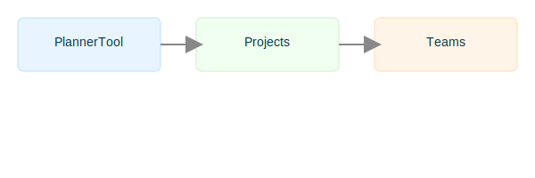

# Adding Documentation

The documentation is served from the `www/docs/` folder and rendered inside the application's Help modal.

- Keep pages focused and small — break long guides into topic-based files.
- Use `index.json` tags to enable quick discovery via search.
- Store images under `www/docs/` and reference them by filename.

## Examples and supported features

- Headings (H1..H6)
- Paragraphs
- Lists (bulleted and numbered)
- Code blocks (fenced with ```)
- Inline code using backticks
- Images and asset references (relative to `/static/docs/`)
- Links to external sites or other docs

Don't break lines in the md files for raw text file layout. The very simple markdown renderer interprets
line changes
as new paragraphs. (like this example)

## Assets

Place images and other resources alongside markdown files. They will be served at `/static/docs/<filename>` so you can reference them directly in Markdown.

## Adding pages

1. Add a new Markdown file under `www/docs/`.
2. Add an entry to `index.json` with a `title`, `file` and optional `tags`.
3. The Help modal will pick up the new doc and render it automatically.

## Examples

Here are concrete examples you can copy into a markdown file under `www/docs/` to verify rendering in the Help modal.

### Heading and paragraph
```
# My Page Title

This is a short paragraph introducing the page. Leave blank lines between paragraphs — the renderer treats line breaks as new paragraphs.

## Header 2
### Header 3
#### Header 4
##### Header 5
###### Header 6
```

Renders as:
# My Page Title

This is a short paragraph introducing the page. Leave blank lines between paragraphs — the renderer treats line breaks as new paragraphs.

## Header 2
### Header 3
#### Header 4
##### Header 5
###### Header 6


### Bulleted list
```
- First bullet
- Second bullet with *emphasis* and **bold**
```

### Numbered (ordered) list
```
1. First numbered item
2. Second numbered item with `inline code`
```

### Code block (fenced)
```
` ` `
function hello(){
	console.log('Hello from a fenced code block');
}
` ` `
```

### Example diagram (served from `www/docs/`):

Image (served from `/static/docs/` — place image file alongside markdown)
```

```

Renders as:


### External link
```
[External site](https://example.com)
```

### Internal link (open another doc in the Help modal)
```
[See the intro page](intro.md)
```

### Anchor link (scroll to heading within same doc)
```
[Jump to section](#examples)
```
