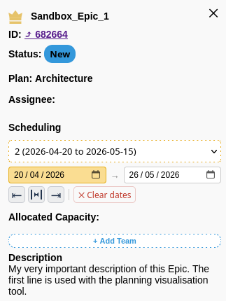
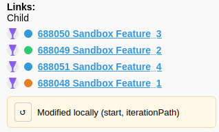

# Details Panel

The Details panel displays full metadata for a selected card and provides edit controls.

## Top part of the details panel

Header
- Title and type indicator.

ID
- Link to open the item in Azure DevOps when available.

Status
- The status of the task. Click the status to change it as part of a scenario.

Assignee
- The name of the person assigned to, if any.

Scheduling
- Setting start/end date of the task using 'iterations'.
- Editable Start and Target date fields. Changes are reflected on the timeline immediately.
- Context sensitive buttons to move start date, both start and end dates, or end date of a task with descendents to match dates of these.
- Clear dates button to remove dates and make the task effectively unplanned.

Allocated capacity
- Add allocation: choose a team and set percentage.
- Adjust allocation with the mouse wheel over the percent field for 10% steps or enter a precise value.
- Allocations are saved into the scenario and can be written back to Azure DevOps via the review modal.

Description
- Free-text area for description. Description field is currently not editable from the tool.

## Bottom part of the details panel

Links:
- Lists ancestors and descendents, and related tasks
- Displays the task type linked and the state of the task using the same colors as the state field.
- Links are active and will display title if the linked task is loaded into the tool, otherwise the task ID.

Modified box
- If fields are modified on a task this box will display. Revert all changes made by clicking the revert button, our doubleclick the task in the board.

# Good to know

Behavior
- Edits affect the active scenario; if autosave is off, use Save to persist locally.
- Pushing to Azure DevOps is explicit and reversible via the review step.

Step-by-step example: change dates and team allocations

1. Open the Details panel
	- Click a card on the timeline. The panel title shows the item `Title` and type (e.g., "Feature").

2. Edit Dates
	- Locate the `Start` and `Target` fields under the "Dates" heading.
	- Click the `Start` value and pick a new date from the date picker.
	- Click the `Target` value or drag the card on the timeline to change the end date.
	- Confirm the updated dates are shown in the panel.

3. Edit Team Allocations
	- Find the "Team allocations" section.
	- To add a new allocation, click the `Add allocation` button.
	- In the new allocation row select a `Team` from the dropdown and enter a `Percent` value (e.g., `40`).
	- To quickly adjust the percent, hover over the `Percent` field and use the mouse wheel for ±10% steps.
	- Existing allocations show as rows with `Team` and `Percent` columns and a delete/trash control to remove them.

4. Add notes (not implemented)
	- Edit the `Description` or `Notes` field to add context for the change.

5. Save changes locally
	- Click `Save` in the Scenario Menu to persist the edits to the active scenario (stored on the server or autosave depending on settings).

6. Push selected changes to Azure DevOps (optional)
	- Click `Save to Azure` button on a scenario to open the Review modal.
	- In the Review modal inspect the listed changes, uncheck any you do not want to push, then click `Confirm` (or `Push`) to write selected updates to Azure DevOps.
	- The modal reports success or displays inline errors for failed updates.

7. Cancel or revert
	- If you decide not to keep edits, click `Revert` button in the detail panel or double click the card.

Notes
 - The panel updates the timeline directly when dates or allocations are edited.
 - Allocations are stored using the PlannerTool format in the item (so they can be round-tripped back to Azure DevOps).
