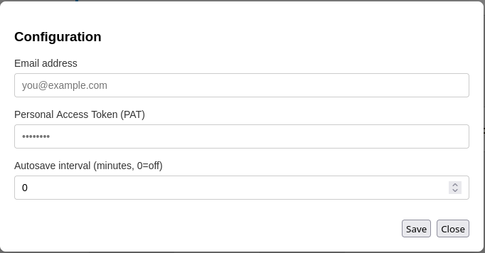

# Initial user setup

When the application loads the first time you will see an empty board, even if the server side is configured. Get started as follows:

## Configuration

Open the Configuration modal (Gear) to enter server and user settings required for fetching data and writing back to Azure DevOps.

Fields
- Email: user identifier used when writing changes back to Azure.
- Personal Access Token (PAT): paste a PAT from Azure DevOps with Work Items (Read/Write/Manage) scope, and Wiki permission (read/write).
- Server settings: server or organization settings may be provided by your PlannerTool installation; confirm correct project visibility.
- Autosave: enable to persist scenario edits automatically in browser storage.

If you don't know how to get a PAT, see below.

2. Save the configuration.
3. Reload the application

Now you should see projects defined on the server and teams. If this works, you are set for using the application.

### Tips
- If projects or teams do not appear after saving configuration, refresh the browser.
- Verify PAT scopes and expiry if refresh or write operations fail.

### How do I generate a Personal Access Token (PAT) when using ADO as the backend?
When you are logged into Azure devops do as follows:

1. Click the "User Settings" button next to your profile image.
2. Select "Personal access tokens".
3. Generate a token by clicking "+ New token".
4. Give it a name "PlannerTool", and assign minimum the Task management and Wiki permission read/write scope to it.
5. Set the expiry date to as far in the future it is allowed.
6. Save the token and copy the string to a safe place.

### I cannot refresh delivery plan markers
You need to have the right permission in Azure DevOps: "Manage Delivery Plans"
