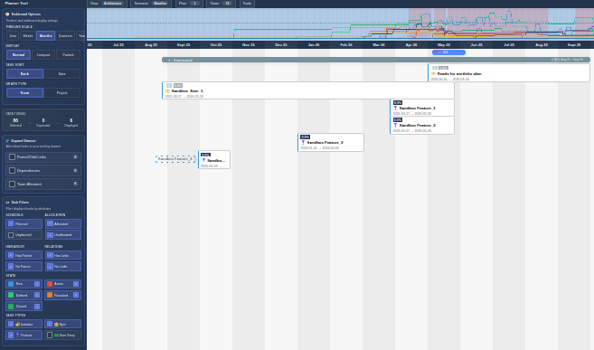

# Quick Usage

Here is a quick overview of the application.

## User Configuration

Click the Gear button in the upper right corner to (re-)configure the user on this browser.

## Getting Help

Click the Help (?) button in the top bar or sidebar to open this modal. Use the search box to filter pages by title or tag.

## Interface overview

In the middle is the board area. This is where tasks are displayed, and most of the work happens. Left of the board is the sidebar containing filters and ways to alter the display of data. Above the board area is a graph displaying capacity assigned to the various team and project plan tasks. Above the graph area is a menu bar with options for creating saved views, scenarios and selecting plans and teams.  When clicking a task card the right side of the board opens a detail panel for the selected card.

## Common tasks

- Find a task: `ctrl+shift+f` to search.
- Create, rename or delete views  from the View menu.
- Create, rename or delete scenarios from the Scenario menu.
- Select plans and teams by using the top menu.
- Use the left sidebar to drill down through the tasks selected.
